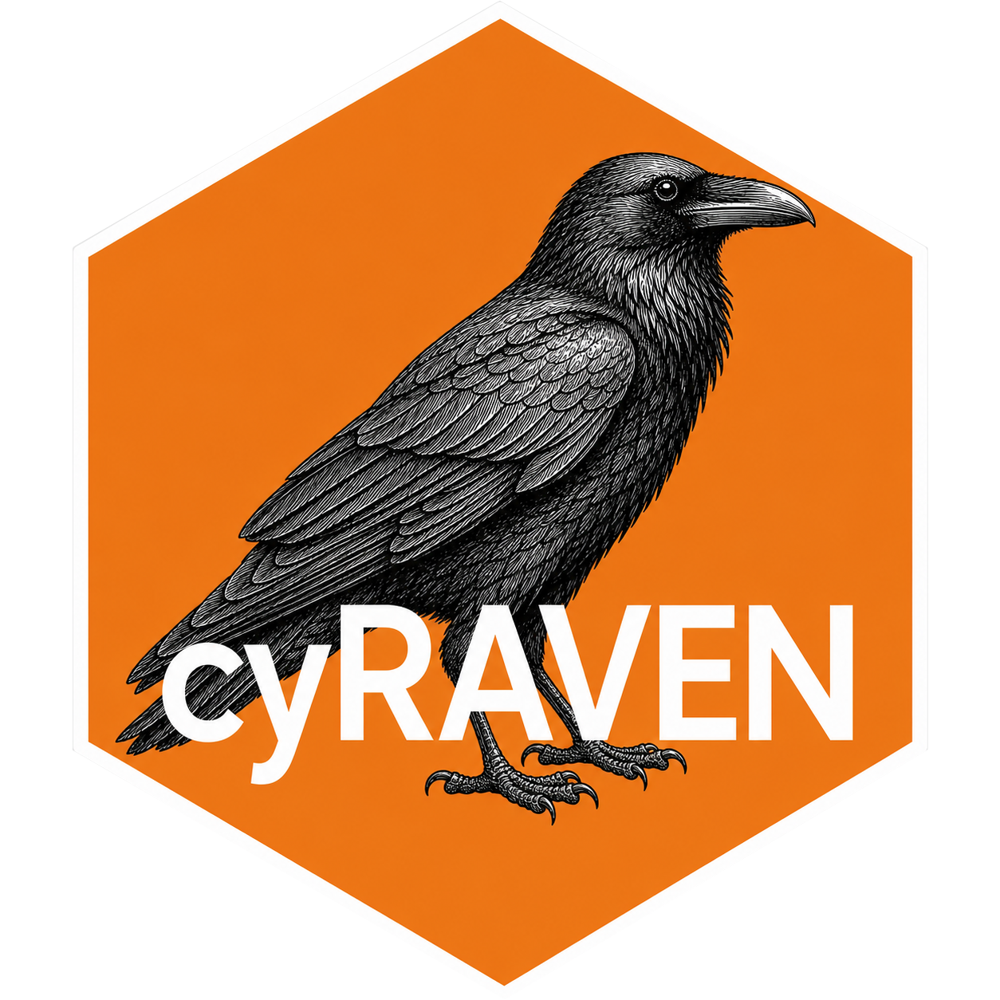
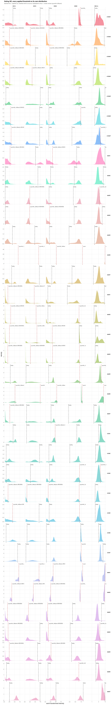
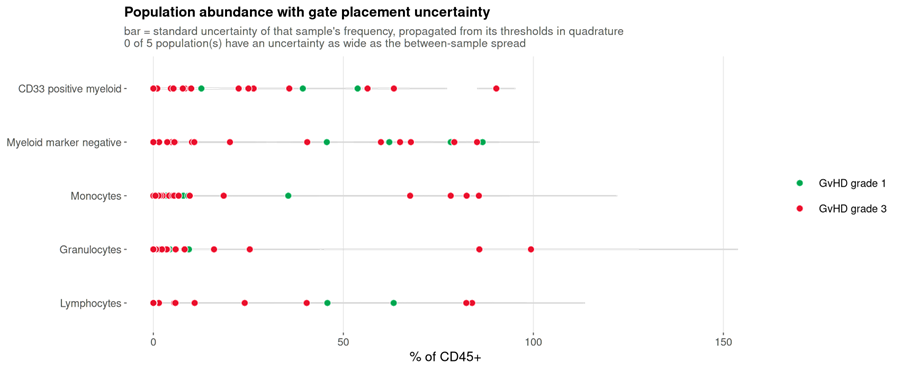
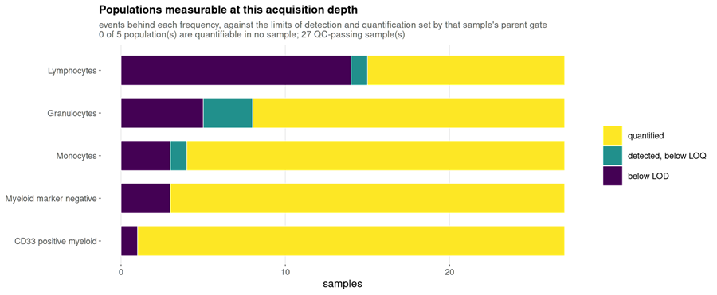
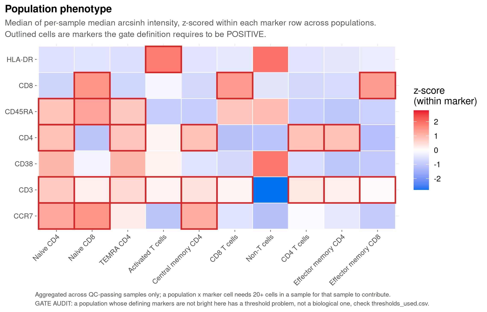
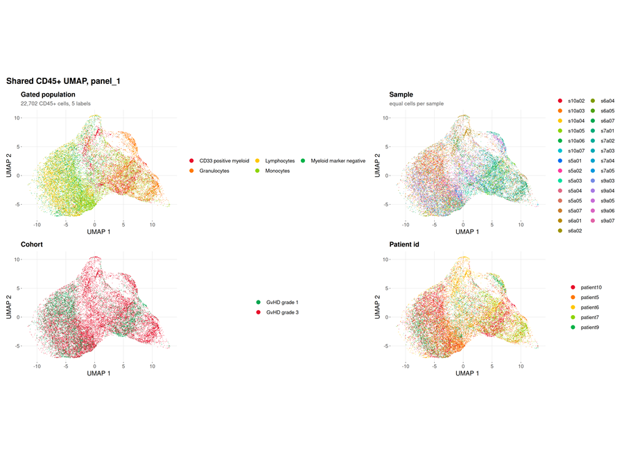
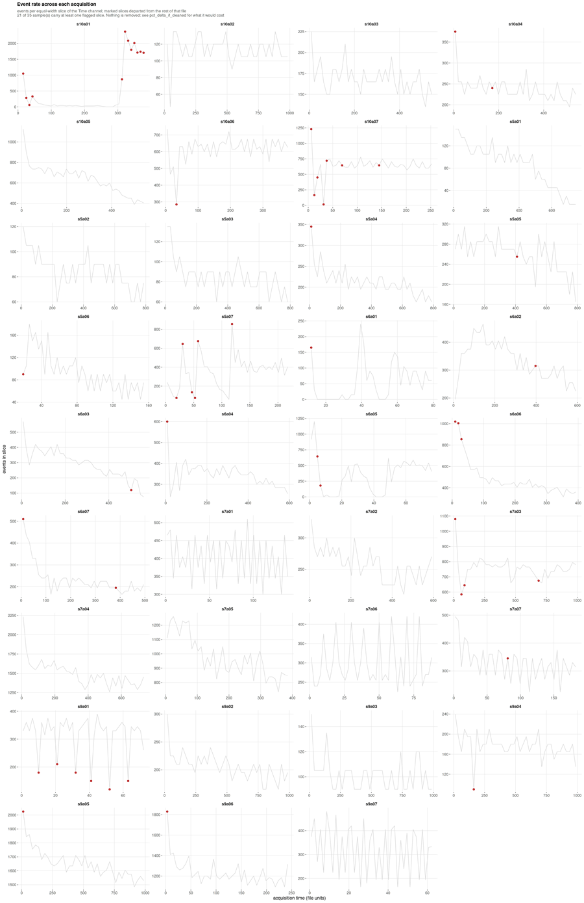

# cyRAVEN 

<!-- badges: start -->
[](https://github.com/bhagesh-h/cyRAVEN/actions/workflows/R-CMD-check.yaml)
[](https://github.com/bhagesh-h/cyRAVEN/actions/workflows/pkgdown.yaml)
[](https://www.gnu.org/licenses/gpl-3.0)
<!-- badges: end -->

**Documentation: <https://bhagesh-h.github.io/cyRAVEN/>**

An R package for supervised immunophenotyping of multi-sample flow cytometry
data, with per-sample gate derivation and donor-level differential abundance and
differential state testing.

A directory of FCS files becomes population frequencies, marker expression, a
shared UMAP and between-group statistics. Every threshold is placed within the
sample it applies to, every frequency carries the uncertainty of the cut and of
the event count behind it, and six diagnostics test whether the gating
specification held.

## 1. Overview

cyRAVEN applies a declarative gating specification to a batch of FCS files,
derives every marker threshold independently within each sample, quantifies
population abundance and marker expression per sample, and then tests that
specification against unsupervised structure recovered from the same cells.

The design addresses a specific failure mode. Manual gating is the dominant
source of technical variance in multi-sample immunophenotyping: operators gating
identical files report population sizes differing by approximately 32%, and
analyst subjectivity accounts for up to 78% of technical variability once more
than one person is involved (Cadwell et al., 2021, *PDA J Pharm Sci Technol*
75:33). Fixed gate coordinates transferred between samples do not remove this
variance; they convert it into a systematic bias that tracks staining intensity.

cyRAVEN removes the analyst from threshold placement and quantifies the residual
uncertainty rather than concealing it. Each cut is resampled from the events it
was derived from and re-derived over the settings that placed it, and the
resulting spread is propagated to every population that reads it, so a frequency
separated by a clean gap and one sitting on a shoulder are no longer reported to
the same apparent precision.

## 2. Quick start

Docker is the supported execution path. Two of cyRAVEN's dependencies determine
numerical results rather than convenience: `uwot` is a stochastic embedder whose
output varies with its own version and with the BLAS beneath it, and every gate
is placed at a kernel density minimum, so a different density implementation
moves thresholds and therefore the frequencies that would be published. The image
pins R 4.4.3, a dated CRAN snapshot and Bioconductor 3.20 for that reason. Local
installation is documented in [section 7](#7-installation-without-docker).

The commands below reproduce a complete run on a public dataset in four steps and
require only Docker.

### 2.1 Build the image

```bash
git clone https://github.com/bhagesh-h/cyRAVEN.git
cd cyRAVEN
docker build -f inst/scripts/Dockerfile -t cyraven:1.0.0 .
```

The first build compiles the dependency stack and takes 15 to 25 minutes. It
finishes by running `--help` and printing every package version, so a broken
image fails at build time rather than during an analysis.

### 2.2 Prepare the demonstration cohort

```bash
mkdir -p demo results
docker run --rm -v "$PWD/demo:/demo" \
  --entrypoint Rscript cyraven:1.0.0 \
  /opt/cyraven/src/inst/scripts/demo_data.R /demo
```

This writes the graft-versus-host disease cohort distributed with flowCore
(Brinkman et al., 2007, *Biol Blood Marrow Transplant* 13:691; Artistic-2.0)
together with `samples.csv` and `panel.yaml`. Nothing is downloaded: the data
ship inside a package cyRAVEN already depends on, so the example is reproducible
offline and cannot break when a repository moves or a certificate expires.

| | |
|---|---|
| Samples | 35 |
| Patients | 5 |
| Acquisition batches | 7 successive visits |
| Groups | GvHD grade 1 against grade 3 |
| Panel | CD15, CD45, CD14, CD33, with forward and side scatter and a Time channel |
| Events per file | 2,205 to 66,105, median 12,666 |

Both groups are transplant recipients, so the contrast is disease severity rather
than disease against health, and the grades are unbalanced across patients. Read
`confounding_diagnostics.csv` before interpreting any between-group difference.

The acquisition recorded pulse height and no area, and names its fluorescence
channels `FL1-H` through `FL4-H` with the marker in `$PnS`. cyRAVEN resolves both
without intervention: the reading stage falls back to height when a file contains
no area channel, and says so, because height and area are different measurements
and thresholds derived from one are not interchangeable with the other.

The `panel.yaml` it writes declares five populations, two `functional_blocks:`
reading marker intensity within a gate rather than using it to define one, and
one entry under `ratios:`. Each section is annotated in the file itself and the
syntax is set out in the
[Gating article](https://bhagesh-h.github.io/cyRAVEN/articles/gating.html).

### 2.3 Check the inputs, then run

Validate first. This reads the FCS headers and the two input files, reports what
the run would do, and exits without analysing anything, so a marker name that
does not match costs a second rather than the run.

```bash
docker run --rm \
  -v "$PWD/demo:/data:ro" \
  -v "$PWD/results:/results" \
  cyraven:1.0.0 \
  --dir /data/fcs \
  --samples /data/samples.csv \
  --config /data/panel.yaml \
  --group-column cohort --reference-group "GvHD grade 1" \
  --batch-column visit \
  --outdir /results --check
```

It should report 35 files, the four markers it resolved, that every marker the
specification names is present, that the sheet covers every file, and the group
sizes. Then run:

```bash
docker run --rm \
  -v "$PWD/demo:/data:ro" \
  -v "$PWD/results:/results" \
  cyraven:1.0.0 \
  --dir /data/fcs \
  --samples /data/samples.csv \
  --config /data/panel.yaml \
  --group-column cohort --reference-group "GvHD grade 1" \
  --batch-column visit --cluster \
  --outdir /results
```

`--batch-column visit` turns on the batch diagnostics, and `--cluster` adds the
unsupervised check that can contradict the declared populations. Both are
optional; without them the run is faster and writes fewer outputs.

Every path inside a flag is a path inside the container, and `--outdir` must fall
within a mounted volume or the output is discarded when the container exits.

On Windows PowerShell, substitute `${PWD}` for `$PWD`.

### 2.4 Read the result

Open `results/report.html`. It carries every figure and table the run produced,
embedded in one self-contained file that needs nothing beside it, presented in
the order the outputs have to be read.

```bash
ls results/
```

Inspect `recon_diagnostics.png` and `gating_qc.png` before any quantity derived
from them. A threshold placed on a distribution shoulder rather than a density
minimum is visible there and in no downstream table.

The reading order for the remaining outputs is given in the
[Diagnostics article](https://bhagesh-h.github.io/cyRAVEN/articles/diagnostics.html);
it is not arbitrary, because each stage can invalidate the ones after it.
[Section 5](#5-output) shows what this run produces.

## 3. Input

Two files besides the FCS directory.

| Argument | Content |
|---|---|
| `--dir` | Directory of FCS files, one per sample |
| `--samples` | One CSV, one row per FCS file: what it is, whose it is, which group and batch it belongs to, and any externally measured counts |
| `--config` | One YAML: the populations to score, and every choice shared by all samples |

Only the FCS files are required. Anything that varies per sample belongs in the
CSV; anything that is one decision for the whole study belongs in the YAML.

```
file,sample_id,patient_id,cohort,sex,age_years,batch,count.Granulocytes
HC-01.fcs,HC-01,HC-01,Healthy controls,female,34,2025-03-04,3810
PT-01_v1.fcs,PT-01_v1,PT-01,Patients,male,41,2025-03-11,5120
PT-01_v2.fcs,PT-01_v2,PT-01,Patients,male,41,2025-06-02,4380
```

Subject attributes repeat across a patient's rows, and rows that disagree are a
fatal error naming each conflict rather than a silent choice between them. Any
column that is not reserved becomes a study variable usable as
`--group-column` or `--batch-column`. A column named `count.<Population>` is
read as an externally measured absolute count.

A population is declared as a conjunction of marker directions evaluated within
the CD45<sup>+</sup> parent gate:

```yaml
populations:
  CD4 T cells:
    CD3: above
    CD4: above
    CD8: below
```

Build both files rather than writing them:

```bash
# a sheet with a row for every file in the directory
docker run --rm -v "$PWD/data:/data" cyraven:1.0.0 \
  --dir /data/fcs --write-samples /data/samples.csv

# validate both against the FCS headers, in seconds, without analysing
docker run --rm -v "$PWD/data:/data:ro" -v "$PWD/results:/results" \
  cyraven:1.0.0 --dir /data/fcs --samples /data/samples.csv \
  --config /data/analysis.yaml --outdir /results --check
```

`--check` reports the markers it resolved from the files, any specification
entry matching none of them, whether the sheet covers every file, the group
levels and their sizes, and the study variables available. A marker-name
mismatch found here costs a second; found during a run it costs the run.

Annotated templates ship with the package as
`system.file("examples", "samples_template.csv", package = "cyRAVEN")` and
`analysis_template.yaml` beside it.

The earlier three-file form, `--sample-map` with `--patient-table` and
`--absolute-counts`, still works unchanged and is not deprecated; it cannot be
combined with `--samples`. Both routes are documented in full in the
[Inputs article](https://bhagesh-h.github.io/cyRAVEN/articles/inputs.html), and
the specification syntax, including three-level markers, functional blocks,
ratios and the `any_of` form, in the
[Gating article](https://bhagesh-h.github.io/cyRAVEN/articles/gating.html).

## 4. Options

Analyses that only add output are enabled by default. Analyses that alter an
existing quantity are opt-in.

```bash
  --transform logicle       # auto-logicle instead of arcsinh
  --cluster                 # SOM clustering and gate concordance
  --explain-clusters        # learn gate geometry for undescribed clusters
  --external-labels x.csv   # learn gates for a labelling from another tool
  --export-gates            # write learned gates as Gating-ML 2.0
  --write-baseline b.rds    # record where this run placed its thresholds
  --baseline b.rds          # test this run against that record
  --batch-column run_date   # quantify batch structure
  --correct-batch           # correct it, subject to the confounding guard
  --lod-events 20           # events below which a population is not detected
  --auto-subcluster-k       # silhouette-selected subcluster count
  --save-umap-model         # persist the embedding for later batches
  --drop-unstable-events    # exclude the flagged acquisition intervals
  --subsample rare          # inverse-density draw, so rare populations survive
  --calibration-beads b.fcs # convert channel units to MESF or ERF
  --no-uncertainty          # skip the gate uncertainty analysis
```

`docker run --rm cyraven:1.0.0 --help` lists every option at the installed
version. All 83 are documented with their defaults and consequences in the
[Options reference](https://bhagesh-h.github.io/cyRAVEN/articles/options.html),
which also sets out the convention governing which are on by default: additive
analyses are, and the five that change numbers the previous run reported are not.

## 5. Output

The run in [section 2](#2-quick-start) writes 30 tables and 22 figures, together
with `run_manifest.txt`, `miflowcyt.md`, `report.html` and `session_state.RData`.
The count varies with the panel and the flags in force: outputs whose inputs are
absent are skipped and the omission is logged.

The figures below are the unmodified output of that run. All 22, with what each
measures and what this run shows, are in the
[worked example](https://bhagesh-h.github.io/cyRAVEN/articles/figures.html),
which also covers the two further figures the package writes and the volumetric
counting input they require.

Four properties of the cohort govern how they read. Both groups are transplant
recipients, so the contrast is GvHD grade rather than disease against health. The
groups are unbalanced, 7 against 28, and grade is a property of the patient, so
between-group differences are partly between-donor differences. The acquisition
recorded pulse height and no area, so cyRAVEN falls back to height and the
singlet gate is skipped. And 8 of 35 samples fail staining QC and are excluded
from every test.

### 5.1 Gate inspection

Per sample: the scatter gate boundary and every marker threshold drawn on the
density it was derived from. Read before any quantity derived from it, because a
threshold placed on a shoulder rather than a minimum appears here and in no
table.



Of 175 sample-and-marker thresholds, 103 resolved a density minimum and 72 fell
back to a quantile. Section 5.7 gives the reason for most of them.

### 5.2 Abundance and its uncertainty

Each per-sample frequency carries the standard uncertainty propagated from the
thresholds behind it.



None of the five populations has a gate uncertainty as wide as its between-sample
spread. The donors differ from each other by more than the cuts move, which is
the condition under which a between-group comparison is worth attempting.

### 5.3 Measurability at this acquisition depth

Placement precision and counting sufficiency are separate guarantees. A cut
through a wide empty gap is well determined however few events lie beyond it, so
each population is also classified against the limits of detection and
quantification set by its own parent gate.



Of 135 population-and-sample values, 104 are quantified, 5 are detected but below
the limit of quantification, and 26 are below the limit of detection. Those 26
cannot be recovered by re-gating: the numerator is small for want of acquired
cells.

### 5.4 Phenotype concordance

Marker intensity against the declared populations, z-scored across the run.
Identity is declared rather than inferred, so this figure serves the inverse
function of its equivalent in clustering-first analysis: a population that does
not show the markers its definition requires falsifies the gate that produced it.



### 5.5 Shared embedding

One UMAP per marker panel, computed across all samples so that cross-sample
comparison is meaningful.



With `--cluster`, a self-organising map over 22,702 cells found 12 metaclusters
and no undescribed one, so the specification accounts for every phenotype
present. It also showed that Lymphocytes and Myeloid marker negative both
dominate the same cluster, at 36.9% and 35.8% purity: in this panel the two
definitions select largely the same cells and are not independent readouts. That
is a gating result a frequency table cannot deliver.

### 5.6 Was the acquisition stable?

Events recorded in each equal-width slice of the acquisition. A sustained trough
is a partial clog, a spike is usually a bubble, a step is a settings change.



Only 14 of 35 samples are stable; 11 are minor and 10 are unstable. Excluding
every flagged slice would move the largest population by 5.749 percentage points,
an order of magnitude more than the gate uncertainty on the same populations. On
this cohort acquisition instability rather than gate placement is the dominant
technical term. Nothing is removed unless `--drop-unstable-events` is given.

### 5.7 Why a threshold did not resolve

`spreading_receivers.csv` reports, per marker, how much wider its negative
population becomes when another channel is bright. CD15's negatives are 3.06
times wider when CD33 is bright, and CD15 falls back to a quantile in 40% of
samples: spreading fills in the valley a threshold would sit in, and no gating
strategy recovers that.

CD14 is the counter-case. It has the highest fallback rate at 57% and receives
almost no spreading, so its failure to resolve has a different cause. Separating
those two is what the table is for.

### 5.8 Reading the result

Of five populations, none reaches raw *p* < 0.05 and none survives correction.

The largest effect is instructive. Myeloid marker negative has a Cliff's delta of
-0.254 and a `difference_over_gate_u` of 11.29: the difference between group
medians is eleven times the distance the gate itself moves, so it is not an
artefact of threshold placement. It is still not significant, because with seven
samples in one group and 28 in the other drawn from five donors, between-donor
variation swamps it. A run that stopped at "much larger than the gate
uncertainty" would have called this a finding; testing on donors rather than
cells is what prevents that.

Batch structure is real and separable: iLISI 3.982 against a null of 5.625
(*p* = 0.048), all four markers differing between visits by at least 1.1 times
their own spread, and Cramér's *V* between visit and grade of 0.26, reported as
low. Correction is permitted here. Had the grades been acquired in distinct
periods, *V* would approach one and `--correct-batch` would refuse.

### 5.9 Principal tables

| File | Content |
|---|---|
| `population_frequencies.csv` | Population percentage of parent, per sample, with gate uncertainty, counting uncertainty, and detection verdict |
| `population_marker_mfi.csv` | Median intensity and percent positive, per sample, population and marker |
| `group_comparison_stats.csv` | Per-population test with Cliff's delta, adjusted p, and the difference expressed in units of gate and of total uncertainty |
| `thresholds_used.csv` | Every threshold, its derivation and its outlier status |
| `threshold_uncertainty.csv` | Sampling and method components of each threshold, and how often resampling recovered it |
| `uncertainty_budget.csv` | Which threshold each population's uncertainty comes from |
| `functional_markers.csv` | Marker intensity read within a population rather than used to define one, scoped by `functional_blocks:` |
| `population_ratios.csv` | Ratios of declared populations, from the config's `ratios:` block |
| `acquisition_qc_impact.csv` | How far each population would move if the flagged intervals were excluded |
| `spreading_receivers.csv` | Per marker, how much wider its negative population becomes under spillover, with its fallback rate |
| `specification_conformance.csv` | This run against an accepted baseline, written by `--baseline` |
| `marker_batch_drift.csv` | Per-marker distributional distance between batches, written by `--batch-column` |
| `batch_group_confounding.csv` | Whether batch and study group are separable, which decides whether correction is permitted |
| `gate_transferability.csv` | Held-out-donor performance of a learned gate, written by `--external-labels` |
| `cluster_gate_agreement_*.csv` | Declared labels against unsupervised clusters |
| `run_manifest.txt` | Package versions, git commit, invocation, options |
| `miflowcyt.md` | ISAC-structured report of the instrument configuration and the analysis |

Every file the pipeline writes, with its columns and the flag that produces it,
is documented in the
[Output article](https://bhagesh-h.github.io/cyRAVEN/articles/outputs.html).

## 6. Method summary

Each item below is treated in depth in the linked article.

**Preprocessing and gating.** Channels are resolved to marker symbols from `$PnS`
with fallback to `$PnN`, and the acquisition spillover matrix is applied when
present. Events pass a four-level hierarchy: scatter, singlet band, viability,
and CD45 positivity. Every marker threshold is then placed at the density minimum
separating negative from positive modes, computed within each sample.
[Gating](https://bhagesh-h.github.io/cyRAVEN/articles/gating.html)

**Uncertainty.** Each threshold is resampled from the events it was derived from
and re-derived across the settings that placed it. The two spreads combine in
quadrature and propagate to every population reading the marker, together with
the parent gate. A counting term derived from the Wilson interval is reported
beside them. The reported frequency is never altered: perturbation runs on
copies.
[Gating §2.4](https://bhagesh-h.github.io/cyRAVEN/articles/gating.html)

**Inference.** Populations are aggregated to one value per sample before testing,
following Weber et al. (2019, *Commun Biol* 2:183), so donors rather than cells
are the replicates. Group comparisons use rank tests with Benjamini-Hochberg
correction within test families, and abundance is additionally tested on centred
log-ratios to separate compositional artefacts from independent change.
[Statistics](https://bhagesh-h.github.io/cyRAVEN/articles/statistics.html)

**Falsification.** Six outputs exist to contradict the supplied specification:
threshold drift between groups, gate and counting uncertainty, phenotype
concordance, gate against unsupervised cluster concordance, learned gate
geometry, and conformance against a baseline from an accepted earlier run.
[Diagnostics](https://bhagesh-h.github.io/cyRAVEN/articles/diagnostics.html)

## 7. Installation without Docker

Reproducibility of numerical output is not guaranteed outside the pinned
environment, for the reasons given in [section 2](#2-quick-start).

```r
install.packages("BiocManager")
BiocManager::install("flowCore")
remotes::install_github("bhagesh-h/cyRAVEN")
```

```r
library(cyRAVEN)

run_cyraven(list(
  dir             = "demo/fcs",
  outdir          = "results",
  sample_map      = "demo/sample_map.csv",
  config          = "demo/panel.yaml",
  group_column    = "cohort",
  reference_group = "GroupA"
))
```

`FlowSOM` is an optional dependency. When absent, self-organising map clustering
falls back to the implementation within the package and all other behaviour is
unchanged.

## 8. Documentation

| Article | Content |
|---|---|
| [Get started](https://bhagesh-h.github.io/cyRAVEN/articles/cyRAVEN.html) | The ten pipeline stages with the function implementing each, and executable examples of cofactor estimation, density minimum detection and group comparison |
| [Gating](https://bhagesh-h.github.io/cyRAVEN/articles/gating.html) | Gate hierarchy and its behaviour when CD45 or viability markers are absent; per-sample thresholding and the `source` column; threshold precision and counting sufficiency; stability against a baseline; specification syntax; arcsinh against logicle |
| [Diagnostics](https://bhagesh-h.github.io/cyRAVEN/articles/diagnostics.html) | The checks in reading order: gate inspection, staining QC, phenotype concordance, threshold drift, gate uncertainty, detection limits, the four gate-cluster concordance patterns, held-out-donor transferability, learned gate geometry, covariate screening, batch structure, conformance, and provenance |
| [Output](https://bhagesh-h.github.io/cyRAVEN/articles/outputs.html) | Every file the pipeline writes, its columns, the flag producing it, and why event counts are not cell counts |
| [Statistics](https://bhagesh-h.github.io/cyRAVEN/articles/statistics.html) | Sample-level aggregation; rank tests against moderated *t* and the sample size at which the trade reverses; the compositional constraint; covariate diagnosis against adjustment; multiplicity within test families; differences expressed in units of uncertainty |
| [Interoperability](https://bhagesh-h.github.io/cyRAVEN/articles/with-cycondor.html) | Method selection by question type; handing a cyCONDOR clustering to cyRAVEN to obtain an executable gate with held-out-donor performance; the four sources of divergence between their embeddings |
| [Worked example](https://bhagesh-h.github.io/cyRAVEN/articles/figures.html) | Every figure from a run on public data, each with what it measures and what that run shows |
| [Options reference](https://bhagesh-h.github.io/cyRAVEN/articles/options.html) | All 83 command-line options with defaults and consequences, and the convention deciding which are on by default |
| [Claude skill](https://bhagesh-h.github.io/cyRAVEN/articles/claude-skill.html) | Installing and using the bundled Claude Code skill, which executes through Docker by default |
| [Scope](https://bhagesh-h.github.io/cyRAVEN/articles/scope.html) | Nine excluded methods with the reasoning and the condition under which each becomes appropriate |

## 9. Citation

```r
citation("cyRAVEN")
```

Cite FlowSOM (Van Gassen et al., 2015, *Cytometry A* 87:636) when using the
unsupervised clustering, and diffcyt (Weber et al., 2019, *Commun Biol* 2:183)
for the aggregation strategy underlying the differential state tests.

## 10. Licence

GPL-3. See [LICENSE](LICENSE).
