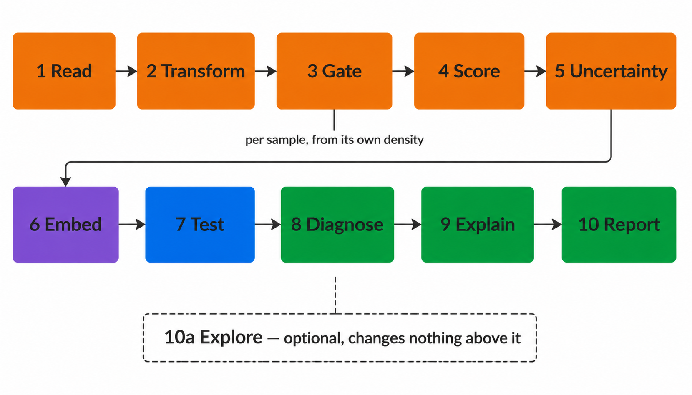

```{r, include = FALSE}
knitr::opts_chunk$set(collapse = TRUE, comment = "#>", eval = FALSE)
```

cyRAVEN turns a directory of FCS files into population frequencies, marker
expression, a shared UMAP and between-group statistics.

This chapter is the argument for the design: what the pipeline does, the ten
stages a run moves through, and why unsupervised discovery is deliberately kept
at arm's length from the specification it exists to check.

New to flow cytometry? Read [About flow cytometry](flow-cytometry.html) first.
Want to run something now? Go to [Get started](cyRAVEN.html).

## Why this exists

Manual gating is a measurable source of technical variance in multi-sample
immunophenotyping. Thirty-eight operators gating the same files under a gauge
repeatability and reproducibility design carried a median expanded uncertainty
of 3.6%, and experience made no significant difference to it (Grant and others,
2021, *PDA J Pharm Sci Technol* 75:33). Across 320 routine clinical samples
analysed by six technologists on three harmonised cytometers, the dispersion
that remained was structured primarily by operator identity rather than by
instrument configuration (Mead and others, 2026, *Cytometry B*,
doi:10.1002/cyto.b.70048).

Copying fixed gate coordinates between samples does not remove that variance. It
converts it into a systematic bias that tracks staining intensity, which is
harder to notice because every sample then carries the same apparent boundary.
cyRAVEN takes the analyst out of threshold placement and measures the
uncertainty that remains instead of hiding it.

One constraint governs everything else:

> The unit of replication is the donor, not the event.

Event counts are set by how long a tube was run, not by study design. Every test
aggregates to one value per sample before estimation, and anything that cannot
be aggregated is reported with an effect size and no p-value.

## What cyRAVEN does

A directory of FCS files becomes population frequencies, marker expression, a
shared UMAP and between-group statistics. Populations are declared in advance;
every marker threshold is derived inside the sample it applies to; and the
declaration is then tested against unsupervised structure recovered from the same
cells.

There are two ways to use it, and they answer different questions.

| | **Supervised**, the default | **Explore mode**, `--explore` |
|---|---|---|
| You supply | A specification of the populations to score | Nothing beyond the FCS files |
| It returns | Named populations, with uncertainty and group statistics | Numbered clusters over every eligible channel |
| It can find | Only what you declared | A population nobody declared |
| Runs on | The parent gate | Every event in the file |

Explore mode writes everything into `<outdir>/explore/` and changes no existing
output, so adding `--explore` to a run is always safe. `--explore-only` skips the
declared analysis entirely and needs no specification, which is the mode for a
panel you have not written one for yet. The two stay isolated unless you pass
`--maybe-learn`; see [Explore mode](advanced.html#explore-mode-unsupervised-discovery) for what that exchanges, and
[the design record](about.html#why-explore-mode-is-built-this-way) for why it is off by default.

The design addresses one failure mode. Manual gating is a measurable source of
technical variance in multi-sample immunophenotyping: thirty-eight operators
gating the same files carried a median expanded uncertainty of 3.6% under a
gauge repeatability and reproducibility design, with experience making no
significant difference (Grant et al., 2021, *PDA J Pharm Sci Technol* 75:33),
and in routine clinical work the residual dispersion is structured primarily by
operator identity rather than by instrument configuration (Mead et al., 2026,
*Cytometry B*, doi:10.1002/cyto.b.70048). Transferring fixed gate coordinates
between samples does not remove that variance; it converts it into a bias that
tracks staining intensity.

cyRAVEN removes the analyst from threshold placement and quantifies what remains.
Each cut is resampled from the events it was derived from and re-derived across
the settings that placed it, and the resulting spread is propagated to every
population that reads it, so a frequency separated by a clean gap and one sitting
on a shoulder are not reported to the same apparent precision.

One constraint governs everything below.

> The unit of replication is the donor, not the event.

Event counts are set by acquisition duration rather than by study design. Every
test aggregates to one value per sample before estimation; quantities that cannot
be aggregated are reported with effect sizes and no p-value.

## How it works: the ten stages

```{r, include = FALSE, eval = TRUE}
# collapse = FALSE, so the printed result appears in its OWN block below the code
# rather than merged into it. Merged, a reader cannot tell at a glance which
# lines they would type and which the session printed back, and copying the
# block copies the output with it.
knitr::opts_chunk$set(collapse = FALSE, comment = "#>", eval = TRUE)
set.seed(1)
library(cyRAVEN)
```

What the pipeline does, stage by stage, with the function implementing each. One
call runs all ten; every stage is also an exported function callable on its own,
so a step can be inspected or replaced without forking the package.

One constraint governs the design and is stated before the stages.

> The unit of replication is the donor, not the event.

Event counts are set by acquisition duration rather than by study design.
Inference over events sets the degrees of freedom from instrument time and allows
one deeply acquired donor to determine a group result. Every test aggregates to
one value per sample before estimation. Quantities that cannot be aggregated are
reported with effect sizes and no p-value.

```{r ten-stages, eval = TRUE, echo = FALSE, fig.alt = "The ten pipeline stages in order, with explore mode attached as an optional branch"}
if (file.exists("images/pipeline-ten-stages.png")) 
```


#### 1 Read

`read_fcs_resolved()` resolves channels to marker symbols from `$PnS` with
fallback to `$PnN`, and applies the acquisition spillover matrix where the file
carries one. Spectral instruments write unmixed data with no matrix, so
`maybe_compensate()` detects and reports rather than assuming; applying
compensation twice is as damaging as omitting it.

#### 2 Transform

```{r cofactor}
set.seed(42)
ex <- matrix(abs(rnorm(20000 * 4, 0, 250)), ncol = 4,
             dimnames = list(NULL, c("CD3", "CD4", "CD8", "CD19")))
cf <- derive_cofactor(ex, setNames(1:4, colnames(ex)))
round(as.numeric(cf), 1)
```

The arcsinh cofactor governs the width of the quasi-linear region near zero. The
conventional value of 5 derives from mass cytometry and over-expands the
background band on spectrally unmixed fluorescence data. Each marker is bisected
until the interquartile range of its background distribution reaches a target,
and the panel adopts the median. `derive_cofactor_pooled()` estimates across
samples so that a single weakly stained file does not set the scale on which
every threshold in the run is computed.

#### 3 Gate

```{r valley}
x <- c(rnorm(8000, 0, 0.4), rnorm(2000, 4, 0.5))   # bimodal marker
round(density_valley(x), 2)
```

Thresholds are placed at the density minimum within each sample.
`density_valley()` returns `NA` for unimodal distributions, after which
`resolve_threshold()` attempts a declared unstained control and falls back to a
flagged quantile. Derivation is recorded per threshold in `thresholds_used.csv`.

Per-sample thresholding accommodates staining variation but permits the
definition of a population to differ between groups, which
`stats_threshold_drift()` exists to detect.

#### 4 Score

```{r spec}
str(default_population_spec()[["CD3 pos CD4 pos"]])
```

Populations are evaluated as Boolean conjunctions of marker directions read from
YAML. Editing the specification changes the analysis without modifying R code.

#### 5 Quantify the uncertainty

```{r unc, eval = FALSE}
u <- threshold_uncertainty(x_parent, source = "valley", B = 100)
c(u$u_sampling, u$u_method, u$u_combined)
```

Each cut is re-derived from resamples of its own events, and again across the
settings that placed it. The two spreads combine in quadrature and propagate to
every population reading that marker, alongside the CD45 parent term, which
enters all of them because it fixes the denominator.

The reported threshold is unchanged: the perturbation runs on copies. Every entry
point saves and restores `.Random.seed`, so the cell selection in the next stage
draws from the same stream position whether this runs or not.

#### 6 Embed

```{r umap, eval = FALSE}
emb <- run_umap(mat, n_neighbors = 30, min_dist = 0.3, seed = 42)
```

`select_umap_features()` excludes scatter, viability, time and the height and
width duplicates of area channels; retaining these was the principal cause of
uninformative embeddings in the precursor implementation. `plan_subsample()`
draws equal cell numbers per sample so that acquisition depth does not determine
the manifold.

`ret_model = TRUE` retains the model for projection of later batches through
`project_umap()`, which holds coordinates fixed between runs. Model retention
alters the embedding; see `?run_umap`.

#### 7 Test

```{r stats}
freq <- data.frame(
  sample_id = rep(sprintf("S%02d", 1:12), each = 2),
  population = rep(c("CD4 T cells", "B cells"), 12),
  pct_of_cd45_pos = c(rbind(rnorm(12, 25, 4), rnorm(12, 10, 2))),
  is_control = FALSE, qc_status = "pass")
grp <- setNames(rep(c("HC", "Patient"), each = 12)[1:12], sprintf("S%02d", 1:12))

res <- stats_group_comparison(freq, grp, reference = "HC")
res[, c("population", "comparison_group", "n_reference", "cliffs_delta", "p_value")]
```

`stats_marker_state()` applies the same treatment to marker expression within a
population, testing median intensity and percent positive separately because a
shift confined to a subset moves one and not the other.

#### 8 Diagnose

Six outputs constrain interpretation of the preceding stages: threshold drift,
gate and counting uncertainty, phenotype concordance, gate against cluster
concordance, learned gate geometry, and conformance against a baseline. The
[Diagnostics](advanced.html#diagnostics-in-reading-order) covers each in full.

`batch_mixing_report()` quantifies batch structure in the embedding against a
permutation null and reports Cramér's *V* between batch and group. Correction
through `--correct-batch` is refused above a configurable *V*, where batch and
biological effect are not separable.

`stats_threshold_drift()` tests whether marker thresholds separate by group,
which would render an abundance difference partly definitional.

`stats_confounding()` reports whether a covariate both differs across groups and
associates with the outcome, the two conditions jointly defining a confounder.

`cluster_gate_agreement()` cross-tabulates declared labels against unsupervised
clusters and is the only output capable of identifying a population absent from
the specification, or a threshold rejecting events that belong to its population.

`run_gate_uncertainty()` reports how far each threshold moves under resampling and
propagates that to every population reading it, so a difference smaller than its
own gate's movement is identifiable as such.

#### 9 Explain

`cluster_gate_agreement()` identifies a cluster matching no declared population
but cannot characterise it, leaving a cluster index and a cell count.

`explain_cluster()` inverts the gating stage. Given labelled events it selects
the two most discriminating markers, fits a convex polygon in that plane, retains
the enclosed events and recurses, producing the topology of a manual gating
strategy.

```r
st <- explain_cluster(marker_matrix, cluster_id == 7)
st$summary               # marker pair and metrics per level
st$levels[[1]]$polygon   # vertices, in arcsinh units
```

Convex polygons rather than thresholds: a conjunction of one-dimensional cuts is
an axis-aligned rectangle, and an oblique boundary constrained to a rectangle
must admit contaminants or exclude genuine events. `derive_singlet_band()` is a
hand-written instance of the same geometry.

Metrics are computed on held-out events with the resubstitution value alongside,
since eight free half-planes can memorise a few thousand events. The stage is
descriptive: it carries no p-value and scored frequencies are identical whether
it runs or not.

`--external-labels` supplies the labels from elsewhere, a cyCONDOR clustering for
instance, and `gate_transferability()` then refits the strategy with one donor
withheld and scores it on that donor. Held-out events come from the same donors
and overstate how well a gate travels; the per-donor minimum does not.
`--export-gates` writes the result as Gating-ML 2.0 in the units the FCS file
stores.

#### 10 Report

Figures, tables, and `write_run_manifest()`, which records R version, package
versions, git commit and working-tree state, the full invocation, and every input
file with size and modification time. The manifest is written before the
expensive stages and rewritten at completion, so an interrupted run records
`status: failed`.

#### 10a Explore

`--explore` runs a second, independent analysis over every event and every
eligible channel, writing to `<outdir>/explore/` and leaving stages 1 to 10
untouched. It has its own quality gate, its own embedding and clustering, and its
own self-contained report. `--explore-only` runs it without stages 2 to 10 at
all. See [Explore mode](advanced.html#explore-mode-unsupervised-discovery).

### Further reading

- [Running cyRAVEN](cyRAVEN.html#commands-and-every-option), for every command and option.
- [Inputs](cyRAVEN.html#inputs-the-sample-sheet-and-the-config), for the sample sheet and the config.
- [Gating](cyRAVEN.html#the-gating-specification), for threshold derivation and specification syntax.
- [Diagnostics](advanced.html#diagnostics-in-reading-order), for the outputs that falsify a specification.
- [Statistics](advanced.html#statistics), for test selection and its assumptions.

```{r, include = FALSE, eval = TRUE}
knitr::opts_chunk$set(collapse = TRUE, comment = "#>", eval = FALSE)
```

## Why explore mode is built this way

The design record for explore mode: what the supervised and unsupervised halves
can lend each other, which of those exchanges are implemented, which are
deliberately refused, and where that leaves cyRAVEN against the tools it sits
beside.

Written because "add unsupervised clustering" is the easy half of the problem.
The hard half is deciding what the two halves are allowed to tell each other
without destroying the guarantee that made either worth having.

### 1. The two failure modes

Supervised and unsupervised cytometry analysis fail in opposite directions, and
neither can detect its own failure.

**Supervised analysis cannot find what it was not told to look for.** You declare
twelve populations, it scores twelve populations. A thirteenth cell type sits in
the data unremarked. Worse, a declared label may cover two distinct phenotypes,
and their total can stay flat while one rises and the other falls. That is a real
pattern that no amount of testing on the declared table can surface, because the
table has one column where the biology has two.

**Unsupervised analysis cannot tell you what it found.** FlowSOM returns cluster
17. Whether cluster 17 is a B cell subset, a doublet artefact, or the same cells
as cluster 4 under a different sampling seed is left to a human squinting at a
heatmap. And because the clusters are defined on the data, the number of them
that reach significance moves with parameters nobody reports. Measured
elsewhere in this project, one cyCONDOR run went from **1 significant cluster to
8** by changing only how many cells were drawn.

Running both and reading them side by side does not fix either. What fixes them
is deciding, deliberately, which specific facts may cross between them.

### 2. The exchange, enumerated

Every transfer that is technically possible between the two halves, with the
verdict on each.

#### 2.1 Declared -> explore

| What could be lent | Verdict | Why |
|---|---|---|
| **The transform and its estimated cofactor** | **Always** | A property of the panel derived from the data, not a product of the declaration. An unsupervised tool assumes a transform; cyRAVEN estimates one. Lending it costs nothing and removes an arbitrary constant |
| **Per-sample thresholds** | **Under `--maybe-learn`** | The single largest gain. See section 3 |
| **Staining QC verdicts** | **Under `--maybe-learn`, as a column** | Recorded, never used to exclude. See section 4 |
| **Batch/group confounding verdict** | **Under `--maybe-learn`** | Without it explore reintroduces the exact failure the declared path refuses. See section 5 |
| **Group labels** | **Always** | They come from the sample sheet, not from the analysis. Withholding them would mean explore could not test anything |
| **The parent gate** | **Never** | Explore exists to look *outside* it. Applying it would make explore a re-clustering of the declared result |
| **The population definitions** | **Never** | That is the thing being checked |

#### 2.2 Explore -> declared

| What could be lent | Verdict | Why |
|---|---|---|
| **Populations spanning several clusters** | **Under `--maybe-learn`**, as `spec_gaps.csv` | The finding the declared path structurally cannot make about itself |
| **Clusters no population covers** | **Under `--maybe-learn`**, same file | Names what the specification missed |
| **Cluster-derived population definitions, adopted automatically** | **Never** | Circular. See section 6 |
| **Re-gating, re-thresholding, or altering any declared frequency** | **Never** | A run whose numbers were changed by a clustering is no longer the run its manifest describes |

The asymmetry is deliberate. Explore may **describe** the declared analysis. It
may never **alter** it.

### 3. Per-sample thresholds: the exchange that matters most

A standalone clusterer names a cluster by pooling every cell, computing a median
per marker, and putting a colour scale on it. Three things are wrong with that on
multi-sample data, and all three are things cyRAVEN has already solved for the
declared path:

1. **The pooled median is not a threshold.** It is the middle of the distribution,
   which for a marker where 80% of cells are positive sits inside the positive
   population.
2. **It ignores staining variation between samples.** A bright sample and a dim
   one are compared against one number, which is precisely the systematic bias
   that per-sample gating exists to remove.
3. **It produces a colour, not a call.** "Reddish for CD19" is not a measurement.

Under `--maybe-learn`, explore reads `thresholds_used.csv` and calls each cell
against **its own sample's cut**. A cluster's phenotype becomes:

```
CD19+ HLA-DR+ CD3- CD14-
```

where every `+` means *this fraction of the cluster's cells were above the
threshold derived in their own sample*, recorded in `frac_pos.<marker>` columns.
A marker the cluster is genuinely mixed for is **omitted** rather than called
either way, so the phenotype string admits what it does not know.

That is a claim no standalone clusterer can make, and it is not a clever
algorithm. It is the reuse of work the declared path already did.

### 4. Two things explore can do that the declared path cannot

**It keeps the samples staining QC excluded.** A sample with no resolvable CD45
mode has no usable parent gate, so every declared percentage from it would be a
fraction of an arbitrary slice of the scatter plot. The declared path must drop
it. Explore does not depend on that gate, so those samples still contribute, and
`staining_qc_verdict` is a *column* rather than a filter. On the KMT2 cohort
analysed in this project that is three donors the declared path had to discard
and explore can still describe.

**It looks outside the parent gate.** Anything the CD45 gate excluded is
invisible to the declared analysis by construction. Explore embeds it, which is
the only way a population that fails the parent gate can ever be seen.

### 5. Carrying the confounding verdict

The most likely way explore mode could damage this package is by becoming a
p-value generator that ignores everything the declared path established.

`explore_cluster_stats.csv` therefore carries `batch_group_cramers_v` and
`batch_group_verdict` as columns of the results table itself, not as a note
elsewhere. On a cohort where batch and group are confounded, a *q* < 0.05 on a
cluster means exactly as little as a *q* < 0.05 on a declared population, and the
table says so on the same row.

Explore's statistics are also donor-level, using the same
`stats_group_comparison()` the declared path uses: one value per sample,
Kruskal-Wallis omnibus, Wilcoxon pairwise, Cliff's delta, Benjamini-Hochberg.
Not a reimplementation: the same function, so the two cannot drift apart.

### 6. Why the draft specification is never adopted automatically

`explore_suggested_spec.yaml` turns clusters into declarable population
definitions. The obvious next step, feeding it straight back into the declared
pipeline, is refused, and this is the most important design decision in the
feature.

cyRAVEN's argument is that populations are declared **before** the data are
examined, and six diagnostics then try to falsify that declaration. Derive the
specification from the same data and the diagnostics become circular:

- **Phenotype concordance** asks whether a population expresses the markers its
  definition demands. Trivially yes, if the definition was read off those cells.
- **Gate-cluster concordance** compares declared gates against unsupervised
  clusters. If the gates came from those clusters, it compares a thing to itself.

There is a sharper version. Explore's clustering is **group-blind**. It never
sees cohort labels, so deriving a definition from cluster *phenotypes* is a mild
form of double-dipping. But `explore_cluster_stats.csv` **does** test by group.
A user who reads that table, sees which clusters differ, and declares those as
populations has selected on the outcome, and every subsequent p-value is invalid.

The defensible uses, ranked:

| Workflow | Verdict |
|---|---|
| Explore on cohort A -> curate -> declared run on **cohort B** | Clean. The intended loop |
| Explore -> curate -> declared run on the **same** cohort, reporting frequencies | Acceptable; state that the spec was data-derived |
| Explore -> read the group statistics -> declare the clusters that differed | **Invalid.** Selection on the outcome |

Hence: a YAML file whose header says it is a suggestion, requiring a human edit,
with no flag anywhere that adopts it.

### 7. Choices inherited rather than invented

Three decisions were taken from the unsupervised literature because they are
better than what a supervised tool would reach for.

**Cluster everything, including scatter and viability.** No lineage preference.
This is what lets the QC gate find debris (leukocyte marker low), dead cells
(viability high) and granulocytes, which no antibody in most panels identifies.
The cost is real: some clusters split on scatter rather than lineage.
`--explore-markers` overrides it.

**Gate on clusters, not events.** Cluster coarsely first, then judge *whole
clusters* by their median profile, so no per-event cutoff is invented. The
debris and dead calls come from 2-means on the per-cluster medians when nothing
better is available, and from per-sample thresholds when it is. Both are recorded
in the `basis` column of `explore_qc_clusters.csv`.

**Refuse a gate that keeps almost nothing.** Below `--explore-min-retained`
(default 5%), the gate is ignored and the run flagged: at that point the markers
are likelier mis-named than the data bad.

One decision goes the other way. **Cells are re-equalised per sample after the
gate.** cyCONDOR does not do this, and its faceted panels then differ in density
for a reason that is group size rather than biology. That trap was documented while
running it during this project. Equalising costs cells and buys panels that can
honestly be read side by side.

### 8. Where this leaves cyRAVEN

| Capability | cyRAVEN | FlowSOM / Phenograph | cyCONDOR | diffcyt | CATALYST |
|---|:--:|:--:|:--:|:--:|:--:|
| Per-sample gate derivation | yes | | | | |
| Uncertainty propagated to every frequency | yes | | | | |
| Detection limits per population | yes | | | | |
| Donor-level inference by construction | yes | | part | yes | part |
| Refuses batch correction when confounded | yes | | | | |
| Unsupervised discovery | yes | yes | yes | yes | yes |
| Clusters named from per-sample thresholds | yes | | | | |
| Cluster -> executable gate geometry | yes | | | | |
| Gating-ML 2.0 export | yes | | | | |
| Empirical-Bayes moderation across clusters | | | | yes | |
| Trajectory inference | | | yes | | |
| Data-determined cluster count | | yes | yes | | yes |

`yes` present. `part` possible but not enforced by the tool.

The gap this feature closes is the "unsupervised discovery" row. The row that
remains distinctive is **clusters named from per-sample thresholds**, which
requires both halves in one tool and is why bolting FlowSOM onto a supervised
pipeline is not the same thing.

#### What is deliberately not adopted

**diffcyt's empirical-Bayes moderation** (edgeR, limma-voom, GLMM). It borrows
strength across clusters via a shared prior, which pays off at mass-cytometry
marker counts with hundreds of clusters. On a declared panel of a dozen
populations there is little to borrow, and the moderation is harder to explain
than it is worth. Reachable through `--external-labels` for anyone who wants it.

**A data-determined cluster count.** Phenograph and consensus methods choose *k*
from the data. `--explore-k` is a setting, and `explore_provenance.csv` says so,
because a *k* chosen from the data is one more thing the significance count
depends on.

**Trajectory inference.** Diffusion maps and pseudotime need a differentiation
continuum the design supports. On cross-sectional human cohorts of 10 to 40
samples it produces a picture, not a measurement.

### 9. The claim worth testing

If there is a methods paper here, the claim is not "cyRAVEN clusters cells".
It is:

> Threshold placement uncertainty, derived per sample and propagated to reported
> frequencies, predicts the between-operator variance that manual gating
> produces, and that populations whose propagated uncertainty is large are the ones
> where published cohorts disagree.

That is falsifiable and, as far as this project's reading goes, untested. It
would need the same files gated by several operators, with the propagated
uncertainty compared against the observed spread of their results. The
inter-laboratory data to do it exists in the literature this package already
cites.

The second claim, weaker but easier to support: **a refusal rule is a feature.**
A tool that declines to run batch correction above a measured Cramér's *V*
between batch and group, and says why, produces fewer results and more
defensible ones. That one needs a demonstration rather than a benchmark: a
cohort where correction would have produced a clean, wrong answer.

### See also

- [Explore mode](advanced.html#explore-mode-unsupervised-discovery): how to run it
- [Statistics](advanced.html#statistics): why the donor is the unit of replication
- [Interoperability](advanced.html#using-cyraven-with-cycondor): handing a cyCONDOR clustering back
- [Scope](limitations.html#scope-what-cyraven-does-not-do): nine excluded methods and the conditions for each
