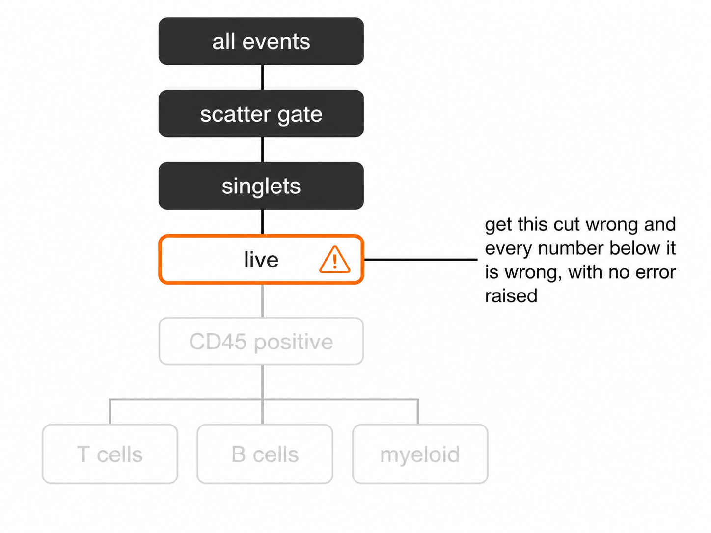
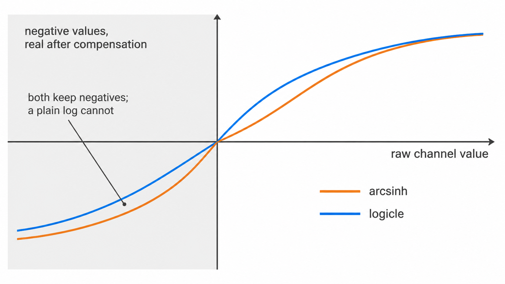
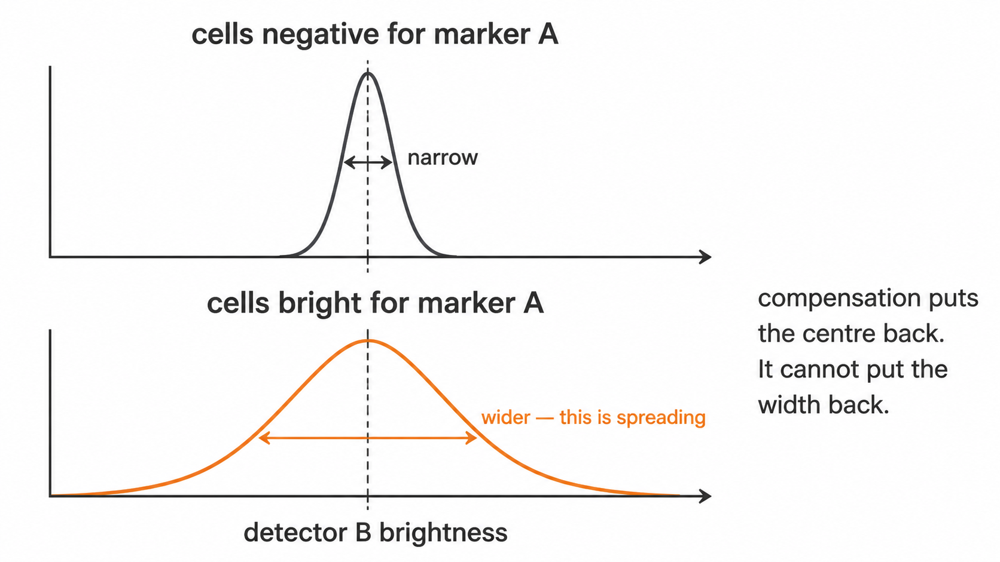

```{r, include = FALSE}
knitr::opts_chunk$set(collapse = TRUE, comment = "#>", eval = FALSE)
```

Everything needed to run cyRAVEN on your own data: install it, run the
demonstration cohort, then build the two input files your own cohort needs.

Work through it in order the first time. The sequence is deliberate, because
each step produces something the next one checks.

1. **Setup** puts the image on your machine.
2. **A complete run** proves the install works, on data that ships with the
   package and needs no download.
3. **Inputs** builds the sample sheet and the config, the only two files you
   write yourself.
4. **The gating specification** says what to score.
5. **Commands and options** is the reference for every flag.

Two habits are worth forming now, because both cost seconds and save whole runs.

Always run `--check` before a real run. It validates the sheet and the
specification against the FCS headers and exits without analysing anything, so a
marker-name mismatch costs a second rather than the run.

Always open `gating_qc.png` before quoting a number. A threshold sitting on the
shoulder of a distribution rather than in its trough is visible there and in no
table the run writes.

## Setup

Docker is the supported path, for a numerical reason rather than convenience:
`uwot` is a stochastic embedder whose output varies with its own version and with
the BLAS beneath it, and every gate is placed at a kernel density minimum, so a
different density implementation moves thresholds and therefore the frequencies
that would be published. The image pins R 4.4.3, a dated CRAN snapshot and
Bioconductor 3.20.

Two ways to get it. They produce the same image; pick by whether you intend to
change the code.

**Pull.** A download rather than a compile, and the image the worked example and
every published run here was produced with.

```bash
docker pull bhagesh/cyraven:1.0.0
```

```bash
docker tag bhagesh/cyraven:1.0.0 cyraven:1.0.0
```

The `docker tag` line only exists so every command on this site can say
`cyraven:1.0.0`. Substitute `bhagesh/cyraven:1.0.0` throughout instead if you
prefer.

**Build.** For a modified source tree, an air-gapped host, or if you would rather
not run a third-party image.

```bash
git clone https://github.com/bhagesh-h/cyRAVEN.git
```

```bash
cd cyRAVEN
```

```bash
docker build -f inst/scripts/Dockerfile -t cyraven:1.0.0 .
```

The build context is the repository root, the directory holding `DESCRIPTION`.
The first build compiles the dependency stack and takes 15 to 25 minutes. It ends
by running `--help` and printing every package version, so a broken image fails
at build time rather than during an analysis.

Both pin R 4.4.3, the same dated CRAN snapshot and Bioconductor 3.20, so they are
numerically interchangeable. Check what you have with:

```bash
docker run --rm --entrypoint Rscript cyraven:1.0.0 \
  -e 'cat(as.character(packageVersion("cyRAVEN")), R.version.string)'
```

Prints:

```
1.0.0 R version 4.4.3 (2025-02-28)
```

Local installation, for development or where Docker is unavailable, is in the
[README](https://github.com/bhagesh-h/cyRAVEN#installation-without-docker).

## A complete run in five minutes

No data of your own required, and nothing downloaded: the demonstration cohort
ships inside a package cyRAVEN already depends on.

Four commands, one block each. Copy and run them one at a time.

**1. Make the folders.**

```bash
mkdir -p demo results
```

**2. Write the cohort, its sample sheet and its config.**

```bash
docker run --rm -v "$PWD/demo:/demo" \
  --entrypoint Rscript cyraven:1.0.0 \
  /opt/cyraven/src/inst/scripts/demo_data.R /demo
```

**3. Validate the inputs, in seconds, without analysing anything.**

```bash
docker run --rm -v "$PWD/demo:/data:ro" -v "$PWD/results:/results" \
  cyraven:1.0.0 --dir /data/fcs \
  --samples /data/samples.csv --config /data/panel.yaml \
  --group-column cohort --reference-group "GvHD grade 1" \
  --batch-column visit --outdir /results --check
```

**4. Run it, then open `results/report.html`.**

```bash
docker run --rm -v "$PWD/demo:/data:ro" -v "$PWD/results:/results" \
  cyraven:1.0.0 --dir /data/fcs \
  --samples /data/samples.csv --config /data/panel.yaml \
  --group-column cohort --reference-group "GvHD grade 1" \
  --batch-column visit --cluster --outdir /results
```

On Windows PowerShell substitute `${PWD}` for `$PWD`; on Git Bash prefix with
`MSYS_NO_PATHCONV=1`.

This writes 24 figures and 35 tables from 35 samples across five allogeneic
transplant recipients. `report.html` carries all of them embedded in one
self-contained file, in the order they have to be read.

## Your own data

Two files besides the FCS directory: one CSV with a row per file, and one YAML
declaring what to score.

A sheet with a row for every file, which you then fill in:

```bash
docker run --rm -v "$PWD/data:/data" cyraven:1.0.0 \
  --dir /data/fcs --recursive --write-samples /data/samples.csv
```

The config template:

```bash
docker run --rm --entrypoint sh cyraven:1.0.0 -c \
  'cat /usr/local/lib/R/site-library/cyRAVEN/examples/analysis_template.yaml' \
  > data/analysis.yaml
```

Then `--check` until it reports no problems, then run. The full sequence, and
every option with the situation it is for, is in
[Commands and every option](cyRAVEN.html#commands-and-every-option).

## Inputs: the sample sheet and the config

A run takes two files besides the FCS directory:

| | |
|---|---|
| `samples.csv` | one row per FCS file: what it is, whose it is, which group and batch it belongs to, and any externally measured counts for it |
| `analysis.yaml` | what to score and how: the populations, and every choice shared by all samples |

Between them they specify a run completely. Anything varying per sample belongs
in the CSV; anything that is one decision for the whole study belongs in the
YAML. An analysis choice put in the CSV would repeat on every row and invite the
rows to disagree about it.

Both templates ship with the package:

```bash
docker run --rm --entrypoint sh cyraven:1.0.0 -c \
  'cat /usr/local/lib/R/site-library/cyRAVEN/examples/samples_template.csv'
```

```bash
docker run --rm --entrypoint sh cyraven:1.0.0 -c \
  'cat /usr/local/lib/R/site-library/cyRAVEN/examples/analysis_template.yaml'
```

From R, `system.file("examples", "samples_template.csv", package = "cyRAVEN")`
and `system.file("examples", "analysis_template.yaml", package = "cyRAVEN")`.

### 1. Build the sheet

Do not write it from scratch. Generate one covering every file in the input
directory, then fill in the columns only you know:

```{r two-input-files, eval = TRUE, echo = FALSE, fig.alt = "The sample sheet holds what varies per sample; the config holds one decision for the whole study"}
if (file.exists("images/two-input-files.png")) knitr::include_graphics("images/two-input-files.png")
```

```bash
docker run --rm -v "$PWD/data:/data" cyraven:1.0.0 \
  --dir /data/fcs --write-samples /data/samples.csv
```

Every acquisition gets a row with its filename and a derived identifier, so the
sheet accounts for every file before you touch it. A file the sheet does not
cover is a fatal error rather than a guess: inferring which patient a file
belongs to from plate order silently mislabels patients, and a mislabelled
patient is not visible in any output.

Then check it, which costs seconds because it reads FCS headers and not events:

```bash
docker run --rm -v "$PWD/data:/data:ro" -v "$PWD/results:/results" \
  cyraven:1.0.0 --dir /data/fcs --samples /data/samples.csv \
  --config /data/analysis.yaml --outdir /results --check
```

`--check` reports the markers it resolved from the files, the specification
entries matching none of them, whether the sheet covers every file, the levels
of the group column and their sizes, the number of batches, and the study
variables available. It analyses nothing and writes nothing. Run it after every
edit to the sheet; a marker-name mismatch found here costs a second, and found
during a run costs however long the run had been going.

### 2. Columns of the sheet

Only `file` is required. Everything else is optional, and a column that is
absent simply disables what depends on it.

#### 2.1 Which file this is

| Column | Meaning |
|---|---|
| `file` | The FCS filename. Matched on basename, so a file moved between subdirectories still matches. Required. |
| `sample_id` | The identifier used in every output. Derived from the filename when absent. |
| `well` | Plate well, used as the identifier when `sample_id` is absent. |
| `patient_id` | The subject. Several rows may share one, which is what makes repeat acquisitions and longitudinal designs work. |
| `panel` | Forces a panel assignment. Panels are fingerprinted from the channels otherwise. |
| `timepoint` | Visit or draw. |
| `is_control` | `TRUE` for a control tube. Controls are read and used as references but excluded from between-group tests. Setting it `FALSE` is not the same as leaving it out: `FALSE` asserts that the file is a biological sample, and the assertion matters. See below. |

##### Say `FALSE` rather than saying nothing

An absent `is_control` column means "unknown", not "no controls here". The
distinction has teeth.

A control tube supplies the reference distribution for markers that resolve no
density minimum, and the cut is then the 99.5th percentile of the control. That
is correct when the reference really is unstained. When it is a stained
biological sample, the cut lands at the top of a real distribution and the
population beneath it all but disappears.

Up to version 1.0.0 a sample that failed staining QC could be promoted to that
reference on a sheet that named no controls, on the reasoning that an unlabelled
tube might be one. On a cohort of twelve patient samples with no controls at all,
that put T cells at 0.034% of CD45+ where the correct figure was over a hundred
times higher, with no error and no warning.

cyRAVEN now believes a control only when the sheet declares one, and says so in
the log when it declines to promote a sample. Two habits follow from that:

- Write `is_control` on every row, `FALSE` for samples and `TRUE` for controls.
  `--write-samples` does this for you.
- If most rows of `thresholds_used.csv` read `control_q995` in the `source`
  column, check which sample supplied the reference before reading any
  frequency.
| `fmo_for` | Comma-separated markers this file is the fluorescence-minus-one control for. |
| `control_group` | Confines a control to the samples sharing its value, since a reagent lot changes between batches. |

#### 2.2 Whose it is

These describe the *subject*, so they repeat on every row of that subject.

`patient_id`, `date_of_birth`, `sex`, `age_years`, `height_cm`, `weight_kg`,
`infection_focus`, `cohort`, `wbc_per_ul`.

They are recognised by their canonical name and by the spellings common in
clinical exports, in English and German, so a sheet headed `Geschlecht` or
`Patient ID` resolves without being translated first. Values are coerced the
same way whichever route supplies them: decimal commas, dates whose day and
month order is resolved from the column as a whole, and sex and clinical
vocabulary translated through a dictionary that passes unknown values through
and reports them rather than mangling them. Extend the dictionary under
`metadata:` in the YAML.

Age is derived from `date_of_birth` when it is missing, against
`--reference-date`. Set that to a fixed study date, or ages change as the
calendar moves and two runs of the same data disagree.

**A subject's rows must agree.** This is the one hazard the one-file shape
introduces that separate tables did not have: with a row per file, a patient
with three acquisitions carries three copies of their sex. If two disagree, the
run stops and names every conflict as `subject / column: value vs value`. There
is no defensible way to pick one, and picking silently is how a cohort acquires
a patient who is both male and female depending on which tube you look at.

A blank is not a disagreement. It is filled from the rows that have a value.

#### 2.3 What was measured externally

Any column named `count.<Population>` is read as an externally measured
absolute count for that population, from bead-based or volumetric counting.

```
file,sample_id,count.Granulocytes,count.Monocytes
HC-01.fcs,HC-01,3810,420
```

A frequency is a proportion of a parent gate, so it moves whenever any other
population moves. An absolute concentration does not, which is why these are
worth carrying when the laboratory measured them. Blanks are skipped rather than
read as zero. Units are `cells/uL` unless `samples: count_unit: cells/mL` says
otherwise, in which case values are divided by 1000.

#### 2.4 Everything else

Any other column is kept as a study variable and can be named by
`--group-column` or `--batch-column`, or used as a covariate. Acquisition date,
treatment arm, instrument, operator and site are all ordinary columns; none of
them needs a reserved name. `--check` lists what it found.

### 3. The config

`populations:` is the only required section. Everything else takes a documented
default when omitted, and the default in force is stated in the run log.

Populations, functional blocks and ratios are covered in the
[Gating article](cyRAVEN.html#the-gating-specification); thresholds, colours and metadata dictionaries in
the [Running cyRAVEN](cyRAVEN.html#commands-and-every-option). One section belongs here, because it is
about the sheet:

```yaml
samples:
  group_column: cohort
  batch_column: acquisition_date
  count_unit: cells/uL
```

Naming the roles here means the two files specify the run on their own, with no
further flags. A flag still wins where both are given: the config is the study's
standing choice, the flag is this run's.

### 4. The older three-file format

`--sample-map`, `--patient-table` and `--absolute-counts` still work exactly as
before and are not deprecated. Runs made with them remain reproducible.

They cannot be combined with `--samples`. The sheet carries the same facts, and
two sources of truth for one fact is what this format removes.

The sheet is a different way to supply the same facts, not a different analysis.
The reader splits it into the same three structures the pipeline always consumed
and applies the same coercions by calling the same code. A test runs one study
both ways and compares every output.

Which to use:

| Situation | Use |
|---|---|
| A new study | The sheet. One key, one file, no joins. |
| An existing pipeline built on the three files | Leave it. Nothing has changed. |
| Counts exported by the counting instrument as its own sheet | `--absolute-counts` reads that file's own layout; see the [Output article](advanced.html#every-output-file). Fold it into the sheet only if transcribing it is easy. |

### 5. Worked example

**The image, once. Pull it, or build it from source if you have changed the code -- see the Running cyRAVEN article.**

```bash
docker pull bhagesh/cyraven:1.0.0
```

```bash
docker tag bhagesh/cyraven:1.0.0 cyraven:1.0.0
```

```bash
mkdir -p data results
```

**Put the FCS files in data/fcs/ a sheet covering every file.**

```bash
docker run --rm -v "$PWD/data:/data" cyraven:1.0.0 \
  --dir /data/fcs --write-samples /data/samples.csv
```

**Edit samples.csv: patient_id, cohort, and any study variable a config: start from the shipped template.**

```bash
docker run --rm --entrypoint sh cyraven:1.0.0 -c \
  'cat /usr/local/lib/R/site-library/cyRAVEN/examples/analysis_template.yaml' \
  > data/analysis.yaml
```

**Edit populations: to match the panel. --check lists the marker names. validate, in seconds.**

```bash
docker run --rm -v "$PWD/data:/data:ro" -v "$PWD/results:/results" \
  cyraven:1.0.0 --dir /data/fcs --samples /data/samples.csv \
  --config /data/analysis.yaml --outdir /results --check
```

**Run.**

```bash
docker run --rm -v "$PWD/data:/data:ro" -v "$PWD/results:/results" \
  cyraven:1.0.0 --dir /data/fcs --samples /data/samples.csv \
  --config /data/analysis.yaml --group-column cohort \
  --reference-group "Healthy controls" --batch-column acquisition_date \
  --cluster --outdir /results
```

Open `results/report.html`. It carries every figure and table the run produced,
embedded, and needs no other file.

### 6. When it goes wrong

A run that fails writes `report.html` anyway, with the error, the stage it
reached, the log leading up to it, what the error means for the data, and the
next action. Everything produced before the failure is embedded below the
diagnosis, because that partial output is usually where the evidence is.

The errors this format can raise, and what each means:

| Message | Cause |
|---|---|
| `these input files are not in the sample sheet` | The sheet has no row for a file. Add rows, or regenerate with `--write-samples`. |
| `conflicting values for the same subject` | Two rows of one subject disagree. The message names each conflict. |
| `duplicate file entries` | Two rows name the same file. |
| `must contain a 'file' column` | The one required column is missing. |
| `--samples supersedes ...` | The sheet was combined with a flag it replaces. |

Every population reported `UNAVAILABLE`, or an empty frequency table, is almost
always a marker name that does not match `$PnS` exactly. `--check` lists every
marker the files carry and names the specification entries matching none of
them.

## The gating specification

Cell identification in cyRAVEN proceeds in three stages: exclusion of
non-cellular and non-viable events, placement of per-sample marker thresholds,
and evaluation of a declarative population specification against those
thresholds. This article documents each stage and the parameters governing it.

### 1. Hierarchy

Four sequential gates precede any marker evaluation. Each is derived from the
data rather than transferred between samples.

```{r hierarchy-inheritance, eval = TRUE, echo = FALSE, fig.alt = "A gate tree in which one wrong cut fades every population beneath it"}
if (file.exists("images/gate-hierarchy-inheritance.png")) 
```

**1.1 Scatter.** The lower forward-scatter bound is placed at the deepest minimum
of the log<sub>10</sub> FSC-A density. Sub-cellular debris forms a distinct
low-scatter mode separated from intact cells; the minimum between them is the
boundary.

**1.2 Singlets.** Coincident events traverse the interrogation point over a
longer interval than single cells, producing a pulse whose area is inflated
relative to its height. Events are retained within median ± *k*·MAD of the
FSC-H:FSC-A ratio computed inside the scatter gate, with *k* set by
`--singlet-mad-k` (default 3).

**1.3 Viability.** Amine-reactive viability dyes penetrate only cells whose
membrane integrity has been lost. Dead cells are excluded at the density minimum
of the dye channel. Panels without a viability marker skip this gate, and the
omission is logged.

**1.4 CD45.** Leukocytes are selected on CD45, which is expressed across
haematopoietic lineages and absent from erythrocytes and platelets. Where CD45 is
not in the panel, all viable events become the parent and a warning is issued,
since percent-of-leukocytes and percent-of-viable are not interchangeable
denominators.

All subsequent population frequencies are expressed as a percentage of the
CD45<sup>+</sup> parent.

### 2. Thresholding

#### 2.1 Rationale

Staining index varies between samples through reagent lot, fluorochrome
degradation, time between staining and acquisition, and cellular autofluorescence.
A threshold transferred between samples is therefore mis-specified in both
directions: conservative in dim samples, permissive in bright ones. The resulting
bias is systematic and correlated with acquisition order, which is the
configuration most likely to be confounded with study group.

#### 2.2 Implementation

For each marker, within each sample, the density of cells passing the parent gate
is evaluated and the threshold placed at the minimum separating the negative from
the positive mode. `density_valley()` returns `NA` where the distribution is
unimodal. `resolve_threshold()` then attempts an unstained control if one is
declared in the sample map, and falls back to a fixed quantile otherwise.

#### 2.3 Interpretation

`thresholds_used.csv` records one row per sample and marker. Two columns
determine how far a downstream frequency can be trusted.

`threshold` is the value applied.

`source` is `valley` where a density minimum was resolved and
`quantile_fallback` where none existed. A fallback indicates that the marker did
not separate positive from negative events in that sample. Frequencies derived
from a fallback threshold are not invalid, but they carry no evidence of
separation. A marker falling back across the majority of samples is not
resolving in that panel, and no gating strategy will recover it.

`threshold_scale_qc.csv` reports, per panel and marker, the median threshold
across samples and the robust *z* of each deviation from it. Thresholds flagged
here are the first candidates for manual review.

#### 2.4 Precision

`source` is a three-valued summary of how a threshold was obtained. It does not
say how well determined the value is, and two cuts both recorded as `valley` can
differ by an order of magnitude in that respect: one sitting in a wide, empty gap
between well-separated modes, the other on a shallow dip that a slightly
different histogram would not have found.

`threshold_uncertainty.csv` supplies the missing quantity. Each cut is re-derived
from resamples of the events it was computed on, giving the component that comes
from having counted a finite number of cells, and again across the settings
`density_valley()` takes, giving the component that comes from the choices this
package makes on the analyst's behalf. The two combine in quadrature.

`bootstrap_valley_rate` is the more direct reading of the two. A cut recovered in
every resample marks a real boundary; one recovered in half of them was found by
histogram noise that happened to clear the relative-depth rule, and a wide
interval understates how little is there.

`uncertainty_budget.csv` carries the consequence through to the populations.
Each marker a population reads contributes a term, as does the CD45 parent
threshold, which enters every population because it fixes the denominator.
The [diagnostics article](advanced.html#diagnostics-in-reading-order) covers how to read the result.

#### 2.4a Reference controls

`resolve_threshold()` falls back to a control distribution when no density
minimum exists. Which control that is decides what the resulting cut means.

An unstained tube, declared through `is_control`, shows where autofluorescence
ends. It cannot show where a marker's background ends in a panel, because a
stained sample's negative population sits wider than an unstained one under
spillover from every other fluorochrome present.

A fluorescence-minus-one control is the same panel with one reagent omitted, so
its distribution in that channel is the negative population under the spreading
the real samples experience. Declare one through two optional sample-map columns:
`fmo_for`, naming the markers the file controls for, and `control_group`,
confining it to the batch it was acquired in. The resulting `source` is
`fmo_q995` rather than `control_q995`.

`fmo_agreement.csv` is the reason to supply one rather than merely the means. It
reports the distance between the derived cut and its FMO-anchored equivalent in
units of that threshold's own uncertainty. Within about one, the two agree to the
precision either can claim and the derived cut is corroborated by an independent
experiment. Beyond about three they disagree by more than either can explain: a
derived cut far above the FMO is discarding real signal, and one far below is
calling spillover positive.

#### 2.4b Overriding one sample's cut

A threshold flagged for review previously admitted two responses: accept it, or
pin that marker for the whole run through `thresholds:`. The second corrects one
tube by applying one number to every sample, which reintroduces the
fixed-coordinate bias section 2.1 describes.

A `sample_overrides:` block corrects one sample and one marker:

```yaml
sample_overrides:
  D07:
    CCR7:
      threshold: 2.15
      reason: "valley sat inside the negative mode, see gating_qc.png"
      set_by: "initials"
```

The resulting `source` is `manual`, distinct from `config`: the first records
that a named person moved one cut for a stated reason, the second that the assay
declares this cut everywhere. `thresholds_used.csv` gains `override_reason` and
`override_by`, and the run manifest lists every override. An entry matching no
sample or marker in the cohort is reported rather than silently ignored.

#### 2.5 Sufficiency

Precision of placement and sufficiency of counting are separate guarantees, and a
population can have one without the other. A cut through a wide empty gap is
well determined however few cells sit beyond it.

`u_counting_pct_points` in `population_frequencies.csv` is what the frequency
carries from the number of events behind it, computed as the Wilson half-width at
one standard deviation. The ordinary binomial standard error is not used because
it evaluates to zero when no events were observed, which asserts certainty about
a population that was never seen.

`lod_pct` and `loq_pct` express the conventional twenty and fifty events as
percentages of that sample's parent gate, and `detection` states which side of
them the population falls. Both are properties of the acquisition rather than of
the gating strategy: a population below the limit of quantification is not
mis-gated, it is under-sampled, and no threshold placement recovers it.

Because the denominator is the parent-gate events this run saw,
`--max-events-per-file` raises both limits in proportion. A population reported
below the limit of a subsample may be perfectly well resolved in the full file.

None of this alters a threshold. The value in `thresholds_used.csv` is
`density_valley()` at its defaults on the real events, with or without the
analysis; the perturbation runs on copies.

#### 2.5 Stability across runs

The comparison in `threshold_scale_qc.csv` is against the other samples of the
same run, which identifies one deviant tube among many sound ones. It is blind to
a cohort that moved together, because the peer median moves with it.

`--write-baseline` records where an accepted run placed each threshold and how
variable it was; `--baseline` measures a later run against that record. This is
the check that survives a laser service, a reagent lot change or a year between
acquisitions.

### 3. Specification

#### 3.1 Syntax

Populations are declared in the `populations:` block of the `--config` YAML as
conjunctions of marker directions.

```yaml
populations:
  CD4 T cells:
    CD3: above
    CD4: above
    CD8: below
  Central memory CD4:
    CD3: above
    CD4: above
    CD8: below
    CCR7: above
    CD45RA: below
```

An event is assigned to a population when it satisfies every declared direction
against that sample's thresholds. The first entry above is the conventional
definition of a CD4 T cell, expressed in a form the scoring stage can evaluate.

#### 3.2 Directions

`above` and `below` denote expression and its absence. If the terms in this
section are unfamiliar, [Flow cytometry for
dummies](flow-cytometry.html) covers events, cuts, scatter and the
pulse suffixes from the beginning.

`intermediate` addresses markers with three resolvable levels. CD14 in monocyte
subsetting is the canonical case: classical monocytes are CD14<sup>++</sup>,
intermediate monocytes CD14<sup>+</sup>CD16<sup>+</sup>, and non-classical
monocytes CD14<sup>dim</sup>. The upper bound of the intermediate interval is
derived from a second density minimum within the positive fraction. Where no
second minimum exists the population is reported UNAVAILABLE rather than being
merged into the bright fraction.

#### 3.3 Construction

1. Enumerate the panel. `thresholds_used.csv` from any run lists every resolved
   marker; the `$PnS` keyword of any file in the batch carries the same
   information.
2. Declare lineage-level populations first and confirm they score plausibly
   before adding subsets. An error in the CD3 gate propagates to every T cell
   subset beneath it.
3. Pass the file with `--config`. The same file optionally carries threshold
   overrides, colour assignments and metadata translations.
4. Read the run log. A population whose markers are not all present is reported
   UNAVAILABLE and scored as absent. An empty frequency table almost always
   indicates a nomenclature mismatch between the specification and `$PnS` rather
   than a biologically absent population.

`system.file("config", "config_cohorts.yaml", package = "cyRAVEN")` provides the
file structure; replace the populations with those of the panel in use.

#### 3.4 Default

The built-in specification describes a myeloid and lymphoid panel comprising
CD14, CD16, CD19, CD56 with NKG2D, CD127 with CD25, and the gamma-delta T cell
receptor chains. A T cell panel of CD3, CD4, CD8, CD38, HLA-DR, CCR7 and CD45RA
intersects it in three populations of fifteen. It is a worked example, not a
default suitable for arbitrary panels.

#### 3.5 Markers read inside a population

A marker can be used to define a population or measured inside one. The two are
different questions, and the second is declared in `functional_blocks:`.

```yaml
functional_blocks:
  CD33 on gated myeloid subsets:
    markers: [CD33]
    populations: [Granulocytes, Monocytes]
  activation:
    markers: [CD69, HLA-DR, CD25]
    require: CD3
  exhaustion:
    markers: [LAG-3, TIM-3, PD-1]
    exclude: [Classical monocytes, Non-classical monocytes]
```

Each block reports its markers' median intensity and percent positive within the
populations it is scoped to, and `functional_markers_stats.csv` tests them
between groups exactly as abundance is tested. Scope is resolved in one of three
ways, in this order of precedence: an explicit `populations:` list; `require:`, a
marker whose direction must be `above` in a population's definition for that
population to be included; or `exclude:`, a list omitted from an otherwise
complete set. Expressing scope as a rule means adding a population to
`populations:` scores it under the right blocks with no further edit.

`population_marker_mfi.csv` already reports every marker in every population.
The point of a block is the scoping, and it has one requirement that matters: a
marker must not be read inside a gate its own threshold helped draw. Testing CD15
within a CD15-positive population returns 100 percent in every sample, so the
result has zero variance and an undefined p-value, and it measures the definition
rather than the biology. Declaring `functional_blocks:` in the config replaces
the built-in blocks entirely rather than adding to them; see
`?default_functional_blocks` for what those are.

#### 3.6 Ratios between populations

```yaml
ratios:
  gran_lymph:
    label: "Granulocyte:lymphocyte ratio"
    numerator: Granulocytes
    denominator: Lymphocytes
```

A ratio of two declared populations is written to `population_ratios.csv` and
tested with the same statistics as any abundance. It is declared rather than
computed after the fact because when both populations are percentages of the same
parent, the ratio is not recoverable from either frequency on its own once the
parent has changed between samples.

There is no default. A ratio hard-coded to population names that a given panel
does not contain would be silently meaningless, so the block is opt-in.

#### 3.7 Provenance

The specification is not estimated from the data. A specification fitted to the
samples against which it is subsequently tested cannot be falsified by them, and
falsification is the function of the threshold drift, phenotype concordance and
gate-cluster concordance outputs.

Data-driven proposal is available and kept separate. `--explain-clusters` derives
two-marker gate geometry for any cluster the specification does not describe,
with performance measured on held-out cells, and writes it to
`cluster_gate_proposals.csv`. Promotion of a proposal to a named population is a
manual decision, and the following run reads an edited specification.

### 4. Transformation

#### 4.1 Scale

```{r transform-compare, eval = TRUE, echo = FALSE, fig.alt = "Arcsinh and logicle transforms compared, both keeping the negative values a plain log cannot"}
if (file.exists("images/transform-arcsinh-vs-logicle.png")) 
```

Fluorescence intensities span four to five decades. Untransformed, the negative
population compresses against the axis and mode separation is not resolvable.
Every threshold in section 2 is therefore placed on a transformed scale, and the
choice of transform determines where it lands.

#### 4.2 Arcsinh

The default. The cofactor governs the width of the quasi-linear region near zero
and is estimated per panel by bisection until the interquartile range of the
background distribution reaches a target. The conventional value of 5 derives
from mass cytometry and over-expands the background band on spectrally unmixed
fluorescence data, so it is estimated rather than assumed.
`derive_cofactor_pooled()` estimates across samples so that a single weakly
stained file does not set the scale for the batch.

#### 4.3 Logicle

`--transform logicle` implements the automatic logicle rule with linearisation
width *w* = (*m* - log<sub>10</sub>(*t*/|*r*|))/2, where *r* is the fifth
percentile of the negative population. The quasi-linear region near zero
accommodates compensated negative values, which arcsinh cannot represent.

Parameters are pooled across the panel. Per-file fitting, implemented by some
tools, assigns each sample an independent scale and invalidates cross-sample
comparison of medians.

#### 4.4 Consequence

The transform is not a display parameter. On a seven-colour T cell panel,
lineage-level populations agreed within 0.1% between transforms while CCR7 and
CD45RA memory subsets differed by tens of percent.

The mechanism is recorded in `thresholds_used.csv`. Under arcsinh the CCR7
threshold resolved to a density minimum in some samples and to a quantile
fallback in others, a difference of approximately 2.5 units on that scale. Under
logicle a minimum was resolved in every sample. For dim markers without clear
bimodality the transform determines whether a stable threshold exists at all,
which makes the `source` column a prerequisite for interpreting any memory subset
frequency.

`--transform none` bypasses transformation for pre-transformed input.

### 5. Compensation

Fluorochrome emission spectra overlap, so signal from one dye is registered in
detectors assigned to others. Uncorrected, this produces apparent positivity in
channels the cell does not express.

```{r spillover-spreading, eval = TRUE, echo = FALSE, fig.alt = "Compensation restores the centre of a distribution but cannot restore its width"}
if (file.exists("images/spillover-spreading.png")) 
```

The spillover matrix is determined at acquisition from single-stain controls and
stored in the FCS keyword block. cyRAVEN applies it where present and reports its
absence. Spectral instruments write unmixed data with no matrix, so
`maybe_compensate()` detects rather than assumes, since applying compensation
twice is as damaging as omitting it.

Matrix construction is out of scope. It belongs in acquisition software, where
the single-stain controls can be inspected.

#### 5.1 What compensation cannot undo

Subtracting a fluorochrome's expected contribution to another detector is correct
on average. What the subtraction cannot remove is the photon-counting variance
that came with the contribution, so a channel receiving spillover from a bright
neighbour has a negative population that is correctly centred and abnormally
wide. Two modes that were separable merge, the valley fills in, and section 2.3
reports `quantile_fallback` with no indication of why.

`spreading_receivers.csv` supplies the cause. For each ordered channel pair, the
spread of the receiver's negative population is compared between cells negative
and positive for the source; restricting to the receiver's own negatives is what
makes this spreading rather than biology, since co-expression moves the positive
cells and not the width of the negatives. `spreading_pairs.csv` holds the full
pairwise ranking.

The finding to act on is the join between the two: a marker that both falls back
to a quantile in most samples and receives substantial spreading is reported as a
panel design problem. No gating strategy recovers a cut that spreading has
erased.

This is a ranking computed from the samples in hand, not a spillover spreading
matrix. The published SSM is derived from single-stain controls, which this
package is not given, and the values here are not comparable with it.

## Commands and every option

One page for every way to run the pipeline: the commands for each task, in Docker
and in R, and every option with the situation it is for.

Part 1 is the commands. Part 2 is how to choose between the options that matter.
Part 3 is the exhaustive reference.

### Part 1. Commands

#### 1.1 Docker or R

Both call the same `run_cyraven()`. The command-line front end is
`system.file("scripts", "cyraven.R", package = "cyRAVEN")`, which is what the
container entrypoint executes.

| | Docker | R |
|---|---|---|
| Use it when | Results will be published, shared or compared against another machine | Developing, exploring, or Docker is unavailable |
| Reproducible | Yes: R 4.4.3, a dated CRAN snapshot and Bioconductor 3.20 are pinned | Only against your own library |
| Option syntax | `--group-column cohort` | `group_column = "cohort"` |
| Paths | Inside the container | On the host |

Docker is the supported path, and the reason is numerical rather than
convenience: `uwot` is a stochastic embedder whose output varies with its own
version and with the BLAS beneath it, and every gate is placed at a kernel
density minimum, so a different density implementation moves thresholds and the
frequencies derived from them.

Every option name is the same in both. Replace hyphens with underscores:
`--group-column` becomes `group_column = `. Flags that take no value become
`TRUE`: `--cluster` becomes `unsupervised = TRUE`. `docker run --rm
cyraven:1.0.0 --help` prints the list at the version installed.

#### 1.2 Get the image, once

Two routes to the same image. Which one you want depends on a single question:
**are you going to change the source?**

| Situation | Route |
|---|---|
| Running cyRAVEN as released | **Pull.** A download, not a 20-minute compile |
| Reproducing the worked example or a published run | **Pull.** It is the image those were produced with |
| You edited `R/`, the Dockerfile, or the config templates | **Build.** A pull cannot contain your changes |
| Air-gapped host, or policy against third-party images | **Build.** |
| No Docker Hub account and rate-limited | **Build**, or authenticate with `docker login` |

##### Pull

```bash
docker pull bhagesh/cyraven:1.0.0
```

```bash
docker tag bhagesh/cyraven:1.0.0 cyraven:1.0.0
```

`bhagesh/cyraven:latest` tracks the most recent release. Pin the version for
anything you intend to publish. `latest` moving under you is exactly the
reproducibility failure the pinned image exists to prevent.

The `docker tag` line exists only so that every command in this article can say
`cyraven:1.0.0`. If you skip it, substitute `bhagesh/cyraven:1.0.0` wherever
`cyraven:1.0.0` appears below.

##### Build

The Dockerfile refers to paths inside the package, so the build context is the
repository root, the directory holding `DESCRIPTION`.

```bash
git clone https://github.com/bhagesh-h/cyRAVEN.git
```

```bash
cd cyRAVEN
```

```bash
docker build -f inst/scripts/Dockerfile -t cyraven:1.0.0 .
```

15 to 25 minutes on a first build. It ends by running `--help` and printing every
package version, so a broken image fails at build time rather than during an
analysis.

##### Either way

Both pin R 4.4.3, the same dated CRAN snapshot and Bioconductor 3.20, so a pulled
and a built image are numerically interchangeable. Confirm which you have:

```bash
docker images | grep cyraven
```

Prints one line per image already present, or nothing at all:

```
bhagesh/cyraven   1.0.0   8261eb7fc1e0   2.59GB
cyraven           1.0.0   8261eb7fc1e0   2.59GB
```

```bash
docker run --rm --entrypoint Rscript cyraven:1.0.0 \
  -e 'cat(as.character(packageVersion("cyRAVEN")), R.version.string)'
```

Prints:

```
1.0.0 R version 4.4.3 (2025-02-28)
```

Every run also writes the image's package versions into `run_manifest.txt`, so a
result folder records what produced it whichever route you took.

#### 1.3 A first run on a new cohort

Each step is cheap and catches what the next would otherwise waste time on. Every
block below is one command, meant to be copied on its own and run before the next
is copied. Steps 2 and 4 are edits you make in a text editor, not commands, which
is the other reason these are not one block: copying a numbered list of commands
and comments into a terminal in one go runs them all before you have looked at
anything.

**1. Make the folders and put the FCS files in `data/fcs/`.**

```bash
mkdir -p data results
```

**2. Write a sheet with a row for every file.**

```bash
docker run --rm -v "$PWD/data:/data" cyraven:1.0.0 \
  --dir /data/fcs --recursive --write-samples /data/samples.csv
```

**3. Edit `data/samples.csv`** and fill in `patient_id`, `cohort` and any study
variable. No command; open it in a spreadsheet or a text editor.

**4. Start the config from the shipped template.**

```bash
docker run --rm --entrypoint sh cyraven:1.0.0 -c \
  'cat /usr/local/lib/R/site-library/cyRAVEN/examples/analysis_template.yaml' \
  > data/analysis.yaml
```

**5. Edit `populations:` in `data/analysis.yaml`** to match your panel. Again an
edit, not a command.

**6. Validate, in seconds, analysing nothing.**

```bash
docker run --rm -v "$PWD/data:/data:ro" -v "$PWD/results:/results" \
  cyraven:1.0.0 --dir /data/fcs --recursive \
  --samples /data/samples.csv --config /data/analysis.yaml \
  --outdir /results --check
```

**7. Repeat steps 5 and 6** until `--check` reports no problems. Then run it.

```bash
docker run --rm -v "$PWD/data:/data:ro" -v "$PWD/results:/results" \
  cyraven:1.0.0 --dir /data/fcs --recursive \
  --samples /data/samples.csv --config /data/analysis.yaml \
  --group-column cohort --reference-group "Healthy controls" \
  --outdir /results
```

**8. Open `results/report.html`.**

The two input files are described in the [Inputs article](cyRAVEN.html#inputs-the-sample-sheet-and-the-config).

In R:

```r
library(cyRAVEN)

opt <- list(dir = "data/fcs", recursive = TRUE, outdir = "results/",
            samples = "data/samples.csv", config = "data/analysis.yaml",
            group_column = "cohort", reference_group = "Healthy controls",
            seed = 42)

run_cyraven(c(opt, list(check_only = TRUE)))   # validate
run_cyraven(opt)                                # run
```

#### 1.4 The full analysis

Batch diagnostics and the unsupervised check are opt-in because each adds
outputs and runtime.

```bash
docker run --rm -v "$PWD/data:/data:ro" -v "$PWD/results:/results" \
  cyraven:1.0.0 \
  --dir /data/fcs --recursive \
  --samples /data/samples.csv --config /data/analysis.yaml \
  --group-column cohort --reference-group "Healthy controls" \
  --batch-column acquisition_date --cluster \
  --covariates age,sex --reference-date 2025-01-01 \
  --no-session \
  --outdir /results
```

#### 1.5 A cohort that must fit in memory

Peak memory is set by the events held at once, not by the number of files.

```bash
docker run --rm -v "$PWD/data:/data:ro" -v "$PWD/results:/results" \
  cyraven:1.0.0 \
  --dir /data --recursive \
  --samples /data/samples.csv --config /data/analysis.yaml \
  --max-events-per-file 300000 \
  --cells-per-sample 6000 --max-cells 150000 \
  --no-session --outdir /results
```

Run one analysis at a time. The stages are already multi-threaded, so nothing is
gained by running containers in parallel, and two concurrent runs at these
settings will exhaust a workstation. A run killed by the out-of-memory killer
exits 137 and writes no report, because SIGKILL runs no handler.

Subsampling raises every detection limit in proportion, because it lowers the
parent-gate count each frequency is a fraction of.

#### 1.6 Comparing runs over time

**Once, on the run being adopted as the reference.**

```bash
docker run --rm -v "$PWD/data:/data:ro" -v "$PWD/results:/results" \
  cyraven:1.0.0 --dir /data/fcs --samples /data/samples.csv \
  --config /data/analysis.yaml --outdir /results \
  --write-baseline /results/baseline.rds
```

**On every later run.**

```bash
docker run --rm -v "$PWD/data:/data:ro" -v "$PWD/results2:/results" \
  -v "$PWD/results/baseline.rds:/baseline.rds:ro" \
  cyraven:1.0.0 --dir /data/fcs --samples /data/samples.csv \
  --config /data/analysis.yaml --outdir /results \
  --baseline /baseline.rds --fail-on-drift
```

`--fail-on-drift` exits non-zero after every output has been written, so it can
gate a pipeline without costing the diagnostics that explain the failure.

#### 1.7 The demonstration cohort

No data of your own required, and nothing downloaded.

```bash
mkdir -p demo results
```

```bash
docker run --rm -v "$PWD/demo:/demo" \
  --entrypoint Rscript cyraven:1.0.0 \
  /opt/cyraven/src/inst/scripts/demo_data.R /demo
```

```bash
docker run --rm -v "$PWD/demo:/data:ro" -v "$PWD/results:/results" \
  cyraven:1.0.0 --dir /data/fcs \
  --samples /data/samples.csv --config /data/panel.yaml \
  --group-column cohort --reference-group "GvHD grade 1" \
  --batch-column visit --cluster --outdir /results
```

Every figure it produces, with what it measures and what this cohort shows, is in
the [worked example](gallery.html).

#### 1.8 Iterating on the code

Mount a checkout and set `CYRAVEN_SOURCE`; the entrypoint loads that tree through
`pkgload::load_all()` instead of the installed copy, so edits take effect without
a rebuild.

```bash
docker run --rm -v "$PWD:/src:ro" -v "$PWD/data:/data:ro" \
  -v "$PWD/results:/results" -e CYRAVEN_SOURCE=/src \
  cyraven:1.0.0 --dir /data/fcs --outdir /results
```

#### 1.9 Paths, mounts and platforms

Every path inside a flag is a path inside the container. `--outdir` must fall
within a mounted volume or the output is discarded when the container exits.

| Platform | Substitution |
|---|---|
| Linux, macOS | as written |
| Windows PowerShell | `${PWD}` for `$PWD` |
| Git Bash on Windows | prefix `MSYS_NO_PATHCONV=1`, or the shell rewrites `/data` into a Windows path |

Mount the data read-only (`:ro`) so a bug cannot alter raw acquisition files.

### Part 2. Which option to use when

#### 2.1 The rule behind the defaults

Options fall into three classes, and the class fixes the default.

**Additive.** Produces a new output and alters nothing existing. On by default,
because an analysis that has to be requested is one that does not get run. The
`--no-*` flags switch these off.

**Parametric.** Changes how an existing quantity is computed. Defaults are the
values the pipeline was validated with; changing one changes results and is a
decision to record.

**Consequential.** Changes numbers a previous run reported, by design. Off by
default without exception, and recorded in `run_manifest.txt` when used. There
are five: `--transform`, `--correct-batch`, `--drop-unstable-events`,
`--subsample rare` and `--calibration-beads`.

#### 2.2 Choosing by situation

Each of the following is a complete command. `$D` is the mount pair every run
needs, written once here so the recipes stay readable:

```bash
D='-v '"$PWD"'/data:/data:ro -v '"$PWD"'/results:/results'
```

or write the two `-v` flags out in full, as in Part 1.

##### Most thresholds fell back to a quantile

`thresholds_used.csv` shows `source = quantile_fallback` on most rows. The marker
did not separate positive from negative, so the cut carries no evidence of
separation. Try the transform first, because for dim markers it decides whether a
stable threshold exists at all.

```bash
docker run --rm $D cyraven:1.0.0 \
  --dir /data/fcs --samples /data/samples.csv --config /data/analysis.yaml \
  --transform logicle \
  --group-column cohort --reference-group "Healthy controls" \
  --outdir /results
```

If it persists, declare an unstained or fluorescence-minus-one control in the
sheet (`is_control`, `fmo_for`) so the cut has a reference rather than a guess.
If it still persists, the marker is not resolving in this panel and no gating
strategy recovers it; `spreading_receivers.csv` says whether the optics explain
it. `--transform` is consequential: it moves every threshold, so say so when
reporting.

##### A population may exist that the specification does not describe

The declared populations are only ever what was declared. Clustering is the one
output that can contradict them.

```bash
docker run --rm $D cyraven:1.0.0 \
  --dir /data/fcs --samples /data/samples.csv --config /data/analysis.yaml \
  --cluster --explain-clusters \
  --group-column cohort --reference-group "Healthy controls" \
  --outdir /results
```

`--cluster` writes `cluster_gate_agreement_*.csv`: a cluster dominated by no
declared label is a population the specification misses, and a label spread
across many clusters covers several phenotypes. `--explain-clusters` then learns
a two-marker gating strategy for each undescribed cluster and writes
`cluster_gate_proposals.csv`. It is descriptive: it proposes gates and never
changes a scored one. Promoting a proposal to a named population is a manual
edit to the config, and the next run reads it.

##### Samples were acquired on several days or instruments

```bash
docker run --rm $D cyraven:1.0.0 \
  --dir /data/fcs --samples /data/samples.csv --config /data/analysis.yaml \
  --batch-column acquisition_date \
  --group-column cohort --reference-group "Healthy controls" \
  --outdir /results
```

This quantifies the batch structure without altering anything: iLISI against a
permutation null, per-marker distributional drift, and Cramér's *V* between batch
and group.

**Read `batch_group_confounding.csv` before going further.** If *V* is high, the
batches and the groups are the same partition, and correcting the batch removes
the finding. cyRAVEN refuses correction above 0.6 for that reason. Where *V* is
low and the drift is real, add correction:

```bash
docker run --rm $D cyraven:1.0.0 \
  --dir /data/fcs --samples /data/samples.csv --config /data/analysis.yaml \
  --batch-column acquisition_date --correct-batch \
  --group-column cohort --reference-group "Healthy controls" \
  --outdir /results
```

`--correct-batch` is consequential. It applies to the embedding and clustering,
not to per-sample thresholds, which are batch-local by construction.

##### Absolute cell numbers rather than percentages

A frequency is a proportion of a parent gate, so it moves whenever any other
population moves. Add `count.<Population>` columns to the sheet, in cells per
microlitre, and the run tests them alongside the frequencies:

```
file,sample_id,patient_id,cohort,count.Granulocytes,count.Lymphocytes
HC-01.fcs,HC-01,HC-01,Healthy controls,3810,1650
```

```bash
docker run --rm $D cyraven:1.0.0 \
  --dir /data/fcs --samples /data/samples.csv --config /data/analysis.yaml \
  --group-column cohort --reference-group "Healthy controls" \
  --outdir /results
```

No extra flag: the columns are recognised by their prefix. `absolute_counts_qc.png`
compares the supplied counts against the frequencies cyRAVEN measured, which is
how a transcription error or a name mismatch is caught. Where the counting
instrument exports its own sheet and transcription is not worth it, use
`--absolute-counts <file>` instead.

##### The same assay runs repeatedly and must not drift

Record where the accepted run placed its thresholds:

```bash
docker run --rm $D cyraven:1.0.0 \
  --dir /data/fcs --samples /data/samples.csv --config /data/analysis.yaml \
  --outdir /results --write-baseline /results/baseline.rds
```

Then test every later run against it:

```bash
docker run --rm $D -v "$PWD/results/baseline.rds:/baseline.rds:ro" \
  cyraven:1.0.0 \
  --dir /data/fcs --samples /data/samples.csv --config /data/analysis.yaml \
  --outdir /results --baseline /baseline.rds --fail-on-drift
```

The within-run peer check already finds one deviant tube among its peers. It
cannot find a cohort that moved as a whole, because the peer median moves with
it; only a baseline from an earlier run can. `--fail-on-drift` exits non-zero
after every output has been written, so it can gate a pipeline without costing
the diagnostics that explain the failure. Omit it while investigating.

##### A longitudinal or paired design

```bash
docker run --rm $D cyraven:1.0.0 \
  --dir /data/fcs --samples /data/samples.csv --config /data/analysis.yaml \
  --paired-column patient_id --condition-column timepoint \
  --group-column cohort --reference-group "Healthy controls" \
  --outdir /results
```

Both flags are required together. Pairing is never inferred: a design where each
donor appears twice is indistinguishable, from the data alone, from one where two
donors happen to share a label, and guessing wrong changes every p-value.

The same two flags also produce `population_trajectories.png`: one line per
patient across the conditions, with the cohort median drawn over them. Add
`--clinical-columns survival_28d` and the lines are coloured by outcome, which is
the comparison a longitudinal design is usually about -- survivors and
non-survivors often differ in the direction each patient moves rather than at any
single timepoint, and a box per timepoint averages exactly that away.

##### A cohort with clinical scores and outcomes

```bash
docker run --rm $D cyraven:1.0.0 \
  --dir /data/fcs --samples /data/samples.csv --config /data/analysis.yaml \
  --group-column infection_focus --reference-group Pulmonary \
  --clinical-columns sofa,survival_28d,crp_mg_l,age_years \
  --outdir /results
```

Any sheet column can be named. `sofa` and `crp_mg_l` are numeric and get
Spearman's rho, `survival_28d` has two levels and gets Wilcoxon with Cliff's
delta, and each effect is written with a percentile bootstrap interval -- which on
a cohort of ten usually spans zero, and seeing that is the point. Read
`clinical_variables_correlation.png` first: p-values are adjusted within each
variable on the assumption that the variables are separate questions, and two
variables correlated with each other are one question asked twice.

##### One sample's threshold is visibly wrong

Where `gating_qc.png` shows the derived cut sitting in a shoulder for one sample
only, correct that sample rather than pinning the marker for all of them. In the
config:

```yaml
sample_overrides:
  PT-01_v1:
    CD14:
      threshold: 2.4
      set_by: "your initials"
      reason: "bimodal but the minimum fell in the shoulder, see gating_qc.png"
```

Then run normally. `set_by` and `reason` are recorded in `run_manifest.txt`, so a
run touched by hand says so in its provenance rather than only in the table it
altered. Setting a fixed threshold for every sample instead would reintroduce the
fixed-coordinate bias the pipeline exists to remove.

##### A rare population is invisible in the embedding

Uniform sampling reproduces each sample's composition, so a population at 0.1%
contributes 0.1% of the drawn cells and forms no cluster.

```bash
docker run --rm $D cyraven:1.0.0 \
  --dir /data/fcs --samples /data/samples.csv --config /data/analysis.yaml \
  --subsample rare --cluster \
  --group-column cohort --reference-group "Healthy controls" \
  --outdir /results
```

Consequential: it changes which cells are embedded, so the UMAP is not comparable
with a uniform run, and `cells_umap.csv` gains a `sampling_weight` column.
Frequencies are unaffected, because they are computed on all events rather than
on the drawn subset.

##### Gates are needed on the instrument or in FlowJo

```bash
docker run --rm $D cyraven:1.0.0 \
  --dir /data/fcs --samples /data/samples.csv --config /data/analysis.yaml \
  --cluster --explain-clusters --export-gates --flowjo-export \
  --outdir /results
```

`--export-gates` writes ISAC Gating-ML 2.0 plus a vertex table, in the linear
units the FCS file stores, so the polygon describes the same region the fit did.
`--flowjo-export` writes UMAP-annotated FCS: open `_ALL_SAMPLES.fcs`, plot UMAP-1
against UMAP-2, and the populations are there as channels.

##### Intensities must be comparable across instruments or over months

```bash
docker run --rm $D -v "$PWD/beads:/beads:ro" cyraven:1.0.0 \
  --dir /data/fcs --samples /data/samples.csv --config /data/analysis.yaml \
  --calibration-beads /beads/rainbow.fcs \
  --calibration-values /beads/lot_values.csv \
  --outdir /results
```

Consequential, and the most far-reaching of the five: conversion happens before
any threshold is derived, so every intensity in the run changes units. A channel
whose fit falls below `--calibration-min-r2` is left in instrument units rather
than converted on a fit that does not hold, and the log says which.

##### Labels from another tool

```bash
docker run --rm $D cyraven:1.0.0 \
  --dir /data/fcs --samples /data/samples.csv --config /data/analysis.yaml \
  --external-labels /data/cycondor_labels.csv --export-gates \
  --outdir /results
```

Learns a gating strategy per supplied label and measures whether it holds on
donors it was not fitted to. Held-out events from the same donors overstate how
well a gate travels; the per-donor minimum in `gate_transferability.csv` does
not. See [Interoperability](advanced.html#using-cyraven-with-cycondor).

##### The run is slow, or the machine runs out of memory

In this order, because the first costs nothing analytically:

**Skip the session file: often most of the wall-clock, none of the results.**

```bash
docker run --rm $D cyraven:1.0.0 \
  --dir /data/fcs --samples /data/samples.csv --config /data/analysis.yaml \
  --no-session --outdir /results
```

**Bound the events read per file, then the cells embedded.**

```bash
docker run --rm $D cyraven:1.0.0 \
  --dir /data/fcs --samples /data/samples.csv --config /data/analysis.yaml \
  --no-session --max-events-per-file 300000 \
  --cells-per-sample 6000 --max-cells 150000 --outdir /results
```

`--no-session` changes no number. `--max-events-per-file` does: it raises every
detection limit in proportion, because it lowers the parent-gate count each
frequency is a fraction of. Run one analysis at a time; the stages are already
multi-threaded.

##### You suspect the specification is missing something

The declared path scores what you declared. It cannot find a population nobody
wrote down, and it cannot see outside the parent gate. Explore mode is the
complement: every event, every eligible channel, no specification.

**Alongside the declared analysis. Writes to results/explore/ and changes NOTHING in the existing output.**

```bash
docker run --rm $D cyraven:1.0.0 \
  --dir /data/fcs --samples /data/samples.csv --config /data/analysis.yaml \
  --group-column cohort --reference-group "Healthy controls" \
  --cluster --explore --outdir /results
```

**...and let the two sides inform each other. The declared run lends explore its per-sample thresholds, so clusters are NAMED rather than guessed at; explore lends the declared run spec_gaps.csv, naming populations that span several clusters and clusters nothing covers.**

```bash
docker run --rm $D cyraven:1.0.0 \
  --dir /data/fcs --samples /data/samples.csv --config /data/analysis.yaml \
  --group-column cohort --reference-group "Healthy controls" \
  --cluster --explore --maybe-learn --outdir /results
```

Without `--maybe-learn` the two are computed in complete isolation, which is the
right default: a check on the specification has to be independent of the
specification to be worth anything.

##### A new panel, and no specification written yet

```bash
# no --config, no --samples. A folder of FCS files is the whole input.
docker run --rm $D cyraven:1.0.0 \
  --dir /data/fcs --explore-only --outdir /results
```

Read `results/explore/explore_report.html`, then curate
`results/explore/explore_suggested_spec.yaml` into a real specification and run
the supervised path with it. Full detail in [Explore mode](advanced.html#explore-mode-unsupervised-discovery).

#### 2.3 The five that change reported numbers

Use these deliberately and say so when you report a result.

| Option | What it changes | Read first |
|---|---|---|
| `--transform logicle` | Every threshold, and therefore every frequency | `gating_qc.png` |
| `--drop-unstable-events` | Every count in an affected file | `acquisition_qc_impact.csv` |
| `--subsample rare` | Which cells are embedded | `cells_umap.csv` gains `sampling_weight` |
| `--correct-batch` | Marker values in the embedding and clustering | `batch_group_confounding.csv` |
| `--calibration-beads` | The units every intensity is expressed in | `calibration_fit.csv` |

#### 2.4 What not to change without cause

`--cofactor` is estimated per panel for a reason: the conventional value of 5
comes from mass cytometry and over-expands the background band on unmixed
fluorescence.

`--batch-max-cramers-v` exists to refuse correction where batch and group are
inseparable. Raising it, or passing `--force-batch-correction`, means the
resulting difference cannot be attributed to biology.

Pinning a threshold in the config applies it to every sample and reintroduces the
fixed-coordinate bias the pipeline exists to remove. Use `sample_overrides:` for
one sample instead.

### Part 3. Every option

The same names are the element names of the list passed to `run_cyraven()`, with
hyphens replaced by underscores.

#### 3.1 Input

| Option | Default | Effect |
|---|---|---|
| `--files` | none | Comma-separated paths, or a glob in quotes |
| `--dir` | none | Directory to search for `.fcs`. Alternative to `--files` |
| `--recursive` | off | Search `--dir` recursively, for cohorts in subdirectories |
| `--pattern` | `[.]fcs$` | Regex for filenames under `--dir`. Any file containing `.fcs` that fails the pattern is listed as a warning rather than silently skipped |
| `--exclude` | compensation controls | Regex; matching paths are dropped after discovery. The default removes single-stain setup files, which carry no CD45 population and form a spurious panel group. `--exclude ''` keeps everything |
| `--max-events-per-file` | 0, meaning all | Read at most N events per file, sampled evenly through the acquisition rather than taken from the start. Bounds peak memory, and raises every detection limit in proportion because it lowers the parent-gate count |
| `--outdir` | `results` | Output directory |

#### 3.2 Inputs and metadata

The standard input is one CSV and one YAML. The three separate tables below them
still work unchanged and are not deprecated, but cannot be combined with
`--samples`. See the [Inputs article](cyRAVEN.html#inputs-the-sample-sheet-and-the-config).

| Option | Default | Effect |
|---|---|---|
| `--samples` | none | The sample sheet: one row per FCS file carrying its identity, its subject's attributes, its study variables and any `count.<Population>` columns. Replaces the three options below |
| `--config` | built-in spec | The analysis: population specification, `functional_blocks`, `ratios`, threshold and `sample_overrides`, colours, metadata dictionaries, and the `samples:` section naming which sheet column plays which role |
| `--write-samples` | none | Write a sheet template covering every input file, and exit |
| `--check` | off | Validate the inputs from FCS headers alone and exit. Reports resolved markers, specification entries matching none of them, sheet coverage, group levels and sizes, batches and study variables. Seconds rather than the full run |
| `--list-channels` | off | List every acquisition parameter and exit: index, `$PnN`, `$PnS`, and the symbol the run resolves it to, which is the name the specification must use. Also reports whether every file carries the same panel. Needs no sheet and no config, because it answers what to put in one |
| `--ignore-channels` | none | Comma-separated marker names dropped before anything else, including before the panel fingerprint. Names match whole and case-insensitively; a name containing `*` is a glob. See [section 3.2a](#a-channel-that-splits-the-cohort) |
| `--reference-date` | today | `YYYY-MM-DD` used to derive age from date of birth and to place two-digit years. Set it to a fixed study date so ages do not change between runs |
| `--group-column` | resolved `cohort` | Column defining the comparison groups. Enables the between-group figure and tests. Also settable as `samples: group_column:` in the config, which the flag overrides |
| `--reference-group` | first alphabetically | The group every other is tested against. Drawn unfilled and leftmost |
| `--write-config` | none | Derive everything, write the resulting YAML, and exit. Shows what the pipeline detected before time is spent. **Needs `--outdir` as well**: deriving the parameters means reading the files, so the early stages run and write their QC output alongside |

The earlier three-file form:

| Option | Default | Effect |
|---|---|---|
| `--sample-map` | none | CSV linking each filename to a sample, patient, group and control status. Only `file` is required. Also carries `fmo_for` and `control_group` |
| `--patient-table` | none | Clinical covariates keyed on patient identifier. Supplies `wbc_per_ul` for absolute concentrations |
| `--absolute-counts` | none | Externally measured absolute counts, wide format. Requires `--sample-map` |
| `--write-sample-map` | none | Write a sample-map template and exit |

##### A channel that splits the cohort

The panel fingerprint is the set of marker names a file resolves. Files sharing
a set form one panel, and each panel gets its own cofactor, its own embedding
and its own thresholds. That is correct when panels genuinely differ, and
destructive when they do not.

Spectral unmixing is where it usually goes wrong. Unmixing writes the extracted
autofluorescence back as channels, often named `[AF color 1]` and upward, and
how many it writes depends on the sample rather than on the panel. They are not
stains and nothing is measured with them, but they enter the fingerprint like
any other channel, so twelve comparable files can resolve into seven panels of
one or two files each. Every downstream quantity is then derived within a panel
of one, and nothing is comparable to anything.

`--list-channels` shows the resolved names, and `--check` reports markers that
are not present in every file. When the culprit is a nuisance channel, drop it:

```bash
--ignore-channels '[AF color*'
```

The channel is removed before the fingerprint is taken, so the files collapse
back into one panel. Names match whole and case-insensitively, and `*` makes an
entry a glob, so `CD16` matches `CD16` and not `CD161`. Separate several with
commas.

Only drop a channel that carries no signal you intend to use. A real marker
missing from some files is a different problem, and the honest handling of it is
the panel split.

#### 3.3 Transformation and gating

| Option | Default | Effect |
|---|---|---|
| `--transform` | `arcsinh` | `arcsinh`, `logicle` or `none`. **Consequential**: it moves every threshold. For dim markers it decides whether a stable threshold exists at all |
| `--cofactor` | derived per panel | Fixed arcsinh cofactor. The conventional value of 5 comes from mass cytometry and over-expands the background band on unmixed fluorescence, which is why it is estimated rather than assumed |
| `--cofactor-from-first-sample` | off | Derive the cofactor from the first file only, as before pooling was introduced |
| `--logicle-m` | 4.5 | Decades on the logicle display scale |
| `--singlet-mad-k` | 3 | Singlet band half-width in MADs of the FSC-H:FSC-A ratio. The gate is skipped, with a log line, when the two are not distinct channels |
| `--viability-marker` | auto-detect | Name the dye where the pattern is ambiguous |
| `--min-cd45-pct` | 5 | Staining QC floor, percent CD45<sup>+</sup> of live |
| `--include-qc-failed` | off | Keep declared samples that failed staining QC. Admits them to every stage, not only the embedding. Their percentages carry no evidence; under this flag `qc_status` reads `pass` and only the `verdict` column in `staining_qc.csv` records which were forced in |
| `--discover-controls` | off | Let a sample that fails staining QC become the unstained reference for its panel even though the sheet declares no control. See below for why this is off |
| `--adaptive-gates` | off | Choose each threshold by sweeping the kernel bandwidth and trying the tail and Otsu rules, instead of one fixed smoothing with a quantile fallback. **Consequential**: it moves thresholds. See [Placing a threshold when no valley exists](#placing-a-threshold-when-no-valley-exists) |
| `--panel-optional-markers` | none | Comma-separated markers that do not define the panel. A reagent stained in only some files otherwise splits the cohort into separate panels with separate embeddings. Named here, the files stay one panel; a population needing the marker scores where it exists and is UNAVAILABLE where it does not |

### Placing a threshold when no valley exists

`density_valley()` answers one question: where is the deepest separation between
two modes. Where a marker is unimodal it answers `NA`, and the threshold then
comes from a fixed quantile of the parent.

On a spectral panel that is not a rare outcome. On the sepsis cohort this was
written against, **65% of every sample-by-marker cut** came back
`quantile_fallback`, which means two thirds of the gates were placed by the
constant rather than by the data, and the viability gate was skipped in all 20
samples because L/D never resolved.

The markers were not unimodal. The histogram being smoothed -- 220 bins, a
9-bin moving average -- is under-smoothed for these data: L/D showed 32 peaks in
one sample and CD45 showed 10, nearly all of them noise. Widen the kernel and
CD45 resolves to exactly two modes.

`--adaptive-gates` keeps the same vocabulary as openCyto
([Finak and others, 2014](https://doi.org/10.1371/journal.pcbi.1003806)) rather
than inventing one:

| Method | For |
|---|---|
| mindensity over a bandwidth ladder | a genuinely bimodal marker, at whatever smoothing resolves it |
| tailgate | one real mode with a positive tail. The cut sits a robust spread above the mode, estimated by mirroring the half the tail cannot reach |
| Otsu | two classes of comparable size |

Every candidate is then scored the same way: **how deep a density gap the cut
sits in**. That is method-agnostic, needs no per-marker configuration, and
measures the property a gate is supposed to have. Where nothing sits in a gap
the tail rule is preferred over the quantile, because it is anchored to the
sample's own mode and spread rather than declaring a fixed share positive.

Measured on that cohort: quantile fallbacks fell from **65% to under 1%** on
properly gated data, and the viability gate placed at 0.1 to 2.4% dead.

**It cannot find a population that was not stained.** One sample there carries
CD3 at 0.3% positive while its CD45 stains normally. No threshold rule recovers
T cells from a channel holding none, and the selector reports what is there.

### Do not require the parent marker twice

A specification that opens every population with `CD45: above` looks like the
textbook leukocyte gate and is a trap.

The hierarchy has already applied CD45: the parent every population is scored
inside is `cd45_pos`. Repeating the requirement asks for a second CD45 threshold
derived from the cells that passed the first -- a distribution that is all
positive and therefore unimodal. No minimum exists in it, the cut falls back to
the 90th percentile, and an `above` comparison on that fallback keeps exactly
10%.

On the cohort above, CD45 fell back to the quantile in 17 of 20 samples and the
share of parent cells carrying any label came out at 10.0, 9.4, 9.3, 9.8 and
9.5% for the first five. Removing the redundant requirement took classified
cells from **21% to 88%**. Nothing else about the specification changed.

The rule generalises: do not name a marker in a population if a gate above it
has already applied that marker.

#### 3.4 Uncertainty and detection limits

| Option | Default | Effect |
|---|---|---|
| `--no-uncertainty` | on | Skip the gate placement uncertainty analysis. With it off the previous output is reproduced byte for byte |
| `--uncertainty-boot` | 100 | Bootstrap replicates per threshold. Below about 50 the standard uncertainty is itself noisy |
| `--uncertainty-max-events` | 20000 | Events per replicate. The cut is a histogram feature and stops moving well before the whole parent gate is used |
| `--lod-events` | 20 | Events below which a population is reported below the limit of detection |
| `--loq-events` | 50 | Events below which it is detected but not quantified. Roughly a 14% counting CV, against 22% at the detection limit |

#### 3.5 Acquisition and panel quality

| Option | Default | Effect |
|---|---|---|
| `--no-acquisition-qc` | on | Skip the acquisition stability check |
| `--acquisition-bins` | 40 | Equal-width Time intervals per file. More bins resolve a shorter disturbance and make each interval's median noisier |
| `--acquisition-mad-k` | 5 | Robust z above which an interval is flagged |
| `--drop-unstable-events` | off | **Consequential**: exclude the flagged intervals, which changes every count, threshold and frequency in the affected files. Read `acquisition_qc_impact.csv` first |
| `--no-spreading` | on | Skip the spillover spreading report |
| `--spreading-max-samples` | 8 | Samples contributing to the spreading ranking, which stabilises well before a whole cohort is used |

#### 3.6 Embedding

| Option | Default | Effect |
|---|---|---|
| `--cells-per-sample` | 20000 | Cells drawn per sample for the embedding |
| `--max-cells` | 200000 | Overall ceiling per embedding. The per-sample allowance is reduced proportionally if the total would exceed it |
| `--subsample` | `uniform` | `uniform` reproduces the sample's composition; `rare` weights by inverse local density so a population too small to form a cluster can be recovered. **Consequential**: it changes which cells are embedded and adds `sampling_weight` to `cells_umap.csv` |
| `--umap-markers` | built-in lineage list | Comma-separated features. Override this where the default list matches fewer than two markers, rather than relying on the all-eligible fallback |
| `--umap-markers-all` | off | Use every eligible marker instead of preferring lineage markers |
| `--n-neighbors` | 30 | UMAP neighbourhood size. Larger values favour global structure |
| `--min-dist` | 0.3 | UMAP minimum distance. Smaller values pack clusters more tightly |
| `--save-umap-model` | none | Persist the trained model so a later batch can be projected into the same embedding |
| `--umap-model` | none | Project into a saved model instead of embedding fresh. Right for more of the same kind of sample, wrong for a new panel or cell type |
| `--threads` | 0, meaning all cores | UMAP threads |

#### 3.7 Clustering and learned gates

| Option | Default | Effect |
|---|---|---|
| `--cluster` | off | Self-organising map clustering and the cross-check against the specification. The only output that can find a population the specification does not describe |
| `--cluster-k` | 12 | Metaclusters |
| `--cluster-grid` | 10 | SOM grid side; the map has grid<sup>2</sup> nodes |
| `--auto-subcluster-k` | off | Choose the subcluster count per population by mean silhouette. Changes the subcluster lettering, so it is opt-in |
| `--explain-clusters` | off | Learn a two-marker gating strategy for each cluster the specification does not describe. Requires `--cluster`. Descriptive: it proposes gates and never changes a scored one |
| `--explain-max-clusters` | 4 | Ceiling on strategies derived. The largest qualifying clusters are taken and the number skipped is logged |
| `--explain-max-depth` | 4 | Maximum gates in a strategy. More levels raise precision and cost recall; the search stops early when another gate does not earn its place |

#### 3.8 External labels and gate export

| Option | Default | Effect |
|---|---|---|
| `--external-labels` | none | CSV of cell labels from another tool. Learns a gating strategy per label and measures whether it holds on donors it was not fitted to |
| `--external-max-labels` | 6 | Ceiling on labels gated; the largest are taken and the number skipped is logged |
| `--transfer-max-donors` | 8 | Leave-one-donor-out folds. Every fold refits, so cost is one fit per donor per label. The subset is drawn at random rather than taken as the largest donors, because a worst-donor score computed on the best-represented donors is optimistic |
| `--transfer-max-cells` | 20000 | Training cells per fold, stratified by label. The held-out donor is always scored in full |
| `--export-gates` | off | Write learned gates as ISAC Gating-ML 2.0 and as a vertex table, in the linear units the FCS file stores |
| `--flowjo-export` | off | Also write UMAP-annotated FCS for interactive inspection |
| `--flowjo-outdir` | `<outdir>/flowjo` | Directory for that export |
| `--flowjo-no-concat` | off | Skip the concatenated `_ALL_SAMPLES.fcs` |
| `--flowjo-no-groups` | off | Skip the per-group files |

#### 3.9 Statistics

| Option | Default | Effect |
|---|---|---|
| `--p-adjust-display` | `raw` | Which p-value the figure brackets show, `raw` or `BH`. Both are always written to the CSV |
| `--no-differential-state` | on | Skip the sample-level differential-state tests |
| `--no-compositional` | on | Skip the centred log-ratio re-test and its concordance table |
| `--no-confounding` | on | Skip the age and sex confounding diagnostic |
| `--no-group-tests` | on | Keep the grouping but run no between-group test. Figures stay split and coloured by `--group-column` and every per-sample quantity is still reported; the abundance, functional-marker, ratio, absolute-count, marker-state and compositional comparisons are skipped. Diagnostics are unaffected |
| `--min-group-n` | 3 | Minimum samples in a group before it is tested. Groups below it appear in `design_feasibility.csv` instead of being tested |
| `--no-parametric` | on | Skip `parametric_tests.csv` and `posthoc_tests.csv` |
| `--read-threads` | 1 | Read this many FCS files at once. Reading is the slowest stage and each file is independent. Peak memory scales with it, and results do not change |
| `--covariates` | `age,sex` | Patient-table columns screened as confounders |
| `--clinical-columns` | none | Sheet columns to test as clinical variables in their own right -- a severity score, a laboratory value, an outcome flag. Different from `--covariates`: a confounder is screened to decide whether a group difference can be believed, a clinical variable *is* the question. Numeric columns get Spearman, two-level columns Wilcoxon with Cliff's delta, three or more Kruskal-Wallis with epsilon-squared, and p-values are adjusted within each variable. Writes `clinical_association*.csv` and the figures below |
| `--rank-ancova` | off | Additionally fit an exploratory covariate-adjusted rank ANCOVA. At single-digit n per group the adjustment is usually extrapolation; read `confounding_diagnostics.csv` first |
| `--paired-column` | none | Column identifying the pairing unit, for example donor. Requires `--condition-column`. Pairing cannot be inferred, so nothing paired runs without it |
| `--condition-column` | none | Column naming the condition within a pair, for example timepoint |
| `--no-threshold-drift` | on | Skip the check for thresholds that differ systematically between groups |
| `--no-heatmaps` | on | Skip the phenotype and cohort composition heatmaps |
| `--other` | off | Draw the `Other CD45+` catch-all on the UMAP figures. A display choice only: those cells are always gated, counted and tabulated |
| `--no-marker-group-umaps` | off | Skip `marker_umaps_by_group/`. Written by every run: one pooled UMAP per marker over all samples, plus the same marker split by **every category present**. Turn it off for a panel wide enough that this is a folder you do not want |

The pooled panel and the split panels answer different questions. Splitting asks
whether a marker sits differently between categories; pooling asks where the
marker is at all. The second has no other home: each facet holds only a subset of
the cells, and `umap_markers.png` shrinks every marker into one cell of a grid,
so no other figure shows a single marker over the whole cohort at full size.

Every category is drawn, not only the one named by `--group-column`. That flag
decides what is *tested*; it says nothing about what is worth *seeing*, and a
cohort usually carries several categories. Numeric columns are never faceted (one
panel per distinct value), nor are identifiers such as `sample_id` and
`patient_id`, nor single-level columns. Past four categories the extras are named
in the log rather than dropped silently, and `--group-column` moves one to the
front of the list.

#### 3.10 Batch structure

| Option | Default | Effect |
|---|---|---|
| `--batch-column` | `$DATE` where it varies | Column identifying the acquisition batch. Enables iLISI, Cramér's *V*, per-marker distributional drift and the threshold test grouped by batch |
| `--correct-batch` | off | **Consequential**: align each marker across batches by monotone quantile mapping. Applied to the embedding and clustering, not to per-sample thresholds, which are batch-local by construction |
| `--batch-max-cramers-v` | 0.6 | Refuse correction above this association between batch and group. Above it, removing the batch and removing the finding are the same operation |
| `--force-batch-correction` | off | Correct anyway. Recorded in the manifest, and the finding cannot then be attributed to biology |
| `--batch-method` | `quantile` | How a correction is fitted, never whether one is defensible. `quantile` fits one map per marker over the whole file. `cluster` fits one per marker **per cell type**, which a whole-file map cannot do when a detector shift moves bright and dim populations by different amounts. `cytonorm` is a synonym for `cluster` |
| `--batch-cluster-k` | 10 | Cell-type clusters to fit for `--batch-method cluster` |

The refusal is evaluated before `--batch-method` is read, so both methods are
refused on identical evidence. A better alignment algorithm does not make a
confounded design correctable.

`cluster` is fitted in two stages. Clustering the raw matrix would let a large
batch shift become the dominant source of variance, so the clusters would be the
batches, each holding one batch with nothing to align against. The clustering is
therefore fitted on a whole-file-aligned copy and the per-cluster maps on the
original values. Measured on a synthetic three-batch shift: fitted the naive way
it left a mean between-batch gap of 1.296 against whole-file alignment's 0.003;
fitted this way it reaches 0.014 while leaving the true between-cell-type
separation at 3.996 against a true 3.994, where whole-file alignment inflates it
to 4.078.

Whichever method runs, `batch_correction.csv` records it, including on a refusal.

#### 3.11 Calibration

| Option | Default | Effect |
|---|---|---|
| `--calibration-beads` | none | **Consequential**: FCS of calibration beads acquired on the same instrument and settings. Converts channel units to the assigned units before any threshold is derived, so every intensity in the run changes |
| `--calibration-values` | none | CSV of assigned bead values, wide or long. Supplied by the manufacturer for that lot |
| `--calibration-min-r2` | 0.98 | Fit quality below which a channel is left in instrument units rather than converted on a fit that does not hold |

#### 3.12 Conformance across runs

| Option | Default | Effect |
|---|---|---|
| `--write-baseline` | none | Record where this run placed each threshold, how variable it was, how often it needed the fallback, and what the populations came out at. Does not end the run |
| `--baseline` | none | Test this run against a baseline written earlier. Catches drift that moved a whole cohort, which the within-run peer check cannot see |
| `--fail-on-drift` | off | Exit non-zero when any marker or population fails conformance. Raised after every output has been written |

#### 3.13 Reporting and session

| Option | Default | Effect |
|---|---|---|
| `--no-report` | on | Skip `report.html`, the single self-contained file carrying every figure and table the run produced, in the documented reading order |
| `--no-miflowcyt` | on | Skip `miflowcyt.md`, the ISAC-structured record of the instrument and the analysis |
| `--no-session` | on | Skip `session_state.RData`. Worth doing: on a large cohort that file reaches several hundred MB and dominates the runtime, and nothing in the results depends on it |
| `--keep-exprs` | off | Include raw expression matrices in the saved session. Large |
| `--seed` | 42 | RNG seed. Seeded once per run; every stage that consumes draws restores the stream so the embedding cannot shift |

`report.html` embeds every figure at full resolution and every table in full, so
it can be moved, attached or archived on its own; it references no other file and
needs no network. Figures zoom and download at full resolution; tables are
searchable, sortable, paged at 10/50/100/all rows and exportable to CSV exactly
as filtered. A run that fails writes it too, with the diagnosis and everything
produced before the failure.

Its size is the sum of the figures it carries, which on a full run is tens of
megabytes. A table larger than 8 MB is named with its row count rather than
embedded, which in practice means only the per-cell exports; change the limit
with `options(cyRAVEN.report_table_max_mb = )`.

#### 3.14 Logging

Progress goes to stderr through `message()`.

```r
options(cyRAVEN.verbose = "none")     # or "inform" (default), or "debug"
```

## Where to go next

- [Advanced](advanced.html) covers unsupervised discovery, the diagnostics in
  the order they have to be read, every output file, the statistics, and driving
  the pipeline from other tools.
- [Gallery](gallery.html) shows every figure a run produces, with what each one
  measures.
- [Limitations](limitations.html) collects every caveat. Read it before quoting
  any number.
- [About cyRAVEN](about.html) explains the ten stages and why the design is what
  it is.
