```{r, include = FALSE}
# eval = TRUE, unlike the other articles: every chunk here is an
# include_graphics() call whose whole purpose is to place the image.
knitr::opts_chunk$set(collapse = TRUE, comment = "#>", echo = FALSE,
                      out.width = "100%")
```

All 22 figures a run produces, shown as unmodified output, with what each
measures and what this particular run shows. The two further figures the package
can write, and why this cohort cannot produce them, are at the end.

# 0. The data, and how to reproduce every figure below

## 0.1 What the data is

The graft-versus-host disease dataset distributed with flowCore (Brinkman et
al., 2007, *Biol Blood Marrow Transplant* 13:691; Artistic-2.0): peripheral
blood from five allogeneic transplant recipients, drawn at up to seven
successive visits and stained with a four-colour myeloid panel.

| | |
|---|---|
| Samples | 35 |
| Patients | 5 |
| Acquisition batches | 7 successive visits |
| Groups | GvHD grade 1 (7 samples) against grade 3 (28) |
| Panel | CD15, CD45, CD14, CD33, with forward and side scatter and a Time channel |
| Events per file | 2,205 to 66,105, median 12,666 |

Nothing is downloaded. The data ship inside a package cyRAVEN already depends
on, so this example is reproducible offline and cannot break when a repository
moves or a certificate expires. `inst/scripts/demo_data.R` writes them out as
FCS together with the two input files, making two preparation changes and no
others: `$PnS` is reduced from `CD15 FITC` to `CD15`, because cyRAVEN matches
marker symbols exactly; and the single area channel `FL2-A` is dropped, leaving
a consistently height-only file. Event values are written as flowCore ships
them.

## 0.2 The exact sequence

Four commands. This is the whole of it, and it reproduces every figure on this
page.

```bash
# 1. the image, once. Pull it -- this is the image these figures were
#    produced with, so it is the shorter path to the same numbers.
docker pull bhagesh/cyraven:1.1.0
docker tag bhagesh/cyraven:1.1.0 cyraven:1.1.0

#    Or build it from source instead; the build context is the repository root.
#    git clone https://github.com/bhagesh-h/cyRAVEN.git
#    cd cyRAVEN && docker build -f inst/scripts/Dockerfile -t cyraven:1.1.0 .

mkdir -p demo results

# 2. write the cohort, its sample sheet and its config
docker run --rm -v "$PWD/demo:/demo" \
  --entrypoint Rscript cyraven:1.1.0 \
  /opt/cyraven/src/inst/scripts/demo_data.R /demo

# 3. validate the inputs, in seconds, analysing nothing
docker run --rm -v "$PWD/demo:/data:ro" -v "$PWD/results:/results" \
  cyraven:1.1.0 --dir /data/fcs \
  --samples /data/samples.csv --config /data/panel.yaml \
  --group-column cohort --reference-group "GvHD grade 1" \
  --batch-column visit --outdir /results --check

# 4. run
docker run --rm -v "$PWD/demo:/data:ro" -v "$PWD/results:/results" \
  cyraven:1.1.0 --dir /data/fcs \
  --samples /data/samples.csv --config /data/panel.yaml \
  --group-column cohort --reference-group "GvHD grade 1" \
  --batch-column visit --cluster --outdir /results
```

On Windows PowerShell substitute `${PWD}` for `$PWD`; on Git Bash prefix the
`docker run` lines with `MSYS_NO_PATHCONV=1`, or the shell rewrites `/data` into
a Windows path.

Step 3 should report 35 files, four resolved markers, that every marker the
specification names is present, that the sheet covers every file, and the group
sizes. Step 4 writes 22 figures and 31 tables into `results/`, plus
`report.html`, which carries all of them embedded in one file.

## 0.3 What each flag is doing

| Flag | Effect on this page |
|---|---|
| `--group-column cohort` | Enables section 6. Without it there is no between-group comparison and `group_comparison.png` is not written |
| `--reference-group "GvHD grade 1"` | The group the other is tested against, drawn unfilled and leftmost |
| `--batch-column visit` | Enables section 7. Without it `batch_diagnostic.png` and the drift table are absent |
| `--cluster` | Enables `unsupervised_clusters.png` and the gate-cluster concordance tables in section 4 |

The defaults supply everything else: gate uncertainty, detection limits,
acquisition QC and the spreading report are all on unless switched off, because
an analysis that has to be requested is one that does not get run.

## 0.4 Why your figures should match

The container pins R 4.4.3, a dated CRAN snapshot and Bioconductor 3.20, and the
run is seeded once at 42 with every stage restoring the RNG stream. Those two
things together are what make the figures on this page reproducible rather than
merely similar. Run outside the container and the embedding will differ, because
`uwot` is stochastic across its own versions and across the BLAS beneath it.

Every option, and the situation each is for, is in
[Running cyRAVEN](usage.html). The two input files are described in
[Inputs](inputs.html).

## 0.5 Four properties of this cohort that govern how the figures read

**The contrast is disease severity, not disease against health.** Both groups are
transplant recipients; the comparison is GvHD grade 1 against grade 3. There is
no healthy arm.

**The groups are unbalanced and confounded with donor.** Seven samples are grade
1 and 28 are grade 3, and grade is a property of the patient rather than of the
visit, so between-group differences are partly between-donor differences. Section
7 is where that shows.

**The acquisition recorded pulse height and no area.** cyRAVEN falls back to
height and says so. Height understates a bright wide event, so thresholds here
are not interchangeable with those from an area acquisition of the same panel.
The singlet gate is skipped, since it needs FSC-H and FSC-A to be distinct.

**Eight of 35 samples fail staining QC** and are excluded from every test. Twenty-
seven remain.

Which file each figure comes from, and which flag produces it, is in the
[Output article](outputs.html). The order to read them in is in the
[Diagnostics article](diagnostics.html) and is reproduced by `report.html`.

# 1. Before any number

## recon_diagnostics.png

The scatter gate per sample, drawn on the distribution it was derived from.

```{r, fig.alt="Forward-scatter density per sample with the derived scatter gate boundary marked"}
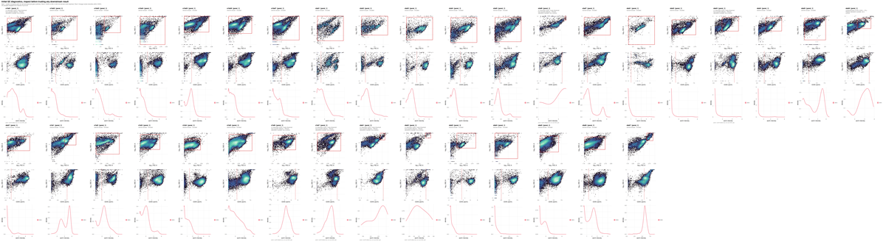
```

**What to look for.** The scatter boundary should sit in the trough between the
debris mode and the intact-cell mode.

**This run.** The log carries `no FSC-A density valley found; using the 60th
percentile`. On this instrument the forward-scatter distribution has no clean
debris shoulder, so the boundary is a quantile rather than a minimum. That is a
fallback, and it is the reason the figure has to be read before anything derived
from it: every population below sits inside a parent gate whose lower edge was
placed by convention rather than by the data.

## gating_qc.png

Every marker threshold superimposed on the density it was derived from.

```{r, fig.alt="Per-sample marker densities with each derived threshold drawn on the distribution it came from"}
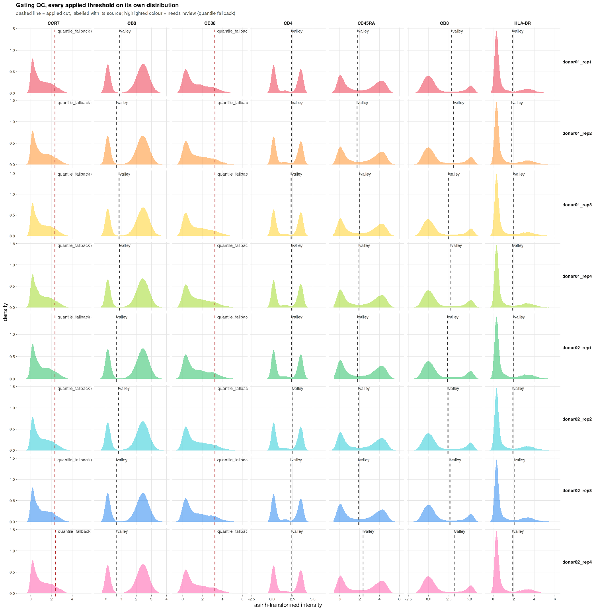
```

**What to look for.** A cut in the trough between two modes is well placed. A cut
on the flank of a single mode is a quantile fallback and carries no evidence of
separation.

**This run.** Of 175 sample-and-marker thresholds, **103 resolved a density
minimum and 72 fell back to a quantile**. The fallbacks are not spread evenly:
`spreading_receivers.csv` in section 5 shows which markers they concentrate in
and why.

# 2. Placement precision and counting sufficiency

## frequency_uncertainty.png

Each population's per-sample frequency with the standard uncertainty propagated
from the thresholds behind it.

```{r, fig.alt="Population frequency per sample with gate placement uncertainty as an interval"}
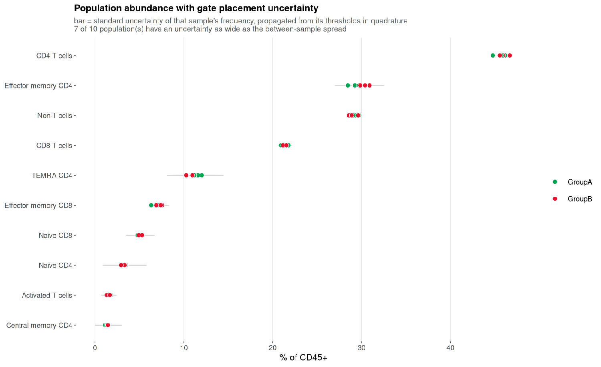
```

**What to look for.** Whether the bar within a sample is narrower than the scatter
between samples. Where it is not, the variation on display is the cut moving.

**This run.** None of the five populations has a gate uncertainty as wide as its
between-sample spread. The donors genuinely differ from each other by more than
the cuts move, which is the configuration in which a between-group comparison is
worth attempting at all.

## uncertainty_budget.png

Which threshold each population's uncertainty comes from.

```{r, fig.alt="Stacked contribution of each marker threshold to every population's uncertainty"}
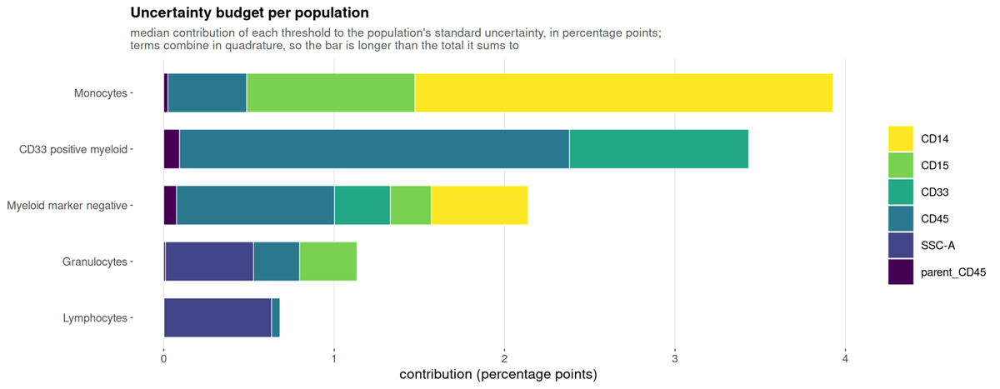
```

**What to look for.** Which gate to fix. A population dominated by one marker has
one threshold worth inspecting.

## detection_limits.png

How many samples each population clears the limits of detection and
quantification in.

```{r, fig.alt="Populations counted by whether their event count clears the limits of detection and quantification"}
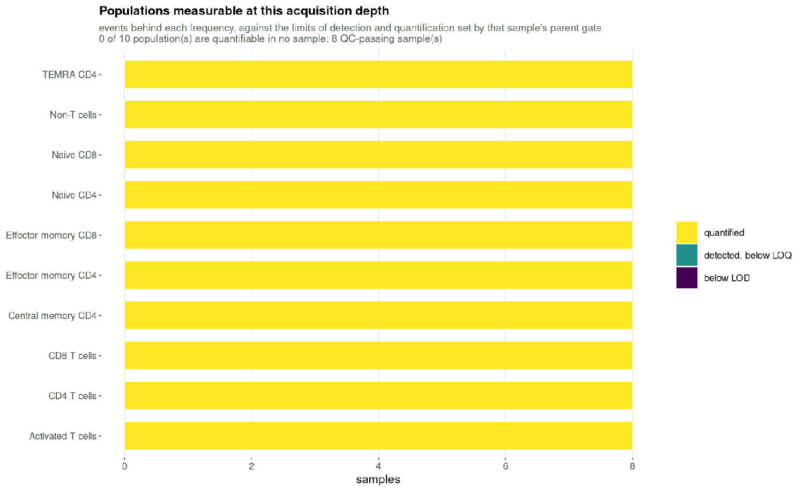
```

**What to look for.** A population mostly below the limit of quantification cannot
be recovered by re-gating: the numerator is small for want of acquired cells.

**This run.** Of 135 population-and-sample values, **104 are quantified, 5 are
detected but below the limit of quantification, and 26 are below the limit of
detection**. The below-limit values are concentrated in the smaller populations
and in the samples with the fewest events, which range from 2,205 upward. Those
26 values should not carry a group comparison on their own.

# 3. Are the populations what they were declared to be

## population_marker_heatmap.png

Measured marker intensity against the declared populations, z-scored.

```{r, fig.alt="Heatmap of z-scored marker intensity across the declared populations"}
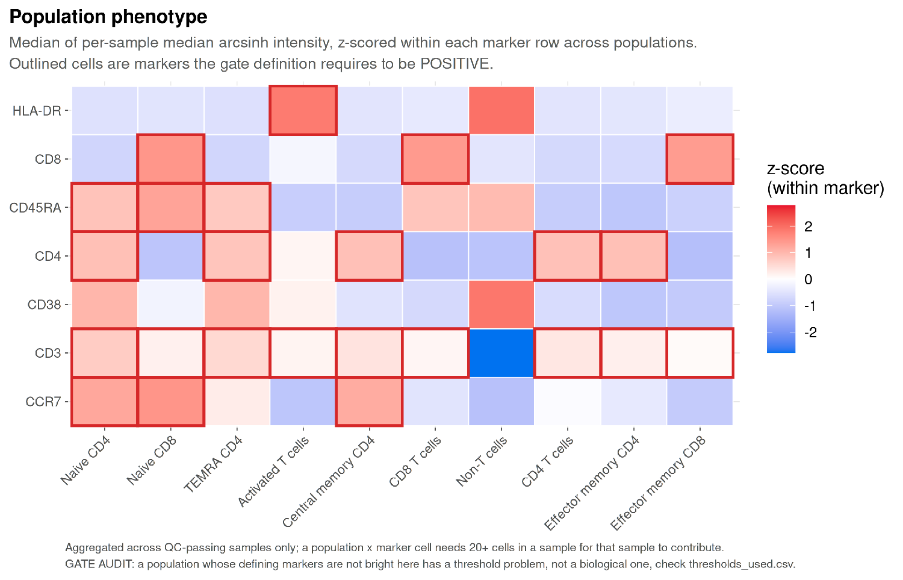
```

**What to look for.** Identity is declared here before the data are examined, so
this figure serves the inverse function of its equivalent in clustering-first
analysis: a population that does not show the markers its definition requires
falsifies the gate that produced it.

## population_frequencies.png

The pooled composition across samples.

```{r, fig.alt="Pooled population composition across all samples"}
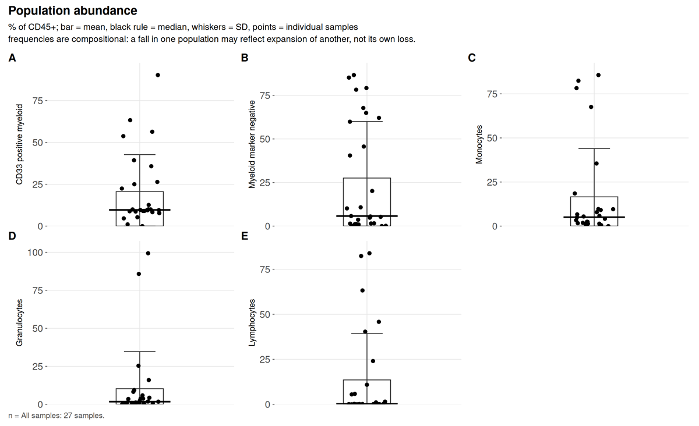
```

## cohort_composition_heatmap.png

Each group's share of every population, after normalising the groups to a common
notional cell count.

```{r, fig.alt="Heatmap of each group's share of every population after normalising to a common cell count"}
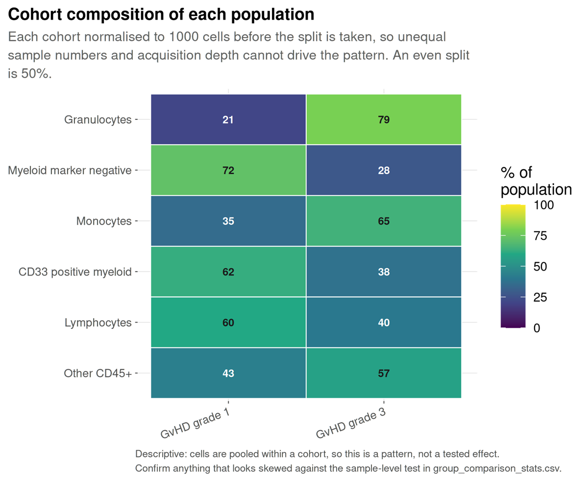
```

**What to look for.** An even split is 50%. Normalising first is what stops the
7-against-28 sample imbalance from generating the pattern.

# 4. The shared embedding

## umap_overview.png

One UMAP per marker panel, computed across all samples.

```{r, fig.alt="Shared UMAP embedding coloured by population, sample and group"}
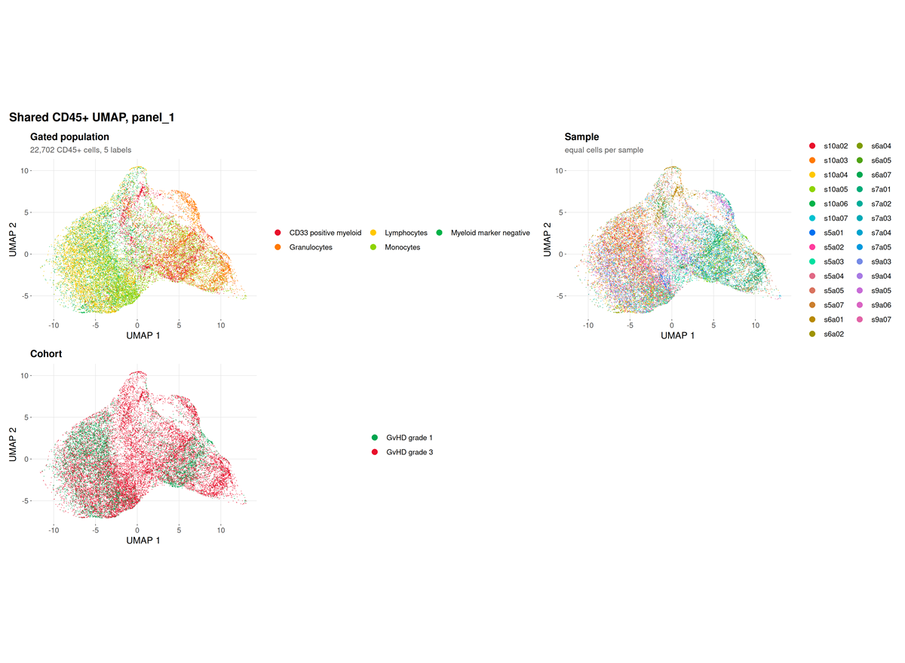
```

**This run.** The panel resolves four markers, and the log records
`fewer than 2 preferred lineage markers present; falling back to all 4 eligible
markers`. The embedding is therefore driven by CD15, CD45, CD14 and CD33 rather
than by a curated lineage set, which is the correct behaviour for a four-colour
panel and a limitation of the panel rather than of the run.

## umap_overview_by_group.png

The same embedding split by GvHD grade.

```{r, fig.alt="Shared UMAP embedding split into one panel per GvHD grade"}
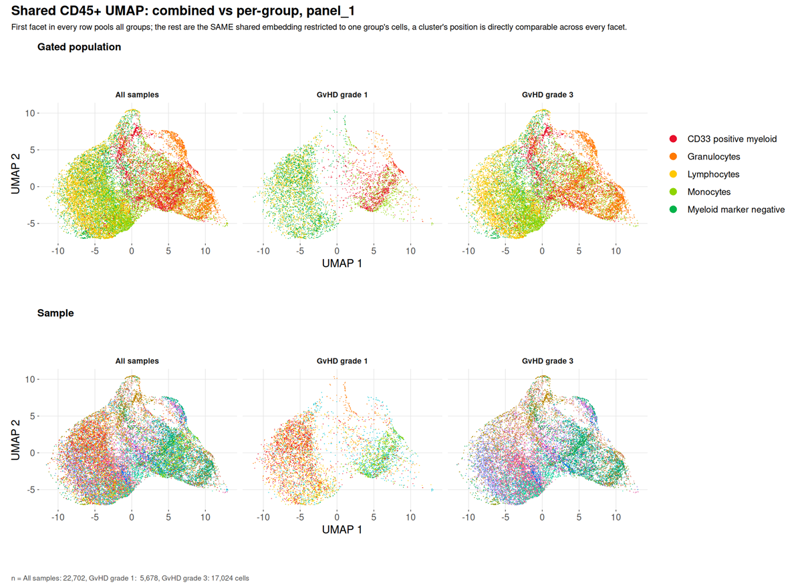
```

## umap_markers.png

The embedding coloured by each marker's intensity in turn.

```{r, fig.alt="Shared UMAP embedding coloured by each marker's intensity in turn"}
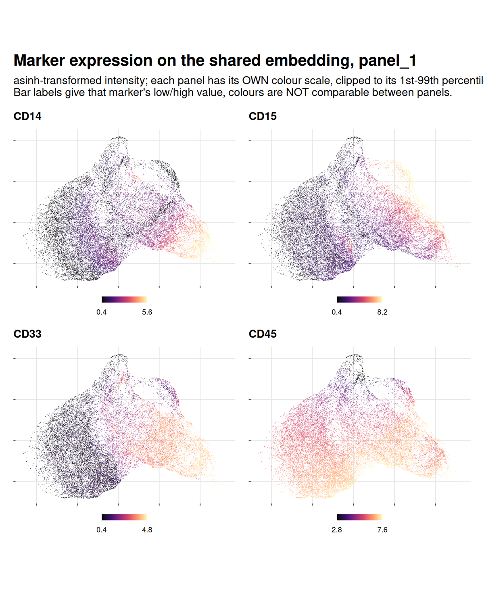
```

## umap_density.png and umap_density_by_group.png

Where cells are concentrated, overall and by group.

```{r, fig.alt="Cell density across the shared UMAP embedding"}
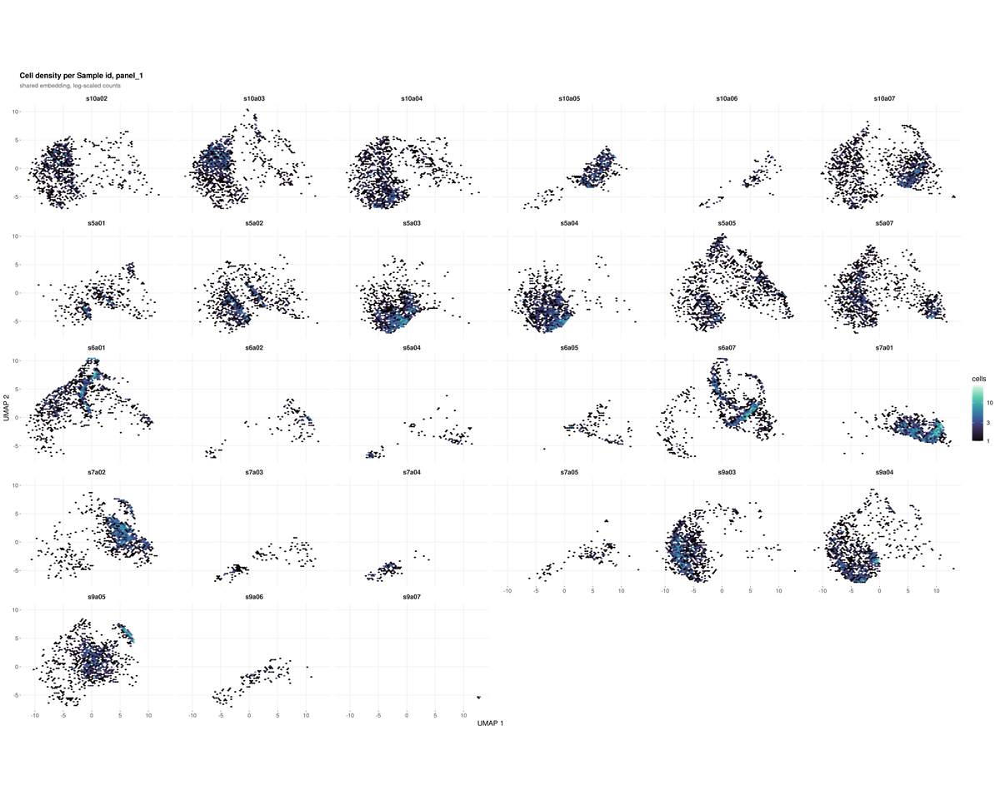
```

```{r, fig.alt="Cell density across the shared UMAP embedding, split by GvHD grade"}
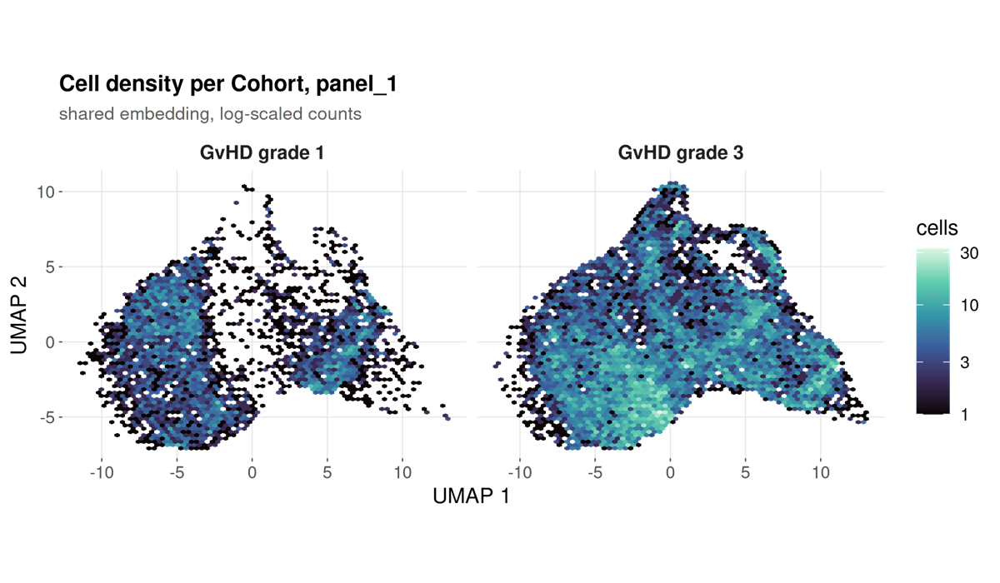
```

## umap_multigraph_overlay.png

Subclusters within each declared population, drawn on the shared embedding.

```{r, fig.alt="Subclusters within each declared population drawn on the shared embedding"}
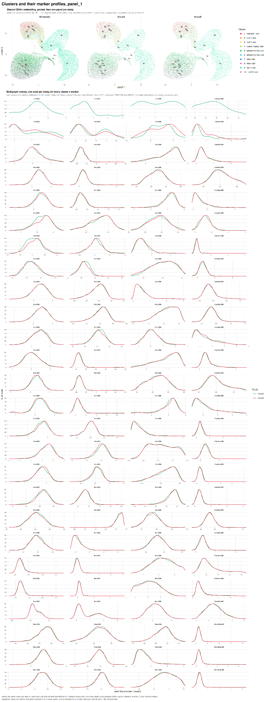
```

## unsupervised_clusters.png

A self-organising map clustering of the same cells, computed without reference to
the specification.

```{r, fig.alt="Self-organising map metaclusters on the shared embedding, with their declared-label composition"}
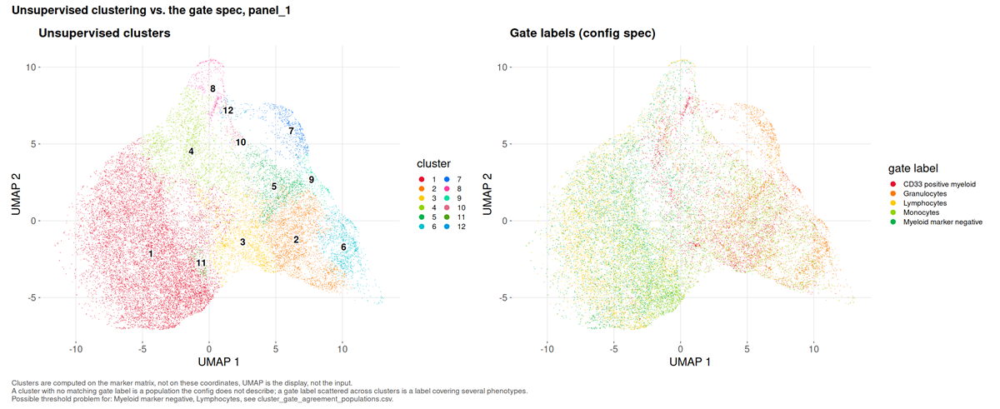
```

**What to look for.** A cluster dominated by the unassigned label is a population
the specification does not describe. A declared population holding far fewer
cells than the cluster it dominates is a misplaced threshold.

**This run.** Twelve metaclusters over 22,702 cells, and no undescribed cluster:
the specification accounts for every phenotype the data contain. Two findings
follow that a frequency table cannot deliver.

Two populations are flagged **suspect threshold**. Lymphocytes and Myeloid marker
negative both have their dominant cluster in cluster 1, and both sit at an
effective cluster count near one (1.30 and 1.54), meaning each is a single
phenotype. But cluster 1 holds 11,724 cells and is 36.9% Lymphocytes against
35.8% Myeloid marker negative. The two definitions, CD45+ SSC-A low CD33- CD14-
and CD45+ CD14- CD15- CD33-, select largely the same cells in this panel. They
are not independent readouts, and section 6 tests them as though they were.

Three populations are flagged **fragmented**: Granulocytes spans an effective
6.13 clusters, CD33 positive myeloid 5.91, Monocytes 3.39. Each label covers
several distinct phenotypes that a four-colour panel cannot separate.

# 5. Why a threshold did not resolve

## acquisition_qc.png

Events recorded in each equal-width slice of the acquisition, with the flagged
slices marked.

```{r, fig.alt="Event rate across each acquisition with the flagged intervals marked"}
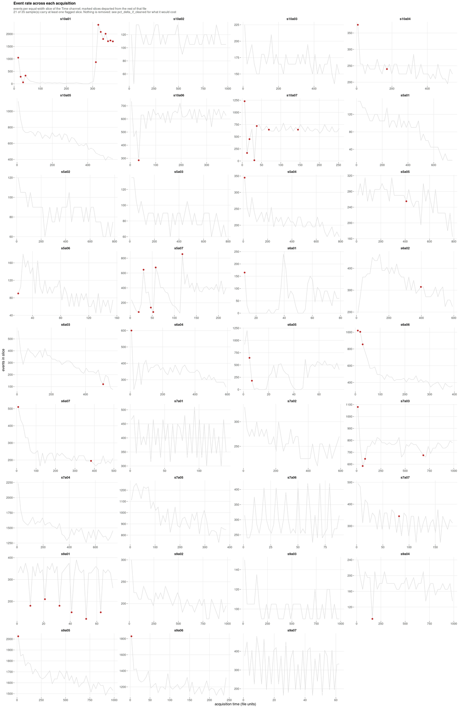
```

**What to look for.** A flat line is a steady acquisition. A sustained trough is a
partial clog, a spike is usually a bubble, a step is a settings change.

**This run, and the most consequential finding in it.** Only **14 of 35 samples
are stable**; 11 are minor and **10 are unstable**. Excluding every flagged slice
would move the largest population by **5.749 percentage points**.

That number is what makes the flag actionable. It is an order of magnitude larger
than the gate uncertainty on the same populations, so unlike a cosmetic
instability this one would materially change the reported frequencies. On this
cohort the honest reading is that acquisition instability, not gate placement, is
the dominant technical term, and the files carrying it deserve inspection before
any frequency from them is published. Nothing is removed unless
`--drop-unstable-events` is given.

## Spillover spreading

`spreading_receivers.csv` and `spreading_pairs.csv` have no figure; they are
ranked tables. They belong here because they answer the question section 1 left
open.

| Receiver | Worst source | Widening | Fallback rate |
|---|---|---|---|
| CD15 | CD33 | 3.06x | 0.40 |
| CD45 | CD15 | 1.51x | 0.40 |
| SSC-A | CD15 | 1.38x | 0.26 |
| CD14 | CD45 | 1.10x | 0.57 |
| CD33 | CD14 | 0.99x | 0.43 |

CD15's negative population is three times wider when CD33 is bright, and CD15
falls back to a quantile in 40% of samples. Spreading fills in the valley a
threshold would sit in, so those cuts are unresolved for an optical reason that
no gating strategy recovers.

CD14 is the instructive counter-case: it has the **highest** fallback rate at 57%
and receives almost no spreading. Its failure to resolve has a different cause,
and the table is what separates the two.

# 6. The results

## group_comparison.png

Per-population abundance between groups, as per-sample distributions.

```{r, fig.alt="Per-population abundance between GvHD grades as per-sample distributions"}
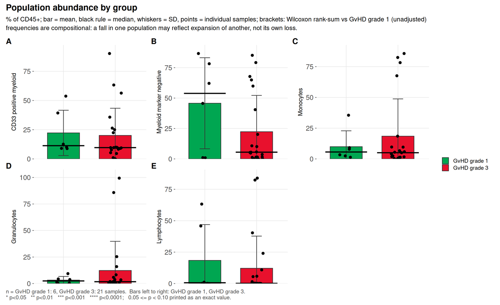
```

**What to look for.** Adjusted p, then Cliff's delta, then
`difference_over_gate_u`, then `difference_over_total_u`.

**This run.** Of five populations, **none reaches raw *p* < 0.05** and none
survives correction. The largest effect, Myeloid marker negative, has a Cliff's
delta of -0.254 and *p* = 0.37.

That population is worth dwelling on, because it is exactly the case the four-way
reading order exists for. Its `difference_over_gate_u` is **11.29**: the
difference between group medians is eleven times the distance the gate itself
moves, so it is not an artefact of threshold placement. And it is still not
significant, because with seven samples in one group and 28 in the other, drawn
from five donors, the between-donor variation swamps it. A run that stopped at
"the difference is much larger than the gate uncertainty" would have called this
a finding. The donor-level test is what prevents that.

## marker_state.png

Differential state per population and marker, on per-sample values.

```{r, fig.alt="Percent positive per population and marker, compared between GvHD grades"}
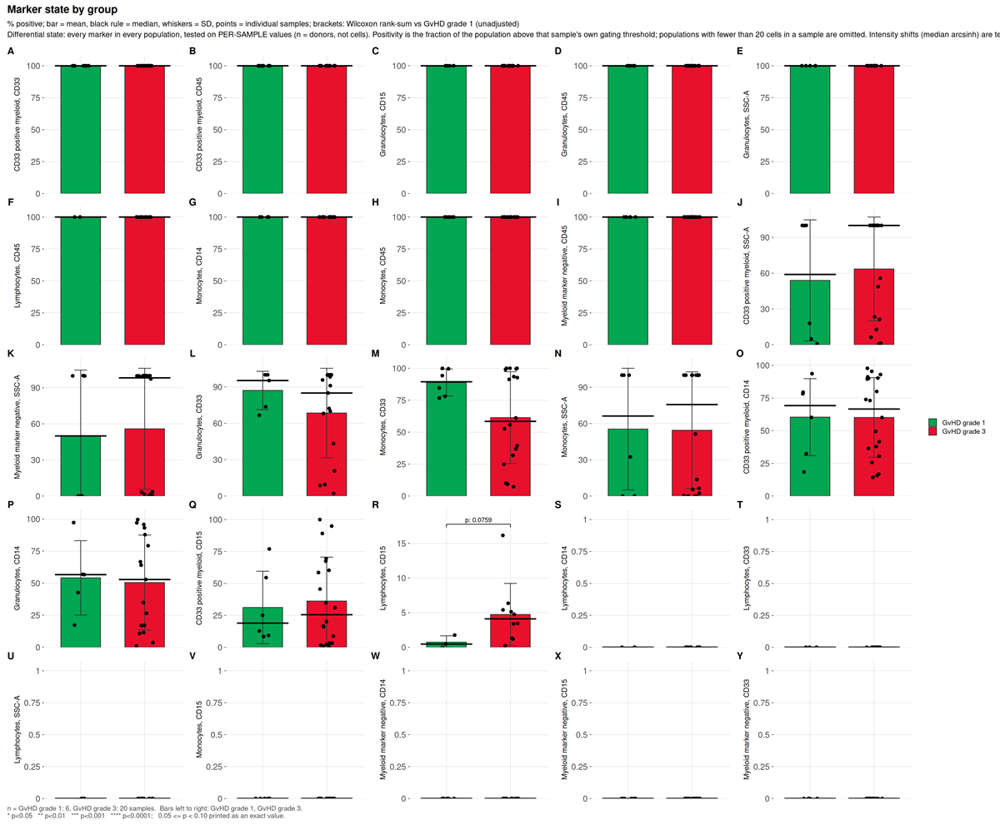
```

**This run.** 50 tests, none reaching raw *p* < 0.05.

## functional_markers.png

Marker intensity read within an already-defined population, rather than used to
define one, scoped by the `functional_blocks:` section of the configuration.

```{r, fig.alt="Marker intensity within scoped populations, compared between GvHD grades"}
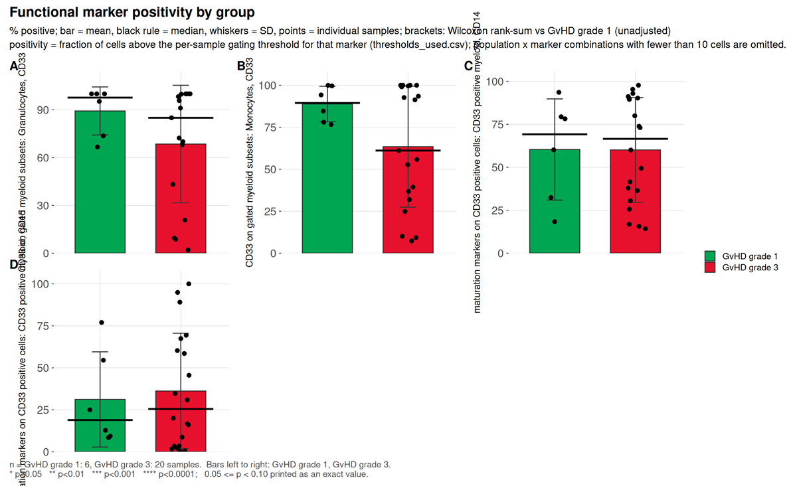
```

**What to look for.** Whether the marker is one of the definers of the population
it is being read in. Testing CD15 inside a CD15-positive gate returns 100% in
every sample: zero variance, an undefined p-value, and a result that measures the
definition rather than the biology. Scoping exists to prevent that, and the demo
configuration splits its two blocks precisely so no marker is reported inside a
gate its own threshold helped draw.

**This run.** Four tests across two blocks. CD33 on gated granulocytes has the
largest effect, Cliff's delta -0.333 at *p* = 0.24. CD14 and CD15 within CD33
positive cells both return a Cliff's delta of exactly 0.000 at *p* = 1.0, which
is a real null and not a degenerate one: the values span 14.2% to 97.7% and 0.4%
to 100% respectively, and the two grade groups interleave exactly.

## population_ratios.png

Ratios of declared populations, from the `ratios:` section, tested with the same
statistics as any abundance.

```{r, fig.alt="Declared population ratios compared between GvHD grades"}
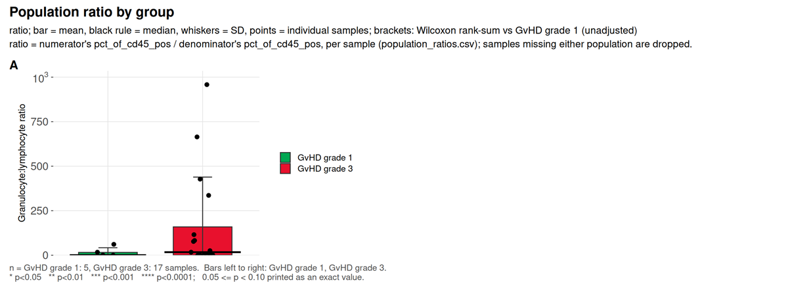
```

**What to look for.** A ratio is not recoverable from either frequency alone when
both are percentages of the same parent, which is why it is declared rather than
derived after the fact.

**This run.** One ratio, granulocyte to lymphocyte, a conventional inflammatory
index. Cliff's delta 0.271 at *p* = 0.39.

# 7. Is the contrast confounded

## threshold_drift.png

Whether each marker's per-sample thresholds separate by study group.

```{r, fig.alt="Per-sample thresholds per marker, checked for separation by study group"}
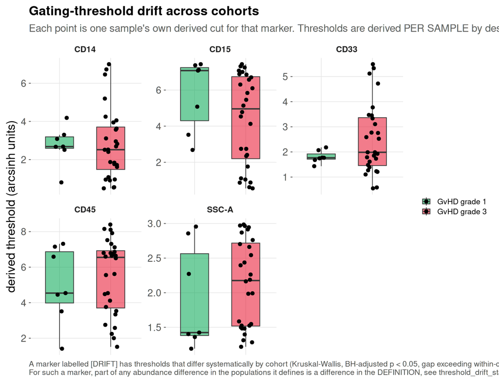
```

**This run.** Five markers tested, none flagged. The thresholds do not track GvHD
grade, so no part of a between-group difference here is definitional.

## batch_diagnostic.png

Batch structure in the shared embedding, against a permutation null.

```{r, fig.alt="Batch mixing in the shared embedding against a permutation null"}
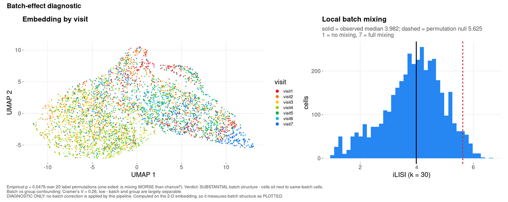
```

**This run.** iLISI **3.982 against a null of 5.625**, *p* = 0.048: substantial
batch structure, meaning cells sit next to cells from the same visit more often
than chance allows.

`marker_batch_drift.csv` names the channels responsible. **All four markers differ
between visits by at least 1.1 times their own spread**, the worst being CD14 at
1.24 MAD between visit 4 and visit 7.

The question that decides what may be done about it is separability, and
`batch_group_confounding.csv` answers it: Cramér's *V* between visit and grade is
**0.26**, reported as *low, batch and group are largely separable*. Correction is
therefore permitted here. Had the grades been acquired in distinct periods, *V*
would approach one and `--correct-batch` would refuse, because removing the batch
and removing the finding would be the same operation.

# The two figures this cohort cannot produce

Twenty-two figures is everything the GvHD cohort supports. The package writes two
more, and both need an input no public FCS archive carries.

`absolute_counts.png` and `absolute_counts_qc.png` are written by
`--absolute-counts`, which takes a table of measured cells per microlitre per
sample and population, from bead-based or volumetric counting on the instrument.
A frequency is a proportion of a parent gate, so it moves when any other
population moves; an absolute count does not. The QC figure compares the supplied
counts against the frequencies cyRAVEN measured, which is how a transcription
error or a sample-name mismatch is caught.

They are absent here because the cohort has no volumetric measurement, and a
count invented to fill the gap would be indistinguishable in the rendered figure
from a measured one. The input format is documented in the
[Output article](outputs.html).

# What this example does and does not show

It shows a pipeline behaving correctly on real, imperfect clinical data: a
scatter gate that had to fall back, 72 thresholds that could not resolve with an
optical explanation for most of them, acquisition instability large enough to
matter, two declared populations that the unsupervised check shows are largely
the same cells, real batch structure that is nonetheless separable from the
contrast, and a difference eleven times the gate uncertainty that is still not a
finding once donors rather than cells are the replicates.

It does not show sensitivity. The group contrast is unbalanced, confounded with
donor, and null at this sample size. Nothing here establishes that cyRAVEN
detects a real biological effect; it establishes what the diagnostics report when
the data are genuinely difficult.
