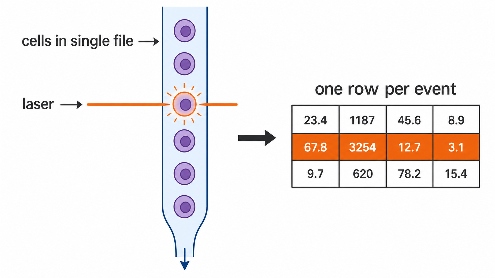
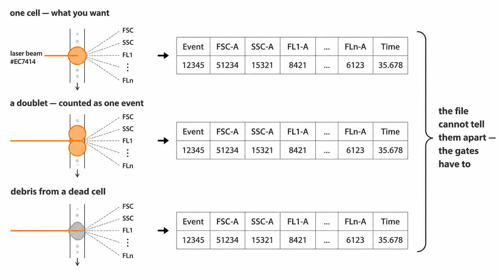
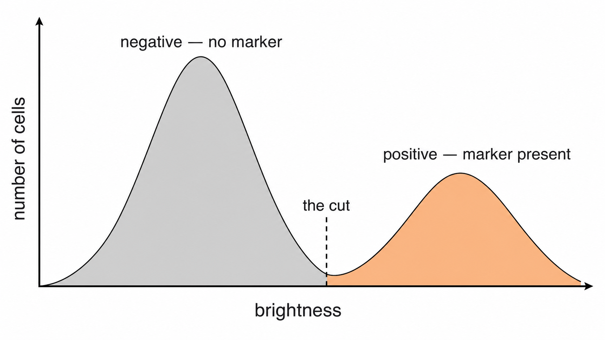
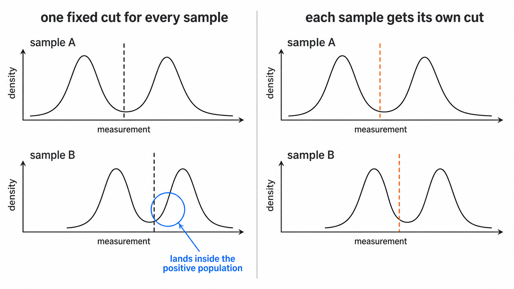
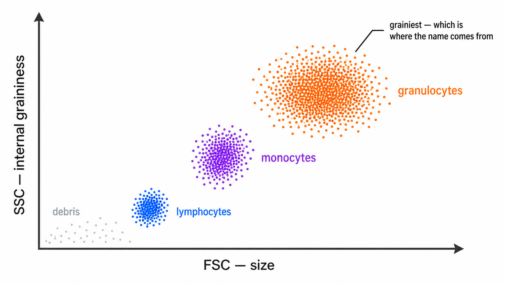
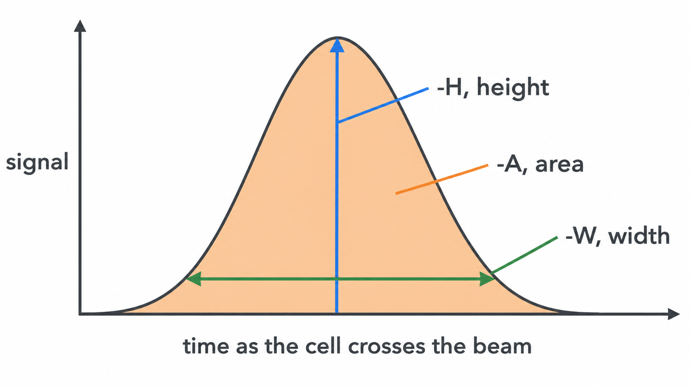
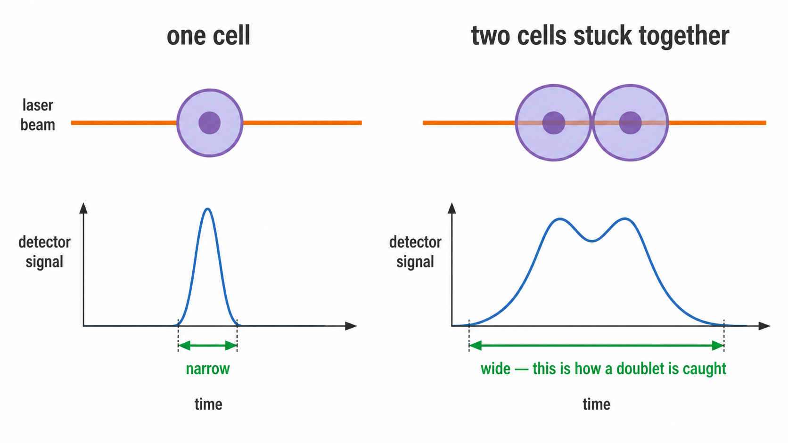
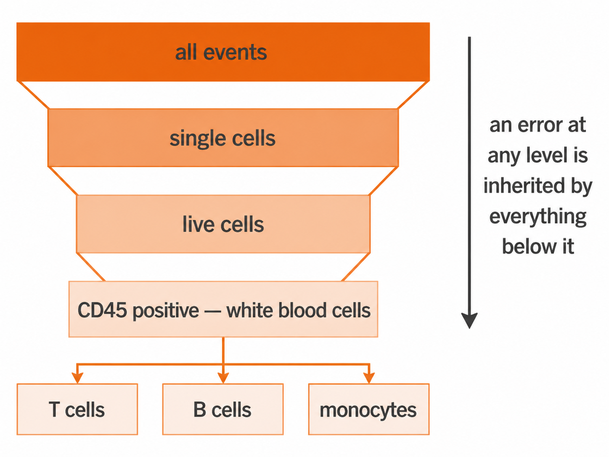

```{r, include = FALSE}
knitr::opts_chunk$set(collapse = TRUE, comment = "#>", eval = FALSE)
```

Every other page here assumes you already know what a cut is, why `SSC-A` sits in
a population definition next to two antibodies, and what the `-A` on the end of a
channel name means. This page assumes none of it.

Read it if you are about to write a `populations:` block and the words `above`
and `below` are doing more work than you can follow.

## 1. One cell, one row

A cytometer does not look at your sample as a whole. It squeezes it into a stream
so narrow the cells have to queue up single file, then fires a laser at the
stream. Each cell crosses the beam alone, one at a time, thousands per second.

```{r fluidics, eval = TRUE, echo = FALSE, fig.alt = "Cells queueing single file through a stream, one crossing the laser at a time, each crossing producing one row of numbers"}
if (file.exists("images/fluidics-single-file.png")) 
```

Every crossing is recorded as one row of numbers. That row is one cell. A typical
file holds a few hundred thousand rows, and the whole analysis is sorting those
rows into groups.

In cytometry the row is called an **event** rather than a cell, and the word is
chosen carefully. An event is "something crossed the beam". Usually that is one
cell. It can also be two cells stuck together, or a fragment of a dead one. Part
of the pipeline exists to throw those out, which is section 7.

```{r event-vs-cell, eval = TRUE, echo = FALSE, fig.alt = "A single cell, a doublet and a fragment of debris all cross the beam and all produce one identical-looking row"}
if (file.exists("images/event-vs-cell.png")) 
```

## 2. Why cells glow

The numbers in each row come from two places, and it is worth keeping them apart
in your head.

Some are physical. The cell blocks and scatters laser light whatever you do to
it, so those measurements come free. That is section 5.

The rest come from staining. You add antibodies that stick only to one specific
protein, each antibody carrying a fluorescent dye. A cell carrying that protein
collects antibodies and glows; a cell without it does not. The protein is called
a **marker**, and each marker gets its own channel of measurement.

So a row of numbers is one cell's answer to "how big, how grainy, and how much of
each of these proteins are you carrying".

## 3. The cut

For each marker you get one number per cell: how brightly that cell glowed. Count
how many cells sit at each brightness and you usually get two humps.

```{r two-humps, eval = TRUE, echo = FALSE, fig.alt = "A bimodal brightness distribution with the cut placed in the dip between the negative and positive humps"}
if (file.exists("images/two-humps-and-the-cut.png")) 
```

The left hump is cells without the marker, glowing faintly from background. The
right hump is cells carrying it. The cut goes in the dip between them, because
that is where the fewest cells are, so a small error in placing it misclassifies
the fewest cells.

**`above` means right of the cut. `below` means left of it.**

Written by hand these are `CD15+` and `CD15-`, said out loud as "CD15 positive"
and "CD15 negative".

### Why the cut is not a number you type

This is the whole reason cyRAVEN exists, so it is worth a paragraph.

Stain two tubes on different days and both humps shift, because staining strength
varies with the reagent lot, the incubation, the instrument settings and the
sample itself. The dip shifts with them.

```{r valley-vs-fixed, eval = TRUE, echo = FALSE, fig.alt = "One fixed cut applied to two samples lands inside a population in the second; a per-sample cut sits in each sample's own dip"}
if (file.exists("images/valley-vs-fixed-cut.png")) 
```

A cut copied from the first tube lands inside a hump in the second and slices a
real population in half. cyRAVEN finds the dip separately in every sample, so the
cut moves with the data. `above` means "bright for this tube", never "above
1500". The values actually used are written to `thresholds_used.csv`.

When no dip can be found, cyRAVEN does not invent one. It falls back to a
percentile, records that in `thresholds_used.csv` as `quantile_fallback`, and
draws the line in red in `gating_qc.png` so you can see which cuts to distrust.

## 4. The three directions

| Direction | Meaning | Written by hand as |
|---|---|---|
| `above` | brighter than the cut, the marker is present | CD15+ |
| `below` | dimmer than the cut, the marker is absent | CD15- |
| `intermediate` | between the cut and a second, higher cut | CD14 dim, or mid |

All the markers listed for a population must hold **at the same time**.

### `intermediate` needs two cuts

Some markers have three levels, not two. Monocytes are the standard case: CD14
bright, CD14 mid, CD14 dim. One cut cannot split three groups, so `intermediate`
uses a second cut above the first, and the cell has to sit between them.

That second cut has to be derivable from the data. If cyRAVEN cannot find a dip
separating mid from bright, it does not guess. The population is marked
unavailable with the reason attached, rather than reporting a number resting on
an invented boundary.

## 5. A worked example

```yaml
populations:
  Granulocytes:
    CD45: above     # it is a white blood cell
    SSC-A: above    # it is grainy inside
    CD15: above     # it carries CD15
```

Read as one sentence: count a cell as a granulocyte if it is above the CD45 cut
**and** above the SSC-A cut **and** above the CD15 cut.

`SSC-A` is the odd one out, and explaining it is the rest of this page.

## 6. FSC and SSC

These are the measurements that need no stain. They are laser light bouncing off
the cell, so every cell has them whatever you stained for.

**FSC**, forward scatter, is light that carries on roughly straight ahead past
the cell. Bigger cell, more light pushed forward. Read it as **size**.

**SSC**, side scatter, is light knocked off sideways at about 90 degrees. Smooth
interiors deflect little. Interiors packed with granules and folded membranes
deflect a lot. Read it as **internal graininess**.

Together they separate the main blood cell types before any antibody is involved:

```{r fsc-ssc, eval = TRUE, echo = FALSE, fig.alt = "Scatter of FSC against SSC with debris, lymphocytes, monocytes and granulocytes occupying separate regions"}
if (file.exists("images/fsc-ssc-populations.png")) 
```

That is why `SSC-A: above` sits in the granulocyte definition next to two real
antibodies. It is not a stain. It is the physical fact that granulocytes are the
grainiest white cells, which is where the name comes from, so "grainy" is part of
the definition rather than a technicality.

## 7. The `-A`, `-H` and `-W` suffixes

As a cell crosses the beam the signal climbs, peaks and falls. That trace is a
**pulse**, and the instrument records three numbers from it.

```{r pulse-ahw, eval = TRUE, echo = FALSE, fig.alt = "One pulse annotated with its area, its height and its width"}
if (file.exists("images/pulse-a-h-w.png")) 
```

**Height** is the peak, **area** is the total underneath, **width** is the
duration. The suffix on a channel name says which one you are looking at, so
`FSC-A` is forward scatter area and `FSC-H` is forward scatter height.

For a single cell, area and height rise and fall together. For two cells stuck in
a clump the pulse lasts twice as long, so the area roughly doubles while the
height barely changes. That mismatch is the only reliable way to spot a clump.

```{r doublet, eval = TRUE, echo = FALSE, fig.alt = "One cell gives a narrow pulse; two cells stuck together give a wider one, which is how a doublet is caught"}
if (file.exists("images/doublet-vs-singlet.png")) 
```

It matters more than it sounds. A clump of a T cell and a B cell stuck together
is recorded as one event positive for both CD3 and CD19, which reads as a cell
type that does not exist. Left in, clumps manufacture rare populations.

cyRAVEN takes the FSC-H to FSC-A ratio for every cell and keeps those within
3 MAD of that sample's median. Events off that line are doublets and are dropped
before anything is counted.

## 8. How cyRAVEN uses each channel

| Channel | Used for |
|---|---|
| `FSC-A` | Debris removal, at the dip in log10 FSC-A, below which events are too small to be whole cells |
| `FSC-H` with `FSC-A` | The singlet gate in section 7 |
| `SSC-A` | A phenotype axis you can name in `populations:`, as in the granulocyte example |

One deliberate exception. Scatter is excluded from the UMAP feature set. Scatter
values span a far wider numeric range than stained markers, so leaving them in
makes the map arrange cells mostly by size and graininess and drowns out the
markers you actually stained for. Scatter decides what counts as a real single
cell, then steps aside.

## 9. Declare the big populations first

Populations are not nested in the config file, but they share markers, and that
is the trap.

Declare `T cells` as `CD3: above`, then subsets like `CD4 T cells` as
`CD3: above, CD4: above, CD8: below`. Every subset re-uses the CD3 cut. If that
cut is misplaced it is not one wrong number. It is wrong in the parent and in
every subset beneath it, all shifted the same way, and all still looking
perfectly reasonable in the output table.

```{r gating-hierarchy, eval = TRUE, echo = FALSE, fig.alt = "A funnel narrowing from all events through single cells and live cells to CD45 positive and then to individual lineages"}
if (file.exists("images/gating-hierarchy.png")) 
```

So score the broad lineage populations first and check they are plausible:
granulocytes at roughly half of blood leukocytes rather than 4% or 95%. Once the
lineage numbers make sense, the cuts feeding the subsets are trustworthy.

Checking a rare subset first tells you nothing, because at that size you cannot
tell a real rare population from a parent cut that drifted.

## Where to go next

- [Gating specification](gating.html): the full syntax, functional blocks, ratios
  and per-sample overrides.
- [Diagnostics](diagnostics.html): the checks that tell you a cut went wrong, in
  the order to read them.
- [Worked example](figures.html): every figure from a real run, including the
  gating QC panels where you can see cuts sitting where they should.
- [Explore mode](explore.html): finding populations without declaring anything,
  for when you do not yet know what to write.
