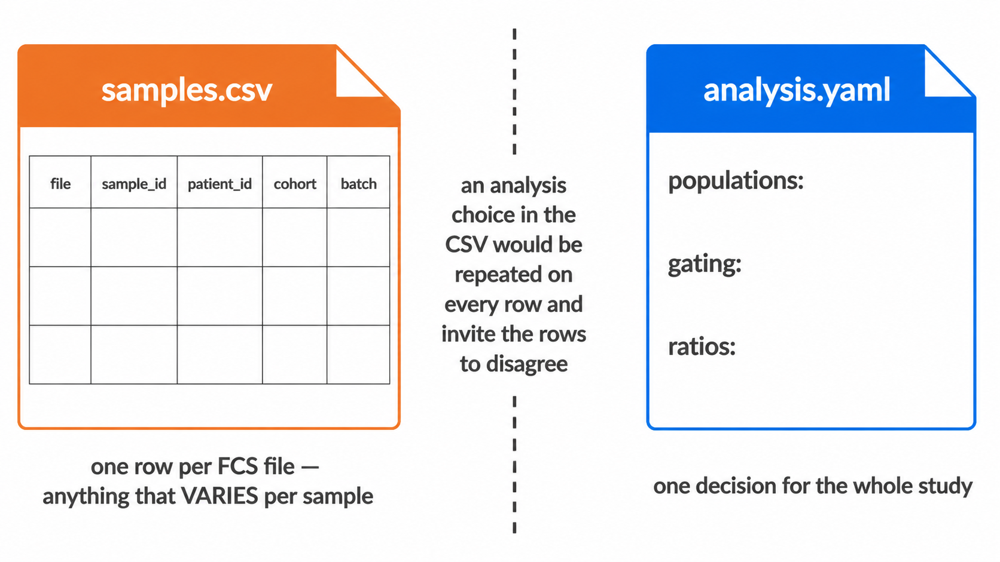

```{r, include = FALSE}
knitr::opts_chunk$set(collapse = TRUE, comment = "#>", eval = FALSE)
```

A run takes two files besides the FCS directory:

| | |
|---|---|
| `samples.csv` | one row per FCS file: what it is, whose it is, which group and batch it belongs to, and any externally measured counts for it |
| `analysis.yaml` | what to score and how: the populations, and every choice shared by all samples |

Between them they specify a run completely. Anything varying per sample belongs
in the CSV; anything that is one decision for the whole study belongs in the
YAML. An analysis choice put in the CSV would repeat on every row and invite the
rows to disagree about it.

Both templates ship with the package:

```bash
docker run --rm --entrypoint sh cyraven:1.0.0 -c \
  'cat /usr/local/lib/R/site-library/cyRAVEN/examples/samples_template.csv'

docker run --rm --entrypoint sh cyraven:1.0.0 -c \
  'cat /usr/local/lib/R/site-library/cyRAVEN/examples/analysis_template.yaml'
```

From R, `system.file("examples", "samples_template.csv", package = "cyRAVEN")`
and `system.file("examples", "analysis_template.yaml", package = "cyRAVEN")`.

# 1. Build the sheet

Do not write it from scratch. Generate one covering every file in the input
directory, then fill in the columns only you know:

```{r two-input-files, eval = TRUE, echo = FALSE, fig.alt = "The sample sheet holds what varies per sample; the config holds one decision for the whole study"}
if (file.exists("images/two-input-files.png")) 
```

```bash
docker run --rm -v "$PWD/data:/data" cyraven:1.0.0 \
  --dir /data/fcs --write-samples /data/samples.csv
```

Every acquisition gets a row with its filename and a derived identifier, so the
sheet accounts for every file before you touch it. A file the sheet does not
cover is a fatal error rather than a guess: inferring which patient a file
belongs to from plate order silently mislabels patients, and a mislabelled
patient is not visible in any output.

Then check it, which costs seconds because it reads FCS headers and not events:

```bash
docker run --rm -v "$PWD/data:/data:ro" -v "$PWD/results:/results" \
  cyraven:1.0.0 --dir /data/fcs --samples /data/samples.csv \
  --config /data/analysis.yaml --outdir /results --check
```

`--check` reports the markers it resolved from the files, the specification
entries matching none of them, whether the sheet covers every file, the levels
of the group column and their sizes, the number of batches, and the study
variables available. It analyses nothing and writes nothing. Run it after every
edit to the sheet; a marker-name mismatch found here costs a second, and found
during a run costs however long the run had been going.

# 2. Columns of the sheet

Only `file` is required. Everything else is optional, and a column that is
absent simply disables what depends on it.

## 2.1 Which file this is

| Column | Meaning |
|---|---|
| `file` | The FCS filename. Matched on basename, so a file moved between subdirectories still matches. Required. |
| `sample_id` | The identifier used in every output. Derived from the filename when absent. |
| `well` | Plate well, used as the identifier when `sample_id` is absent. |
| `patient_id` | The subject. Several rows may share one, which is what makes repeat acquisitions and longitudinal designs work. |
| `panel` | Forces a panel assignment. Panels are fingerprinted from the channels otherwise. |
| `timepoint` | Visit or draw. |
| `is_control` | `TRUE` for a control tube. Controls are read and used as references but excluded from between-group tests. Setting it `FALSE` is not the same as leaving it out: `FALSE` asserts that the file is a biological sample, and the assertion matters. See below. |

### Say `FALSE` rather than saying nothing

An absent `is_control` column means "unknown", not "no controls here". The
distinction has teeth.

A control tube supplies the reference distribution for markers that resolve no
density minimum, and the cut is then the 99.5th percentile of the control. That
is correct when the reference really is unstained. When it is a stained
biological sample, the cut lands at the top of a real distribution and the
population beneath it all but disappears.

Up to version 1.0.0 a sample that failed staining QC could be promoted to that
reference on a sheet that named no controls, on the reasoning that an unlabelled
tube might be one. On a cohort of twelve patient samples with no controls at all,
that put T cells at 0.034% of CD45+ where the correct figure was over a hundred
times higher, with no error and no warning.

cyRAVEN now believes a control only when the sheet declares one, and says so in
the log when it declines to promote a sample. Two habits follow from that:

- Write `is_control` on every row, `FALSE` for samples and `TRUE` for controls.
  `--write-samples` does this for you.
- If most rows of `thresholds_used.csv` read `control_q995` in the `source`
  column, check which sample supplied the reference before reading any
  frequency.
| `fmo_for` | Comma-separated markers this file is the fluorescence-minus-one control for. |
| `control_group` | Confines a control to the samples sharing its value, since a reagent lot changes between batches. |

## 2.2 Whose it is

These describe the *subject*, so they repeat on every row of that subject.

`patient_id`, `date_of_birth`, `sex`, `age_years`, `height_cm`, `weight_kg`,
`infection_focus`, `cohort`, `wbc_per_ul`.

They are recognised by their canonical name and by the spellings common in
clinical exports, in English and German, so a sheet headed `Geschlecht` or
`Patient ID` resolves without being translated first. Values are coerced the
same way whichever route supplies them: decimal commas, dates whose day and
month order is resolved from the column as a whole, and sex and clinical
vocabulary translated through a dictionary that passes unknown values through
and reports them rather than mangling them. Extend the dictionary under
`metadata:` in the YAML.

Age is derived from `date_of_birth` when it is missing, against
`--reference-date`. Set that to a fixed study date, or ages change as the
calendar moves and two runs of the same data disagree.

**A subject's rows must agree.** This is the one hazard the one-file shape
introduces that separate tables did not have: with a row per file, a patient
with three acquisitions carries three copies of their sex. If two disagree, the
run stops and names every conflict as `subject / column: value vs value`. There
is no defensible way to pick one, and picking silently is how a cohort acquires
a patient who is both male and female depending on which tube you look at.

A blank is not a disagreement. It is filled from the rows that have a value.

## 2.3 What was measured externally

Any column named `count.<Population>` is read as an externally measured
absolute count for that population, from bead-based or volumetric counting.

```
file,sample_id,count.Granulocytes,count.Monocytes
HC-01.fcs,HC-01,3810,420
```

A frequency is a proportion of a parent gate, so it moves whenever any other
population moves. An absolute concentration does not, which is why these are
worth carrying when the laboratory measured them. Blanks are skipped rather than
read as zero. Units are `cells/uL` unless `samples: count_unit: cells/mL` says
otherwise, in which case values are divided by 1000.

## 2.4 Everything else

Any other column is kept as a study variable and can be named by
`--group-column` or `--batch-column`, or used as a covariate. Acquisition date,
treatment arm, instrument, operator and site are all ordinary columns; none of
them needs a reserved name. `--check` lists what it found.

# 3. The config

`populations:` is the only required section. Everything else takes a documented
default when omitted, and the default in force is stated in the run log.

Populations, functional blocks and ratios are covered in the
[Gating article](gating.html); thresholds, colours and metadata dictionaries in
the [Running cyRAVEN](usage.html). One section belongs here, because it is
about the sheet:

```yaml
samples:
  group_column: cohort
  batch_column: acquisition_date
  count_unit: cells/uL
```

Naming the roles here means the two files specify the run on their own, with no
further flags. A flag still wins where both are given: the config is the study's
standing choice, the flag is this run's.

# 4. The older three-file format

`--sample-map`, `--patient-table` and `--absolute-counts` still work exactly as
before and are not deprecated. Runs made with them remain reproducible.

They cannot be combined with `--samples`. The sheet carries the same facts, and
two sources of truth for one fact is what this format removes.

The sheet is a different way to supply the same facts, not a different analysis.
The reader splits it into the same three structures the pipeline always consumed
and applies the same coercions by calling the same code. A test runs one study
both ways and compares every output.

Which to use:

| Situation | Use |
|---|---|
| A new study | The sheet. One key, one file, no joins. |
| An existing pipeline built on the three files | Leave it. Nothing has changed. |
| Counts exported by the counting instrument as its own sheet | `--absolute-counts` reads that file's own layout; see the [Output article](outputs.html). Fold it into the sheet only if transcribing it is easy. |

# 5. Worked example

```bash
# 0. the image, once. Pull it, or build it from source if you have changed
#    the code -- see the Running cyRAVEN article.
docker pull bhagesh/cyraven:1.0.0
docker tag bhagesh/cyraven:1.0.0 cyraven:1.0.0

mkdir -p data results
# put the FCS files in data/fcs/

# 1. a sheet covering every file
docker run --rm -v "$PWD/data:/data" cyraven:1.0.0 \
  --dir /data/fcs --write-samples /data/samples.csv

# 2. edit samples.csv: patient_id, cohort, and any study variable

# 3. a config: start from the shipped template
docker run --rm --entrypoint sh cyraven:1.0.0 -c \
  'cat /usr/local/lib/R/site-library/cyRAVEN/examples/analysis_template.yaml' \
  > data/analysis.yaml

# 4. edit populations: to match the panel. --check lists the marker names.

# 5. validate, in seconds
docker run --rm -v "$PWD/data:/data:ro" -v "$PWD/results:/results" \
  cyraven:1.0.0 --dir /data/fcs --samples /data/samples.csv \
  --config /data/analysis.yaml --outdir /results --check

# 6. run
docker run --rm -v "$PWD/data:/data:ro" -v "$PWD/results:/results" \
  cyraven:1.0.0 --dir /data/fcs --samples /data/samples.csv \
  --config /data/analysis.yaml --group-column cohort \
  --reference-group "Healthy controls" --batch-column acquisition_date \
  --cluster --outdir /results
```

Open `results/report.html`. It carries every figure and table the run produced,
embedded, and needs no other file.

# 6. When it goes wrong

A run that fails writes `report.html` anyway, with the error, the stage it
reached, the log leading up to it, what the error means for the data, and the
next action. Everything produced before the failure is embedded below the
diagnosis, because that partial output is usually where the evidence is.

The errors this format can raise, and what each means:

| Message | Cause |
|---|---|
| `these input files are not in the sample sheet` | The sheet has no row for a file. Add rows, or regenerate with `--write-samples`. |
| `conflicting values for the same subject` | Two rows of one subject disagree. The message names each conflict. |
| `duplicate file entries` | Two rows name the same file. |
| `must contain a 'file' column` | The one required column is missing. |
| `--samples supersedes ...` | The sheet was combined with a flag it replaces. |

Every population reported `UNAVAILABLE`, or an empty frequency table, is almost
always a marker name that does not match `$PnS` exactly. `--check` lists every
marker the files carry and names the specification entries matching none of
them.
