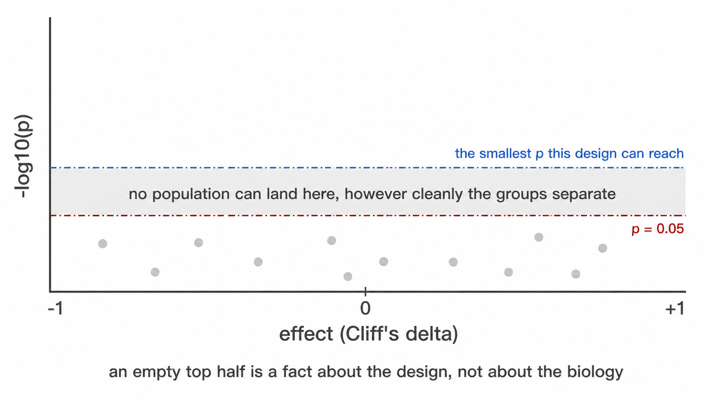

```{r, include = FALSE}
knitr::opts_chunk$set(collapse = TRUE, comment = "#>", eval = FALSE)
```

Reference for every file a run writes, its columns, and the flag that produces
it. Worked examples of the principal figures, rendered from a run on public data,
are in the
[Worked example](figures.html); this article is the
exhaustive list rather than a second copy of them.

## 1. Quality control

| File | Content |
|---|---|
| `recon_diagnostics.png` | Gate boundaries per sample |
| `gating_qc.png` | Thresholds superimposed on the densities they derive from |
| `staining_qc.csv` | Per-sample verdict and exclusion reason |
| `thresholds_used.csv` | Threshold, derivation, cofactor and outlier status per sample and marker |
| `threshold_scale_qc.csv` | Panel median and robust *z* per marker |
| `acquisition_qc.csv`, `.png` | Per-sample acquisition stability, and the flagged intervals |
| `acquisition_qc_bins.csv` | Per-interval rate and channel departure |
| `acquisition_qc_impact.csv` | How far each population would move if the flagged intervals were excluded |
| `fmo_agreement.csv` | Derived cut against its FMO-anchored equivalent, in units of the cut's own uncertainty |
| `spreading_pairs.csv` | Per channel pair, how much wider the receiver's negatives become |
| `spreading_receivers.csv` | Per marker, total spreading received and whether it explains a fallback |
| `calibration.csv` | Bead fit per channel, written by `--calibration-beads` |

`thresholds_used.csv` gains `override_reason` and `override_by` only when the
config declares a `sample_overrides:` block, so a run that overrides nothing
writes the table it always wrote. `source` is `manual` for an overridden cut,
`fmo_q995` for one anchored to a fluorescence-minus-one control.

Read `acquisition_qc_impact.csv` against `u_pct_points` for the same population
before acting on an acquisition flag. `--drop-unstable-events` performs the
exclusion; without it nothing is removed.

These constrain the interpretation of every subsequent file. A run whose gates
are misplaced produces internally consistent statistics that are unusable.

## 2. Uncertainty

| File | Content |
|---|---|
| `threshold_uncertainty.csv` | Sampling and method components per sample and marker, their quadrature sum, the valley's relative depth, and the fraction of resamples that found it |
| `uncertainty_budget.csv` | Contribution of each threshold to each population's uncertainty, per sample |
| `frequency_uncertainty.png` | Per-sample frequencies with their uncertainty, one row per population |
| `uncertainty_budget.png` | The same budget as a stacked median contribution |
| `detection_limits.png` | Samples per population, split by whether the event count clears each limit |

`bootstrap_valley_rate` is the column to read first. A threshold found in every
resample is a population boundary; one found in half of them is histogram noise
that happened to clear the depth rule, and the two are indistinguishable in
`thresholds_used.csv`.

`u_combined` is `NA` rather than zero where it could not be computed, which
happens for a threshold taken from a separate control tube. `n_terms_missing` on
the frequency table counts how many of a population's markers contributed
nothing, so a small total that is small only because most terms are absent is
distinguishable from a genuinely tight one.

Two uncertainties are reported per frequency and they answer different questions.
`u_pct_points` is placement: how far the number moves when the cuts behind it
move. `u_counting_pct_points` is sufficiency: what it carries from the number of
events counted, as the Wilson half-width at one standard deviation.
`u_total_pct_points` is their quadrature sum. The two are alike for an abundant
population and diverge for a rare one, where a cut through a wide gap is well
determined and the count behind it is not.

`lod_pct` and `loq_pct` place the conventional twenty and fifty events on the
percentage scale of that sample's parent gate, and `detection` says which side of
them the value falls. Both are set by what was acquired rather than by the gating
strategy, so `--max-events-per-file` raises them in proportion; `--lod-events` and
`--loq-events` change the conventions themselves.

Counting is deliberately not a row in `uncertainty_budget.csv`. That table
answers which threshold a population's uncertainty comes from, and counting is
not a threshold.

Written by default. `--no-uncertainty` skips it and restores the previous output
exactly.

## 3. Conformance

Written by `--baseline`.

| File | Content |
|---|---|
| `specification_conformance.csv` | Per marker: this run's threshold against the baseline's, scaled by the baseline's own spread, with a verdict |
| `specification_conformance_populations.csv` | The same for population frequencies |
| `specification_changes.csv` | Populations added, removed or redefined since the baseline |

Three verdicts. `pass` is within tolerance, `qualify` is a marker worth looking at
before pooling the two runs, `fail` says the cuts are no longer in the same place
and the frequencies are not the same measurement.

`not comparable` is a fourth value and means the comparison was withdrawn rather
than made: the transform differs from the baseline's, so thresholds are on
different scales, or the population was redefined, so it is a different
population and a drift statistic would be a category error.

`--write-baseline` writes the reference itself. It contains summaries and the
specification text, no event-level or patient data, so it can be
version-controlled beside the config it describes.

## 4. Abundance

| File | Content |
|---|---|
| `population_frequencies.csv` | Percentage of parent per population per sample |
| `population_marker_mfi.csv` | Median transformed intensity and percent positive per sample, population and marker |
| `functional_markers.csv` | The same restricted to functional marker blocks declared in the config |
| `population_ratios.csv` | Derived ratios where declared |
| `gate_counts.csv` | Event counts at each level of the gate hierarchy |
| `population_frequencies.png` | Pooled composition across samples |
| `population_marker_heatmap.png` | Marker intensity against declared populations, z-scored |

`count` is an event count and scales with acquisition duration. It is not an
abundance. Report `pct_of_cd45_pos` unless absolute counts were supplied through
`--absolute-counts`.

## 5. Embedding

| File | Content |
|---|---|
| `cells_umap.csv` | Per-cell coordinates with sample, population and panel |
| `umap_overview.png` | Embedding by population and by sample |
| `umap_markers.png` | One panel per marker |
| `umap_density.png` | Cell density in embedding space |
| `umap_density_by_group.png` | The same, faceted by study group |
| `umap_overview_by_group.png` | Combined embedding with one column per group |
| `marker_umaps_by_group/` | Full-size UMAPs per marker, in its own folder. `umap_CD3.png` pools every sample, and `umap_CD3_by_<category>.png` is written beside it for **every** category present, not only the `--group-column` one. Numeric columns, identifiers and single-level columns are not faceted; past four categories the extras are named in the log |
| `umap_multigraph_overlay.png` | Per-compartment marker distributions against the reference group |
| `umap.model`, `umap.model.meta.rds` | Persisted model, written by `--save-umap-model` |

A persisted model permits projection of subsequent batches into the same
coordinate space, holding cluster positions fixed between runs. Projection is
refused where the new data lack markers the model used, since zero-filling would
produce coordinates that are geometrically valid and biologically meaningless.

## 6. Inference

| File | Content |
|---|---|
| `group_comparison_stats.csv` | Abundance between groups, per population |
| `group_differences.png` | Every population on one pair of axes: the effect against the evidence. The shortlist -- read this to decide which panel below to read carefully |
| `group_comparison.png` | The same as per-sample distributions, one panel per population |
| `marker_state_stats.csv` | Differential state per population and marker |
| `marker_state.png` | The same as per-sample distributions |
| `functional_markers_stats.csv` | Functional blocks between groups |
| `population_ratios_stats.csv` | Declared ratios between groups |
| `compositional_clr_stats.csv` | Abundance tests on centred log-ratios |
| `compositional_concordance.csv` | Classification of each result against both parameterisations |
| `paired_comparison_stats.csv` | Paired designs, written by `--paired-column` |
| `covariate_adjusted_stats.csv` | Rank ANCOVA, written by `--rank-ancova` |
| `subcluster_marker_shifts.csv` | Pooled-event marker shifts per compartment |
| `design_feasibility.csv` | Which group comparisons can be made, and why the rest cannot |
| `parametric_tests.csv` | The t-test or ANOVA equivalent, with its assumptions recorded |
| `posthoc_tests.csv` | Pairwise comparisons by three methods, for three or more groups |

Every file above except the last three uses one value per sample.
`subcluster_marker_shifts.csv` operates on pooled events, carries effect sizes
without p-values, and answers a different question from the tests above it.

### `group_differences.png`

One point per population: **Cliff's delta** on the x-axis, −log10 p on the y. A
fold change of medians is the conventional x-axis and is the wrong one here — it is
unbounded, and at single-digit group sizes it is decided by whichever sample sits
at the median, so a population whose reference median is near zero produces a fold
change of 40 that means nothing. Cliff's delta is bounded [−1, 1], is the effect
size the rank test corresponds to, and reads directly: 0.5 means the comparison
group was higher in three quarters of the cross-sample pairs.

```{r p-floor, eval = TRUE, echo = FALSE, fig.alt = "A volcano plot whose attainable p floor sits above the 0.05 line, so no population can reach significance"}
if (file.exists("images/attainable-p-floor.png")) 
```

Two horizontal lines. The dashed red one is p = 0.05. The dot-dash blue one is the
**smallest p this design can produce at all**: a Wilcoxon rank-sum test has
`choose(n1 + n2, n1)` equally likely rank arrangements under the null, so the most
extreme possible separation gives a two-sided p of `2 / choose(n1 + n2, n1)` and
nothing below it is reachable. At 4 against 5 that floor is 0.016, and after
correcting across a dozen populations no population can reach 0.05 however cleanly
the groups separate. When the blue line sits *above* the red one, an empty upper
region of the figure says nothing about biology — it is a property of the design,
and the figure says so rather than leaving the reader to work it out.

The floor is drawn per comparison, not once for the figure: each comparison group
has its own size and so its own minimum, and 3 against 6 stops at 0.024 where 6
against 6 reaches 0.0022. With three or more groups the figure facets by comparison
and each panel carries its own line.

### `design_feasibility.csv`

Read before any of the tests. One row per group, carrying `n_samples`,
`n_donors`, `will_be_tested`, `valid_unpaired` and a `reason`.

Two failures it is there to catch. A group smaller than `--min-group-n` is
skipped, and a skipped comparison looks exactly like a comparison that ran and
found nothing, because both produce no row. And a donor contributing to more
than one group, which happens whenever the group column is a timepoint, makes an
unpaired test treat repeated measures on one person as independent observations.
That second one is the dangerous case, because the test runs and its output is
well formed. `will_be_tested` says what the run did; `valid_unpaired` says
whether it should have.

### `parametric_tests.csv` and `posthoc_tests.csv`

The rank tests remain the primary result. These hold the parametric equivalents
most immunology papers report, computed on arcsine square root transformed
percentages, which stabilises the variance of proportion data.

Two groups give Welch's t-test with Student's alongside it and Cohen's *d*. Three
or more give Welch's ANOVA with the classical one-way alongside it and eta
squared. `posthoc_tests.csv` then carries Games-Howell, Tukey HSD and Dunn for
every pair.

Every row records `shapiro_p` and `brown_forsythe_p` with the derived
`residuals_normal`, `equal_variance` and `assumptions_met`. Where
`assumptions_met` is `FALSE` the rank test is the defensible one, and the
`recommended` column says which test to read. Normality is tested on the
within-group residuals, not the pooled values, because pooled values are bimodal
whenever the groups genuinely differ.

Disable with `--no-parametric`.

## 7. Diagnostics

| File | Content |
|---|---|
| `threshold_drift_stats.csv`, `threshold_drift.png` | Whether thresholds separate by group |
| `confounding_diagnostics.csv` | Covariate imbalance, outcome association, and verdict |
| `batch_mixing_stats.csv` | iLISI against a permutation null |
| `batch_group_confounding.csv` | Cramér's *V* and correction verdict |
| `batch_diagnostic.png` | Observed against null mixing |
| `populations_by_batch.png` | Every population's abundance per acquisition batch, one box per batch and a point per sample. `batch_diagnostic.png` asks whether the *embedding* separates by batch; this asks whether the *reported numbers* do, which is the question that decides whether a group difference might be an acquisition difference |

### Clinical variables, written by `--clinical-columns`

A severity score, a laboratory value or an outcome flag is neither the study
group nor a confounder. A confounder is screened to decide whether a group
difference can be believed; a clinical variable is the question. Name any sheet
column with `--clinical-columns` — or `samples: clinical_columns:` in the config
— and it is associated with every population and every marker.

| File | Content |
|---|---|
| `clinical_variables_correlation.png` | The clinical variables against **each other**. Read this first, see below |
| `clinical_association.csv` | One row per population × variable: test, n, the effect with its bootstrap interval, raw and BH-adjusted p, the levels or range tested, and an `underpowered` flag |
| `clinical_association.png` | Heatmap of the signed effect, populations against variables, with `*` on the tiles that survive correction |
| `clinical_landscape.png` | The whole cohort as one picture: one column per sample ordered by the first numeric variable, every clinical variable as a strip above, every population as a z-scored row below |
| `clinical_effects_<variable>.png` | Every population's effect against that variable, ordered, with a 95% percentile bootstrap interval on each |
| `clinical_<variable>.png` | The data behind one column of the heatmap: a scatter against a numeric variable, a box plot against a categorical one, one point per sample and one panel per population |
| `clinical_association_markers.csv`, `clinical_association_markers.png` | The same against per-sample median marker intensity, collapsed across populations |
| `population_trajectories.png` | Written by `--paired-column` with `--condition-column`, and coloured by the first two-level clinical column when there is one: per-patient lines across the conditions with the median over them |

The test follows the variable's type rather than being chosen: **Spearman's rho**
for a numeric column, **Wilcoxon rank-sum with Cliff's delta** for a two-level
column, **Kruskal-Wallis with epsilon-squared** for more levels. Rank methods
throughout, for the reason they are used everywhere else here — clinical scores
are ordinal by construction, laboratory values are skewed with outliers that are
real rather than erroneous, and cohorts are small.

Epsilon-squared is `H / (n − 1)`, the proportion of rank variance the grouping
accounts for. It is **unsigned**: a variable with three levels has a magnitude but
no single direction, which is why the `signed` column exists and why those tiles
stay grey on the heatmap rather than being coloured as though they pointed
somewhere.

### The effect, its interval, and why they come before the p-value

`ci_low` and `ci_high` are a 95% percentile bootstrap interval on the effect —
2000 resamples of the patient–value pairs for Spearman, stratified within each arm
for Cliff's delta, from a fixed seed so the same table always yields the same
interval. `clinical_effects_<variable>.png` draws them ordered by effect.

On ten patients most intervals span zero, and that is the finding: a rho of 0.61
whose interval runs −0.1 to 0.9 is a lead worth powering a follow-up on, not a
result. The interval is itself approximate at this size — below about nine
observations the bootstrap's effective resample is smaller than the nominal one
and coverage falls short of 95% — so read a wide interval as *this cohort does not
constrain the effect* rather than as a precise range. It is suppressed entirely
below six samples rather than quoted at a width nobody should trust.

### Read the variables against each other first

Benjamini-Hochberg is applied within each variable, which treats the variables as
separate questions. That holds only when they carry different information. A
cohort where the sickest patients are also the ones who died has **one** gradient
and two columns describing it, and an association found against both is one
finding reported twice. `clinical_variables_correlation.png` is where that is
visible: circle area is the absolute Spearman coefficient, fill is its sign, and
the number is printed where the unadjusted p-value is below 0.05. Two-level
variables are included coded 0/1, for which Spearman is the rank-biserial
correlation; variables with three or more unordered levels are excluded and named
in the caption, because there is no ordering to correlate and coding them 1/2/3
would invent one.

Benjamini-Hochberg is applied **within each variable**, across the populations
tested against it, because each variable is its own question asked of every
population. Pooling across variables would penalise a well-powered variable for
the company it keeps.

Two things this deliberately is not. It is not **survival analysis**: a 28-day
flag is tested as the two-group comparison it is, and no time-to-event model is
fitted because the sheet carries no follow-up time. And it is not a **claim about
cells**: every test runs on one value per sample, so the replicates are subjects.
Correlating a score against tens of thousands of events would treat one deeply
acquired patient as tens of thousands of observations.

Read the effect before the asterisk. On a small cohort these tests detect only
very large effects, so a null result says little, and the `underpowered` column
marks every test run on fewer than ten samples.
| `marker_batch_drift.csv` | Earth Mover's distance between batches per marker, in analysis units and scaled by the marker's own MAD |
| `threshold_batch_drift.csv` | The threshold test above, grouped by batch instead of by study group |
| `batch_correction.csv` | Whether a correction ran, which method fitted it, the Cramér's *V* it was judged on, and the reason. Written whenever `--correct-batch` is set, including on a refusal |

The last two are written by `--batch-column` and answer the question the first
three cannot: which channel moved. iLISI is a property of the embedding, so a
flagged run names nothing actionable, whereas a flagged marker names a reagent
lot or a detector.

Read `emd_over_mad` rather than `emd_max`: the raw distance is in the units of
whichever marker it describes, and dividing by that marker's own spread is what
makes two of them comparable. `worst_pair` names the batches responsible.

Both tables are needed. A threshold is one number per sample and registers only
drift that moves the cut, while a marker can change its spread or lose the
separation between its modes with the density minimum between them unmoved.

| File | Content |
|---|---|
| `run_manifest.txt` | Versions, commit, invocation, options |

## 8. Clustering

Written under `--cluster` and `--explain-clusters`.

| File | Content |
|---|---|
| `unsupervised_clusters.csv`, `.png` | Cluster assignment per cell |
| `cluster_gate_agreement_clusters.csv` | Dominant label and purity per cluster |
| `cluster_gate_agreement_populations.csv` | Recovery of each declared population |
| `subcluster_k_selection.csv` | Silhouette-selected k, from `--auto-subcluster-k` |
| `cluster_gate_proposals.csv` | Learned gate geometry with held-out metrics |
| `cluster_gate_polygons.csv` | Polygon vertices in transformed units |
| `cluster_gate_strategy_<k>.png` | One figure per explained cluster |

## 9. External labels

Written by `--external-labels`, and by `--export-gates` for the last two.

| File | Content |
|---|---|
| `external_label_gates.csv` | Learned strategy per supplied label, with held-out metrics at each depth |
| `external_label_polygons.csv` | Polygon vertices on the analysis scale |
| `gate_transferability.csv` | Precision, recall and F1 on each donor, from a strategy refitted without that donor |
| `gate_transferability_summary.csv` | Minimum, median, maximum and IQR of F1 across donors |
| `external_label_strategy_<label>.png` | One figure per label |
| `*.gatingml.xml` | ISAC Gating-ML 2.0, linear units, levels chained parent to child |
| `*_polygons_linear.csv` | The same vertices as a table, for redrawing by hand |

Read `f1_min` from the summary, not `f1_median`. A gate scoring 0.9 on every donor
and a gate scoring 1.0 on nine donors and 0.1 on one have the same median and are
not the same gate.

The Gating-ML vertices are subdivided along each edge. An edge that is straight
on the analysis scale is a curve in the linear units the FCS file stores, so a
polygon built from the corners alone would describe a different region from the
one that was fitted and validated. Dimensions are named by marker symbol, which
is what cyRAVEN resolves from `$PnS`.

## 10. Auxiliary

| File | Content |
|---|---|
| `run_manifest.txt` | R and package versions, git commit, invocation, options, run status |
| `miflowcyt.md` | The same run against the ISAC reporting checklist |
| `report.html` | Every output above embedded in one self-contained file, in the order this documentation says to read them. Written for failed runs too, with a diagnosis |
| `patient_metadata_english.csv` | Patient table after column mapping and value translation |
| `absolute_counts.csv`, `absolute_counts.png` | Measured cells per microlitre per sample and population, written by `--absolute-counts` |
| `absolute_counts_raw.csv` | The supplied workbook flattened to CSV exactly as read, before any header or population-name interpretation. Open this first when a population from `--absolute-counts` looks wrong: it separates a reading problem from a mapping one |
| `absolute_counts_stats.csv` | Between-group tests on the measured counts, on `cells_per_ul`. Written when the run performs group tests, so it needs `--group-column` and is absent under `--no-group-tests` |
| `absolute_counts_qc.png` | The supplied counts against the frequencies this run measured, same flag. Written unconditionally whenever counts are supplied, and deliberately before the group-comparison figure, because a unit or mapping error has to be visible before the more inviting figure is read as a finding |
| `populations_unavailable.csv` | One row per sample and population the panel cannot score, with the reason. Written only when there is at least one |
| `flowjo/` | UMAP-annotated FCS, written by `--flowjo-export` |
| `config_derived.yaml` | Derived parameters, written by `--write-config` |
| `sample_map_template.csv` | Written by `--write-sample-map` |

### The `--absolute-counts` input

A frequency is a proportion of a parent gate, so it moves when any other
population moves. An absolute concentration does not, which is why bead-based or
volumetric counts are worth carrying through the run when the laboratory measured
them.

The flag takes a CSV or Excel sheet laid out as the counting instrument exports
it: the first row is a header, the first column identifies the sample, and every
further column whose header is non-empty and whose body is numeric is read as a
population. Blank rows are skipped, so cohort separators do not need removing.

```
sample,        Granulocytes, Monocytes, Lymphocytes
HC-13;2.fcs,           3810,       420,        1650
HC-14;1.fcs,           2990,       395,        1880
```

Units come from any header cell that is not itself a population column. A label
containing microlitre, `uL` or `µL` is read as cells per microlitre; one
containing `mL` or millilitre is converted by dividing by 1000. When no unit
label is present the values are assumed to be cells per microlitre already and
the log says so; verify that before trusting the figure.

Each row is matched to a `sample_id` by `patient_id` first and then by
acquisition filename, both insensitive to case, surrounding whitespace, a `.fcs`
extension and a trailing ` copy`. The filename match is a suffix match with a
delimiter required immediately before it, because export sheets routinely omit
the batch prefix the acquisition filename carries. A key matching more than one
file is treated as no match rather than guessed at, and every unmatched row is
named in the log. `--absolute-counts` needs `--sample-map`, since that is where
the join key lives.

`miflowcyt.md` completes the two checklist sections a run can establish. The
instrument section comes from the FCS keyword block: cytometer, serial,
acquisition software, date, operator and event counts per file, then one detector
table per panel with `$PnN`, `$PnS`, voltage, range and amplification mode. The
data-analysis section comes from the run, so the compensation statement, the
transform and its parameters, the gate hierarchy, the population specification
and the tally of how the thresholds were obtained all describe what was actually
computed.

Experiment intent and specimen biology are marked `TO BE COMPLETED`, and a
keyword the file does not carry is written as `not recorded in the FCS file`
rather than dropped. Both follow the same rule: an absent line reads as a line
that did not apply, and neither of those is true here.

### `report.html`

The reading order made navigable, and the one file worth sending to someone
else. Each section states what it reports and how to read the outputs under it,
and a run that excluded samples says so above every result.

It is **self-contained**. Every figure is embedded at full resolution and every
table in full, so it can be moved, attached to an email or archived on its own;
it references no other file, loads no font or script from a network, and works
from a `file://` path. A report whose images live beside it becomes a page of
broken icons the moment it is moved, and a result that cannot survive being
moved is not a record.

| Feature | Behaviour |
|---|---|
| Sections | Collapsible, with a sidebar indexing every section, figure and table, and expand/collapse-all |
| Figures | Uniform display box whatever the native aspect ratio; click to zoom, with keyboard `+`/`-` and Escape; download the original PNG at full resolution |
| Tables | Searchable across all columns, sortable by clicking a heading, shown 10, 50, 100 or all rows, scrollable with a sticky header |
| Export | Any table exports to CSV exactly as filtered and sorted, so what you export is what you were looking at |
| Completeness | Every figure and table the run wrote appears; anything no section names is collected under "Further outputs" rather than omitted |

Its size is the sum of the figures it carries, which on a full run is tens of
megabytes. A table larger than 8 MB is named with its row count instead of being
embedded, which in practice means only the per-cell exports; the limit is
`options(cyRAVEN.report_table_max_mb = )`.

**A run that fails writes it too.** The diagnosis comes first: the error, the
stage the run reached, the log leading up to it, what the message means for the
data rather than for R, and the next action. Everything produced before the
failure is embedded below, because that partial output is usually where the
evidence is. A `gating_qc.png` written before the failure often shows the cause
directly.

`--no-miflowcyt` and `--no-report` skip those two. `--write-config`,
`--write-samples` and `--write-sample-map` terminate after writing and cannot be
combined with a full run, and `--check` validates the inputs and exits without
writing anything.

The FlowJo export writes one pooled file, one per sample and one per group. Open
`_ALL_SAMPLES.fcs`, plot UMAP-1 against UMAP-2, and decode the Population,
SampleID and CohortID parameters using `population_codes.csv`.

## 10a. The statistics catalogue

Written on every run, grouped or not.

| File | Content |
|---|---|
| `statistical_methods.csv` | Every commonly reported method in the immunophenotyping and cytometry literature, whether this run computed it, and why |
| `normality_tests.csv` | Shapiro-Wilk per population per group, and Brown-Forsythe for equal variances across groups |

These exist because a reader arriving from a paper that reports *t*-tests and
ANOVA finds rank tests here instead. `statistical_methods.csv` names Student's
and Welch's *t*, one-way and two-way ANOVA with Tukey, repeated measures,
Mann-Whitney, Kruskal-Wallis with Dunn, chi-squared, Bonferroni and the diffcyt
family, and states what was done about each.

`normality_tests.csv` is the evidence for that choice. Read its `interpretation`
column rather than `shapiro_p` alone: Shapiro-Wilk on 4 to 10 donors has almost
no power, so a non-significant result is **not** evidence of normality, and the
column says so. That fact is itself the argument for the rank test.

What deliberately does not happen is running every test and reporting all the
p-values. At these group sizes, choosing among six p-values per population is
p-hacking with extra steps.

## 10b. `explore/`: unsupervised discovery

Written only under `--explore` or `--explore-only`, and only into this
subdirectory. Nothing outside it changes.

| File | Content |
|---|---|
| `explore_report.html` | Self-contained report, separate from `report.html` |
| `explore_cluster_profile.csv` | Per cluster: size, phenotype string, fraction positive and median per channel |
| `explore_qc_clusters.csv` | The cluster-level gate: `call` and the `basis` for it |
| `explore_cluster_abundance.csv` | Per donor per cluster, with counting uncertainty and LOD/LOQ |
| `explore_cluster_stats.csv` | Donor-level group tests, carrying the batch/group confounding verdict |
| `explore_cells.csv` | One row per cell: sample, event index, cluster, UMAP coordinates |
| `explore_vs_populations.csv` | Cross-tab against the declared labels |
| `explore_findings.csv` | Clusters no declared population covers |
| `explore_population_split.csv` | Declared labels spanning several clusters |
| `explore_suggested_spec.yaml` | A draft specification, for curation |
| `explore_provenance.csv` | Every choice explore made, and on what basis |

Figures: `explore_umap_clusters.png`, `explore_cluster_heatmap.png`,
`explore_umap_by_group.png`, `explore_umap_markers.png`, and
`explore_marker_umaps_by_group/`.

The last four tables appear only when a specification was scored **and**
`--maybe-learn` is set. Without that flag the two analyses are computed in
isolation and neither sees the other; see [Explore mode](explore.html).

`spec_gaps.csv` is the one file explore may add to the run directory itself, and
only under `--maybe-learn`. It names declared populations spanning several
clusters and clusters no population covers.

## 11. Failure handling

Analyses beyond the core pipeline execute after the primary outputs are written
and are individually wrapped. A failure logs a warning naming the analysis and
leaves all other output intact. An addition capable of destroying the result it
augments is not an addition.
