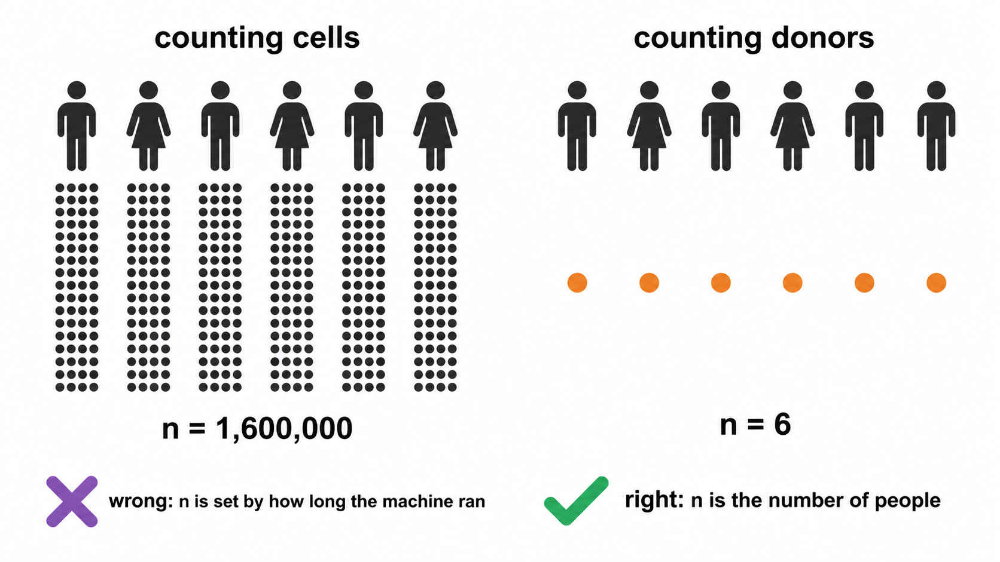
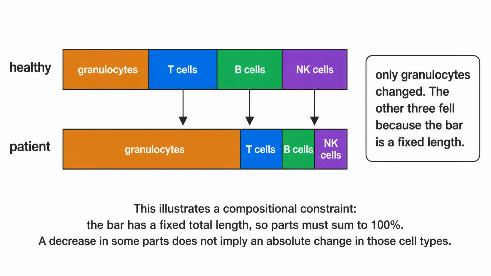
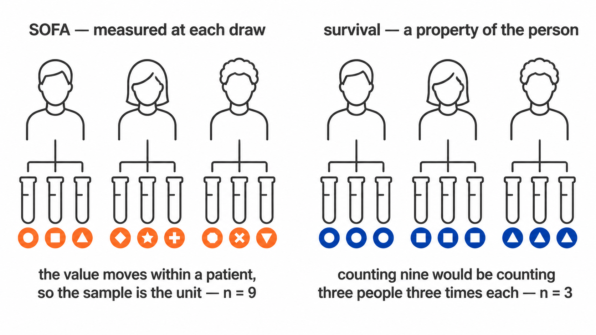
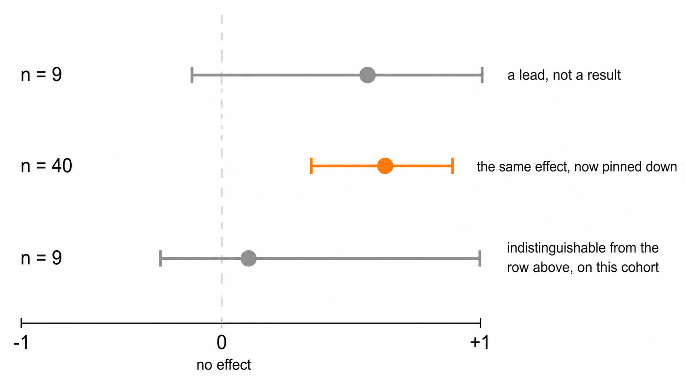

```{r, include = FALSE}
# collapse = FALSE, so the printed result appears in its OWN block below the code
# rather than merged into it. Merged, a reader cannot tell at a glance which
# lines they would type and which the session printed back, and copying the
# block copies the output with it.
knitr::opts_chunk$set(collapse = FALSE, comment = "#>")
set.seed(1)
```

```{r setup}
library(cyRAVEN)
```

Every test here trades assumptions against power. This article states which trade
was made at each point, and the sample size at which it should be revisited.

## 1. Aggregation

### 1.1 Pseudoreplication

The event count in an FCS file is determined by acquisition duration, not by
study design. Treating events as independent observations sets the degrees of
freedom from an operational parameter: sixteen donors contributing one million
events each yield a nominal *n* of 1.6 × 10<sup>7</sup>.

Two consequences follow. Statistical power becomes a function of instrument time,
so extending acquisition on one tube increases apparent significance. More
seriously, a single donor acquired to greater depth contributes disproportionate
weight, and inter-individual variation in that donor is indistinguishable from a
group effect.

### 1.2 Implementation

Every test aggregates to one value per sample per population before estimation,
following Weber et al. (2019, *Commun Biol* 2:183). The degrees of freedom
reflect the number of donors.

```{r ds}
mfi <- expand.grid(sample_id = sprintf("S%02d", 1:12),
                   population = "CD4 T cells", marker = "HLA-DR",
                   stringsAsFactors = FALSE)
mfi$n_cells <- 500
mfi$median_asinh <- rnorm(12, 2, 0.3) + rep(c(0, 0.8), each = 6)
mfi$pct_positive <- pmin(100, pmax(0, rnorm(12, 30, 5) + rep(c(0, 10), each = 6)))
mfi$is_control <- FALSE; mfi$qc_status <- "pass"
grp <- setNames(rep(c("HC", "Patient"), each = 6), sprintf("S%02d", 1:12))

res <- stats_marker_state(mfi, grp, reference = "HC")
res[, c("marker", "measure", "n_reference", "n_comparison", "delta_median", "p_value")]
```

`n_reference` is 6, the number of control donors, not 3,000, the number of events
they contributed.

Event-level quantities remain available through `stats_subcluster_shifts()`,
which reports effect sizes without p-values. They are hypothesis-generating.

```{r donors-not-cells, eval = TRUE, echo = FALSE, fig.alt = "Counting cells sets n from how long the machine ran; counting donors sets it from the number of people"}
if (file.exists("images/donors-not-cells.png")) 
```

## 2. Test selection

Group comparisons use Wilcoxon rank-sum and Kruskal-Wallis, which assume
independence and ordinal comparability.

The principal alternative, implemented in diffcyt, is limma's moderated *t*,
which stabilises variance estimates through an empirical Bayes prior shared
across markers. At mass cytometry marker counts of 30 to 40 and designed sample
sizes, this is the more powerful choice.

At a dozen markers and single-digit donors per group the prior is estimated from
too few markers to stabilise, and the normality assumption becomes load-bearing
at precisely the sample size where it cannot be assessed.

**Cost.** Reduced power under normality, and no direct mechanism for covariate
adjustment.

**Revisit at.** Approximately fifteen samples per group, where the prior becomes
informative and mixed models can accommodate repeated measures.

### 2a. The parametric tests, and why they are reported separately

Most immunology papers report a *t*-test or an ANOVA, and a reviewer may ask for
one. Declining to compute it does not remove it from the paper; it moves the
calculation somewhere with no record of whether its assumptions held.

So `parametric_tests.csv` carries the parametric equivalent of every comparison,
and `group_comparison_stats.csv` is unchanged. Two files, two answers, and the
columns that decide between them sit on the parametric row.

**The transform.** Frequencies are proportions. They are bounded, their variance
depends on their mean, and near 0 or 100 they are strongly skewed, which is
exactly where rare populations live. The arcsine square root transform stabilises
that variance and is the conventional remedy, so the parametric tests run on
transformed values. Group means are reported back on the percentage scale,
because a difference of 0.07 arcsine units means nothing to a reader.

**Which test.** Two groups give Welch's *t*-test, which does not assume equal
variances, with Student's *t* beside it. Three or more give Welch's ANOVA with
the classical one-way beside it. Welch's is the default in both cases because
equal variance is an assumption, not a property, and the cost of Welch's when
variances happen to be equal is small.

**The assumptions, on every row.** `brown_forsythe_p` tests equal variance, using
deviations from the median rather than the mean so it does not itself assume
normality. `shapiro_p` tests normality of the **within-group residuals**, not the
pooled values, which are bimodal whenever the groups genuinely differ and would
fail the test for the wrong reason. `assumptions_met` combines them and
`recommended` names the test to read.

**Post-hoc.** With three or more groups, `posthoc_tests.csv` carries all three
standard families: Games-Howell, which uses Welch's standard error and
pair-specific degrees of freedom and so pairs with Welch's ANOVA; Tukey HSD,
which assumes equal variances and pairs with the classical ANOVA; and Dunn, the
rank equivalent that follows Kruskal-Wallis. All three are written, adjusted
within each family, and the assumption columns say which to read. Choosing after
seeing the p-values is the thing this arrangement is designed to make visible.

**What is still not here.** Mixed models and GLMMs are the right tool for
repeated measures and are not implemented; `--paired-column` with
`--condition-column` covers the two-timepoint case and nothing wider. Beta
regression, which models the bounded support directly rather than transforming
it, is the better answer at larger sample sizes. Both become worth the dependency
at roughly fifteen donors per group.

## 3. Compositionality

### 3.1 Constraint

Population percentages within a sample are constrained to sum to 100 and cannot
vary independently. A genuine granulocyte expansion mechanically depresses every
lymphocyte percentage. Those depressions test significant while absolute
lymphocyte counts per microlitre remain unchanged.

```{r compositional-constraint, eval = TRUE, echo = FALSE, fig.alt = "Two stacked bars of equal length: only granulocytes changed, yet every other segment shrank because the bar is a fixed length"}
if (file.exists("images/compositional-constraint.png")) 
```

### 3.2 Log-ratio

`clr_frequencies()` applies the centred log-ratio, expressing each population
relative to the geometric mean of the sample composition rather than to a fixed
total.

```{r clr}
freq <- data.frame(
  sample_id = rep(sprintf("S%02d", 1:6), each = 3),
  population = rep(c("Granulocytes", "CD4 T cells", "B cells"), 6),
  pct_of_cd45_pos = as.vector(replicate(6, {v <- c(60, 25, 15) * exp(rnorm(3, 0, .1)); 100*v/sum(v)})),
  is_control = FALSE, qc_status = "pass")
head(clr_frequencies(freq)[, c("sample_id", "population", "pct_of_cd45_pos", "clr")], 3)
```

### 3.3 Concordance

Both parameterisations are tested and `compositional_concordance()` classifies
each result.

`robust_to_composition` survives both and supports interpretation as an
independent change.

`raw_only__possible_composition_artefact` is significant on percentages and not
on log-ratios, which is the configuration produced by section 3.1.

`clr_only__was_masked_by_composition` is the converse, an independent change
obscured by the constraint.

### 3.4 Limit

The log-ratio does not recover absolute abundance. Proportional expansion of
every population leaves the composition invariant and is undetectable in
frequency data by construction. Discriminating expansion from relative expansion
requires cells per microlitre, so `abundance_measure()` uses absolute counts
wherever the patient table supplies a leukocyte count.

## 4. Covariates

Age and sex are diagnosed rather than adjusted.

At the sample sizes cytometry cohorts reach, commonly under ten donors per group,
a model estimating age and sex effects alongside the group term consumes the
residual degrees of freedom required for the comparison of interest. Where the covariate is strongly associated with group,
the parameters are not separable at any sample size, because the design contains
no observations at the covariate levels required to estimate the effects
independently.

`stats_confounding()` therefore reports the two conditions that jointly define a
confounder: differential distribution across groups, and association with the
outcome. `stats_rank_ancova()` fits the adjusted model on request, labels every
row `EXPLORATORY`, and records `NOT FITTED` with the reason where residual
degrees of freedom are insufficient.

### 4a. Clinical variables, which are a different question

A confounder is screened to decide whether a group difference can be believed.
A clinical variable, a severity score, a laboratory value, an outcome flag, is
the question itself, and `stats_clinical_association()` treats it that way.

```{r unit-of-analysis, eval = TRUE, echo = FALSE, fig.alt = "A score measured at each draw is per sample; a property of the person is per patient"}
if (file.exists("images/per-sample-vs-per-patient.png")) 
```

The test follows the variable's type rather than being chosen:

| Variable | Test | Effect reported | Signed |
|---|---|---|---|
| Numeric (SOFA, CRP, lactate, BMI) | Spearman's rho | rho, with a bootstrap interval | yes |
| Two levels (28-day survival) | Wilcoxon rank-sum | Cliff's delta, with a bootstrap interval | yes |
| Three or more levels (infection focus) | Kruskal-Wallis | epsilon-squared | no |

Epsilon-squared is `H / (n - 1)`, the proportion of rank variance the grouping
accounts for, bounded 0 to 1. It is unsigned, because a variable with three
unordered levels has a magnitude and no direction, and that is carried explicitly
in a `signed` column rather than left for the reader to infer from a sign that
happens to be positive. Before it was added, a multi-level variable produced a
p-value and nothing else: the figure could say a test had run and not whether it
had found anything.

Rank methods throughout, for the reason they are used everywhere else in this
package. Clinical scores are ordinal by construction, so a Pearson correlation
asserts an interval scale the data does not have. Laboratory values are skewed
and carry outliers that are real rather than erroneous, a creatinine of 335 is a
patient, not a typing error, and a product-moment correlation on nine points
with one such value is a statement about that one patient.

Multiplicity is corrected **within each variable**, across the populations tested
against it. Each variable is one question asked of every population, and that is
the family; pooling every variable into one correction would penalise a
well-powered variable for the company it keeps. The choice is recorded here
because it is a judgement rather than a default.

It also has a stated assumption, which is that the variables are separate
questions. They frequently are not: in a cohort where the sickest patients are
also the ones who died, SOFA and 28-day survival describe one gradient, and a
population associated with both is one finding counted twice.
`fig_clinical_correlogram()` exists to make that visible before the heatmap is
read, because no correction can repair it and nothing else in the run would show
it. Two-level variables appear there coded 0/1, for which Spearman is the
rank-biserial correlation; variables with three or more unordered levels are
excluded rather than coded 1/2/3, which would invent an ordering.

### 4b. Effect intervals on a small cohort

Every signed effect above is written with a 95% percentile bootstrap interval:
2000 resamples of the patient-value pairs for Spearman, stratified within each arm
for Cliff's delta, from a fixed seed so a given table always yields the same
interval and the RNG stream is restored afterwards so nothing downstream is
perturbed.

```{r interval-not-point, eval = TRUE, echo = FALSE, fig.alt = "The same effect estimate with a wide interval at n = 9 and a narrow one at n = 40"}
if (file.exists("images/interval-not-point.png")) 
```

The interval is the part of the answer that carries how little a small cohort
constrains the effect. On ten patients a rho of 0.61 with an interval from -0.1 to
0.9 and a rho of 0.05 can be the same underlying quantity, and the point estimate
alone cannot say so; reporting the effect and its interval beside the p-value,
rather than the p-value alone, is the standard recommendation for exactly this
situation.

Its own limits are stated on the figure that draws it. A percentile bootstrap at
this sample size is approximate: below about nine observations the effective
resample is smaller than the nominal one and coverage falls short of 95%. So a
wide interval should be read as *this cohort does not constrain the effect* rather
than as a calibrated range, and no interval is written at all below six samples,
a number quoted at a width nobody should trust is worse than a blank.

The same reasoning is why `group_differences.png` draws the smallest p-value the
design can reach. A Wilcoxon rank-sum test has `choose(n1 + n2, n1)` equally
likely rank arrangements under the null, so the most extreme separation possible
gives a two-sided p of `2 / choose(n1 + n2, n1)`. At 4 against 5 that is 0.016,
and after correcting across a dozen populations nothing can reach 0.05 however
cleanly the groups separate. Where that floor sits above the 0.05 line, an empty
region of the figure is a fact about the design and not about the biology.

Two boundaries. This is **association, not survival analysis**: a 28-day flag is
tested as the two-group comparison it is, and no time-to-event model is fitted,
because the sample sheet carries no follow-up time and a proportional-hazards fit
on a binary column with no time is a category error rather than an approximation.
And every test runs on **one value per sample**, so the replicates are subjects;
correlating a score against pooled events would treat one deeply acquired patient
as tens of thousands of independent observations, which is the same failure
`abundance_measure()` exists to prevent.

The `underpowered` column marks every test run on fewer than ten samples. At that
size a rank test detects only very large effects, so a null result carries almost
no information and should not be reported as evidence of no association.

## 5. Batch effects

Correction methods displace cells until batch labels mix. This is valid when
batch is independent of the study design.

Clinical cohorts rarely satisfy that condition: recruitment and acquisition are
typically sequential, so batch and group approach collinearity. Displacing cells
until batches mix then also removes the biological contrast, and the algorithm
cannot distinguish the two contributions.

`batch_mixing_report()` returns both required quantities before any correction:
iLISI against a permutation null, establishing whether batch structure exists,
and Cramér's *V*, establishing whether it is separable from group. A high *V*
means no setting makes correction safe, which is the most informative result the
diagnostic can return.

`--correct-batch` performs the correction and is refused above a configurable
threshold.

## 6. Multiplicity

Benjamini-Hochberg correction is applied within each test family, with raw and
adjusted p-values both reported.

Differential state adjusts within each measure rather than across both. Median
intensity and percent positive are two summaries of the same events and are
strongly correlated; pooling them would inflate the family with non-independent
hypotheses and over-penalise every result.

## 7. Effect sizes

Every p-value is reported with an effect size: Cliff's delta across samples, or
matched-pairs rank-biserial for paired designs. Clinical associations add a
bootstrap interval on the effect as well; see §4b for why, and for why the
interval is suppressed rather than narrowed below six samples.

Differences rather than ratios are reported for transformed intensities. Arcsinh
and logicle scales admit negative values, on which a ratio is undefined in
interpretation and changes sign without a corresponding change in biology.

## 8. Measurement resolution

An effect size states how large a difference is relative to the spread between
donors. It does not state whether the instrument and the gating strategy could
resolve a difference of that size at all.

`difference_over_gate_u` supplies the second quantity: the observed difference in
medians divided by the typical within-sample uncertainty on the frequency, itself
propagated from where the thresholds were placed. Below one, the groups differ by
less than the distance the cut travels under resampling of the cells that
determined it.

This is a screen, not a test. The uncertainty is partly shared across the run,
since every sample passes through one panel, one transform and one placement
rule, so it cancels in part when a difference is taken and the ratio is
conservative. A ratio below one is a reason to open `threshold_uncertainty.csv`
before interpreting the comparison, not grounds to discard it.

`difference_over_total_u` repeats the comparison against the gate term and the
counting term together. The two ratios coincide for an abundant population and
separate for a rare one, where the threshold can be well placed and the frequency
still rest on too few events to support the difference being tested. Where they
disagree, the smaller is the one to act on.

The order to read remains: adjusted p, then effect size, then these. A result
that survives all of them is one where the groups differ, the difference is large
relative to donor variation, and it is larger than both the distance the gate can
move and the noise in the count.

## 8a. Detection limits

An effect size and a p-value can both be computed from a population of nine
events. Neither reports that fact.

`detection` in `population_frequencies.csv` classifies each value against the
conventional limits of detection and quantification, twenty and fifty events
against the parent gate. A population below the limit of quantification in most
samples should not be carried into a group comparison at all: the test will run,
and its result is a statement about acquisition depth.

This is a screen on the measurement rather than a correction to the test. No
p-value is adjusted by it, and the tests behave as they did before.

## 9. Summary

| Question | Function | Unit |
|---|---|---|
| Did population abundance change? | `stats_group_comparison()` | sample |
| Does it survive the compositional constraint? | `clr_frequencies()`, `compositional_concordance()` | sample |
| Did marker expression change within a population? | `stats_marker_state()` | sample |
| Is the contrast confounded by age or sex? | `stats_confounding()` | sample |
| Is the contrast confounded by batch? | `batch_mixing_report()` | cell, descriptive |
| Is the contrast an artefact of the gate? | `stats_threshold_drift()`, `cluster_gate_agreement()` | sample and cell |
| Is the difference bigger than the gate's own uncertainty? | `run_gate_uncertainty()`, `annotate_gate_uncertainty()` | sample |
| Were enough cells counted for the frequency to mean anything? | `counting_uncertainty()` | sample |
| Which markers shift within a subcluster? | `stats_subcluster_shifts()` | cell, no p-value |

## 10. Sources for the tests implemented here

Where each method came from, and what it is for.

**Proportions.** Population frequencies are bounded and their variance depends on
their mean, so a test assuming constant variance is wrong in a way that gets
worse as the population gets rarer. The arcsine square root transform is the
standard remedy, and its asymptotic variance is known rather than estimated from
the data, which is what lets ordinary ANOVA machinery run on top of it
([Frontiers in Psychology, 2022](https://www.frontiersin.org/articles/10.3389/fpsyg.2022.1045436)).

**Unequal variance.** Welch's t-test and Welch's ANOVA do not assume equal
variances, so they stay valid when group sizes and spreads differ, which they
almost always do in an immunophenotyping cohort. Games-Howell is the post-hoc
test that matches: it uses Welch's standard error and pair-specific degrees of
freedom rather than one pooled estimate
([rstatix](https://rpkgs.datanovia.com/rstatix/reference/games_howell_test.html)).

**Rank post-hoc.** Dunn's test compares mean ranks computed over the whole
dataset, which is what makes it the correct follow-up to Kruskal-Wallis. A set of
pairwise Wilcoxon tests re-ranks within each pair and answers a different
question.

**Clinical associations: the unit of analysis.** A cohort sampled at several
timepoints carries two kinds of clinical column. One is constant within a patient
, 28-day survival, BMI, age, and asks a *between-subject* question; the other
varies within a patient, a severity score at each draw, and asks a
*within-subject* one. Treating repeated samples from one patient as independent
observations is pseudoreplication: it inflates the apparent sample size, narrows
the interval and makes significance more likely without a single extra patient
having been recruited, and it is common enough in the life sciences to be one of
the standard threats to reproducibility
([*The problem of pseudoreplication in neuroscientific studies*, BMC Neuroscience](https://bmcneurosci.biomedcentral.com/articles/10.1186/1471-2202-11-5);
[*Statistics Done Wrong*, on pseudoreplication](https://www.statisticsdonewrong.com/pseudoreplication.html)).
Collapsing to one value per subject is the first remedy named in that literature
and is what `clin_variable_unit()` triggers for a patient-constant column.

For a column that varies within a patient, collapsing would delete the variation
being asked about, so the per-sample test is kept and `n_patients` and
`repeated_measures` are reported beside it. The dedicated method there is a
repeated-measures correlation, which estimates the common within-individual slope
without averaging
([Bland & Altman 1995; Bakdash & Marusich, *Frontiers in Psychology* 2017](https://www.frontiersin.org/journals/psychology/articles/10.3389/fpsyg.2017.00456/full),
implemented in [`rmcorr`](https://cran.r-project.org/package=rmcorr)). It is
named rather than implemented, for the same reason as the mixed models below.

**Effect sizes with intervals, not p-values alone.** Reporting the estimated
effect with a confidence interval, rather than a p-value on its own, is what the
reporting guidelines for prognostic marker studies ask for, and the surveys
behind those guidelines found 96% of papers reporting p-values against 42%
reporting an interval
([REMARK explanation and elaboration, *BMC Medicine* 2012](https://bmcmedicine.biomedcentral.com/articles/10.1186/1741-7015-10-51)).
`clinical_association.csv` carries `ci_low` and `ci_high` on every signed effect
for that reason, and `fig_clinical_forest()` draws them.

**Rank effect sizes.** Cliff's delta is the non-parametric two-group effect size
for ordinal or non-normal data, and percentile bootstrap intervals are the
standard way to bound it
([*Cliff's Delta Calculator*, Universitas Psychologica](http://www.scielo.org.co/scielo.php?script=sci_arttext&pid=S1657-92672011000200018)).
Epsilon-squared, `H / (n - 1)`, is the corresponding effect size for
Kruskal-Wallis, following Tomczak & Tomczak's recommendation as implemented in
[`rstatix::kruskal_effsize()`](https://rpkgs.datanovia.com/rstatix/reference/kruskal_effsize.html);
it is unsigned because a variable with three unordered levels has no direction.
The bootstrap's own limit at these sample sizes, an effective resample smaller
than the nominal one, and coverage falling short of 95% below about nine
observations, is documented rather than ignored
([*Statistical uncertainty analysis for small-sample, high log-variance data*](https://pmc.ncbi.nlm.nih.gov/articles/PMC6754704/)),
which is why no interval is written below six.

**What is deliberately not implemented.** Generalised linear mixed models are the
right tool when donors contribute several samples, and CytoGLMM implements them
for cytometry specifically
([Seiler et al.](https://christofseiler.github.io/CytoGLMM/)). Beta regression
models bounded support directly instead of transforming it
([npj Systems Biology, 2025](https://www.nature.com/articles/s41540-025-00572-4)).
Both need more donors per group than the cohorts this package is aimed at, and
both add a dependency whose failure modes are harder to explain than the tests
above. `--paired-column` with `--condition-column` covers the two-timepoint case;
anything wider belongs in one of those packages.
